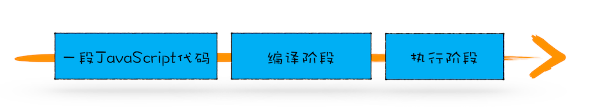

# 变量提升
```javascript
showName()
console.log(myname)
var myname = 'dd'
function showName() {
  console.log('函数showName被执行')
}

//函数showName被执行
//undefined
```

```javascript
showName()
console.log(myname)
function showName() {
  console.log('函数showName被执行')
}

//myname is no defined
```

结论：

1. 在执行过程中，若使用了未声明的变量，那么 JavaScript 执行会报错。
1. 在一个变量定义之前使用它，不会出错，但是该变量的值会为 undefined，而不是定义时的值。
1. 在一个函数定义之前使用它，不会出错，且函数能正确执行。

```javascript
tips: var foo = function () {}
这样声明函数也会变量提升
```

**模拟变量提升**

```javascript
/*
 * 变量提升部分
 */
// 把变量 myname提升到开头，
// 同时给myname赋值为undefined
var myname = undefined
// 把函数showName提升到开头
function showName() {
  console.log('showName被调用')
}

/*
 * 可执行代码部分
 */
showName()
console.log(myname)
// 去掉var声明部分，保留赋值语句
myname = 'dddd'
```

**所谓的变量提升，是指在 JavaScript 代码执行过程中，JavaScript 引擎把变量的声明部分和函数的声明部分提升到代码开头的“行为”。变量被提升后，会给变量设置默认值，这个默认值就是我们熟悉的 undefined。**

## JavaScript 代码的执行流程

从概念的字面意义上来看，“变量提升”意味着变量和函数的声明会在物理层面移动到代码的最前面，正如我们所模拟的那样。但，这并不准确。实际上变量和函数声明在代码里的位置是不会改变的，而且是在编译阶段被 JavaScript 引擎放入内存中。对，你没听错，一段 JavaScript 代码在执行之前需要被 JavaScript 引擎编译，编译完成之后，才会进入执行阶段。大致流程你可以参考下图：


### 编译过程

```javascript
showName()
console.log(myname)
var myname = 'ddd'
function showName() {
  console.log('函数showName被执行')
}
```

我们可以一行一行来分析上述代码：<br />第 1 行和第 2 行，由于这两行代码不是声明操作，所以 JavaScript 引擎不会做任何处理；<br />第 3 行，由于这行是经过 var 声明的，因此 JavaScript 引擎将在环境对象中创建一个名为 myname 的属性，并使用 undefined 对其初始化；<br />第 4 行，JavaScript 引擎发现了一个通过 function 定义的函数，所以它将函数定义存储到堆 (HEAP）中，并在环境对象中创建一个 showName 的属性，然后将该属性值指向堆中函数的位置

```javascript

VariableEnvironment:
     myname -> "ddd",
     showName -> function : {console.log(myname)
```

### 执行过程

JavaScript 引擎开始执行“可执行代码”，按照顺序一行一行地执行。下面我们就来一行一行分析下这个执行过程：<br />当执行到 showName 函数时，JavaScript 引擎便开始在变量环境对象中查找该函数，由于变量环境对象中存在该函数的引用，所以 JavaScript 引擎便开始执行该函数，并输出“函数 showName 被执行”结果。

接下来打印“myname”信息，JavaScript 引擎继续在变量环境对象中查找该对象，由于变量环境存在 myname 变量，并且其值为 undefined，所以这时候就输出 undefined。

接下来执行第 3 行，把“ddd”赋给 myname 变量，赋值后变量环境中的 myname 属性值改变为“ddd”，

## 总结

在编译阶段，变量和函数会被存放到变量环境中，变量的默认值会被设置为 undefined；<br />在代码执行阶段，JavaScript 引擎会从变量环境中去查找自定义的变量和函数。<br />如果在编译阶段，存在两个相同的函数，那么最终存放在变量环境中的是最后定义的那个，这是因为后定义的会覆盖掉之前定义的。<br />**JavaScript 的执行机制：先编译，再执行。**

```javascript
const check = (firstName,lastName)=>{
  console.log(firstName)
  console.log(lastName)
  var firstName = "chen";
  function firstName (){console.log("this is first name func")}
  lastName =()=>{console.log("this is last name func")}
  console.log(firstName)
  console.log(lastName)
}
check("zhao","vivi")


[Function: firstName]
vivi
chen
[Function: lastName]

```
