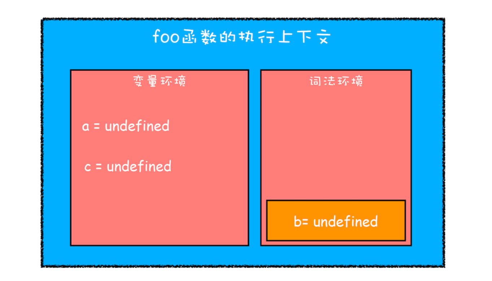
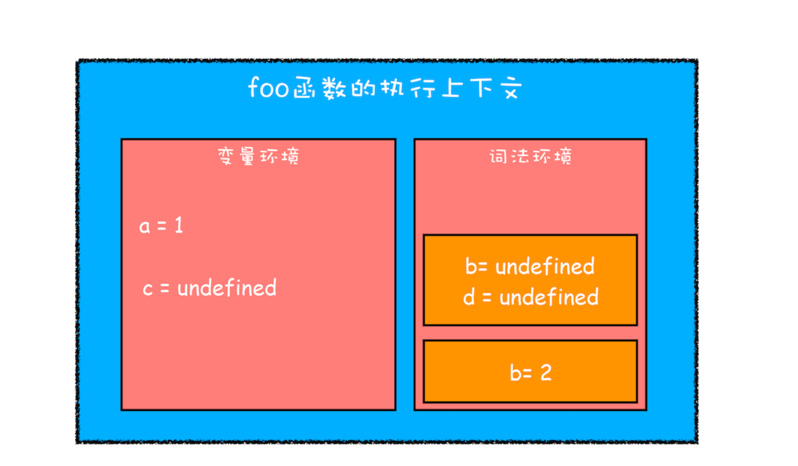
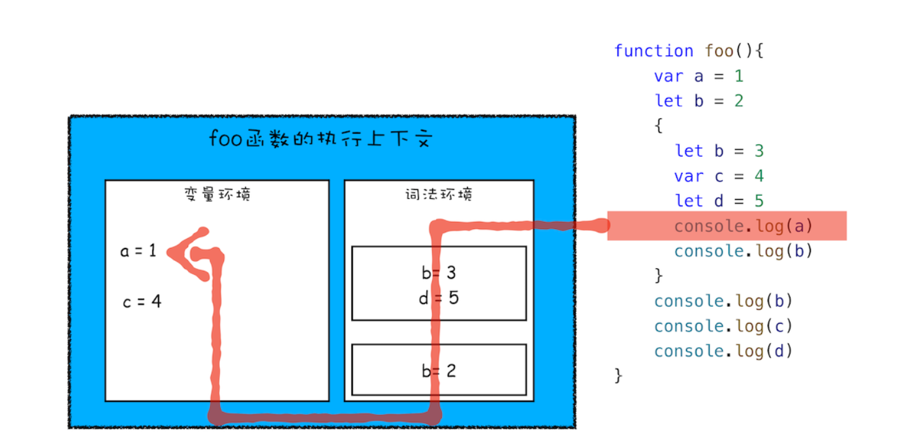
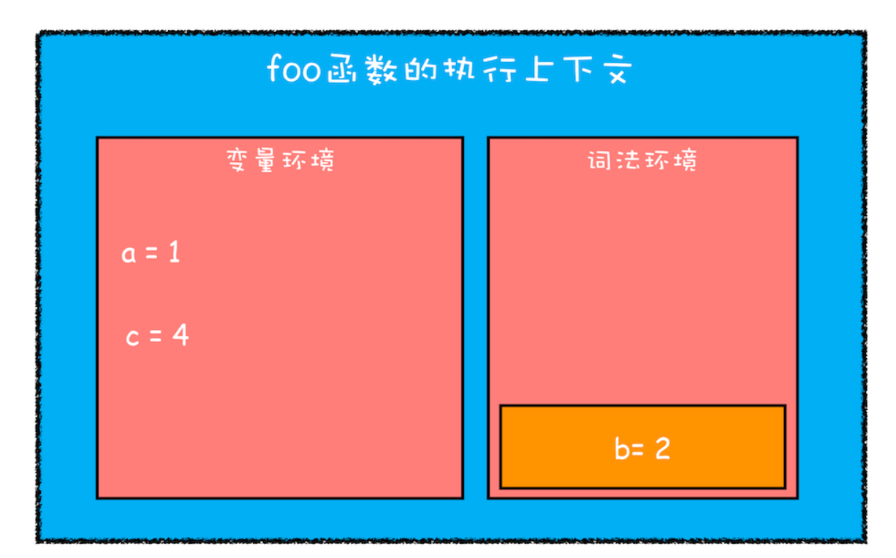

# 块级作用域：var缺陷以及为什么要引入let和const？

> JavaScript 存在变量提升这种特性，从而导致了很多与直觉不符的代码，这也是 JavaScript 的一个重要设计缺陷。
> 为什么 JavaScript 中会存在变量提升这个特性，而其他语言似乎都没有这个特性呢？要讲清楚这个问题，我们就得先从作用域讲起。


# 作用域
作用域是指在程序中定义变量的区域，该位置决定了变量的生命周期。通俗地理解，作用域就是变量与函数的可访问范围，即作用域控制着变量和函数的可见性和生命周期。<br />在 ES6 之前，ES 的作用域只有两种：**全局作用域**和**函数作用域**。

- **全局作用域**中的对象在代码中的任何地方都能访问，其生命周期伴随着页面的生命周期。
- **函数作用域**就是在函数内部定义的变量或者函数，并且定义的变量或者函数只能在函数内部被访问。函数执行结束之后，函数内部定义的变量会被销毁。

在 ES6 之前，JavaScript 只支持这两种作用域，相较而言，其他语言则都普遍支持**块级作用域**。块级作用域就是使用一对大括号包裹的一段代码，比如函数、判断语句、循环语句，甚至单独的一个{}都可以被看作是一个块级作用域。为了更好地理解块级作用域，你可以参考下面的一些示例代码：
```javascript
//if块
if(1){}

//while块
while(1){}

//函数块
function foo(){}
 
//for循环块
for(let i = 0; i<100; i++){}

//单独一个块
{}
```
和 java 、 C 不同，ES6之前是不支持块级作用域的


# 变量提升带来的问题

## 变量容易在不被察觉的情况下被覆盖
```javascript
var myname = "aaa"
function showName(){
  console.log(myname);//undefined
  if(0){
   var myname = "bbb"
  }
  console.log(myname);//undefined
}
showName()
```
执行上面这段代码，打印出来的是 undefined<br />而java 、c 这个则会输出 aaa

showName 函数的执行上下文创建后，JavaScript 引擎便开始执行 showName 函数内部的代码了。首先执行的是：
```javascript
console.log(myname);
```
这时有两个myname 变量，一个在全局执行上下文中，一个在showName函数的执行上下文中，其值为undefined, JavaScript 会优先从当前的执行上下文中查找变量，由于变量提升，当前的执行上下文中就包含了变量 myname，而值是 undefined，所以获取到的 myname 的值就是 undefined。

## 本应销毁的变量没有被销毁
```javascript
function foo(){
  for (var i = 0; i < 7; i++) {
  }
  console.log(i); 
}
foo()
```
如果你使用 C 语言或者其他的大部分语言实现类似代码，在 for 循环结束之后，i 就已经被销毁了，但是在 JavaScript 代码中，i 的值并未被销毁，所以最后打印出来的是 7。<br />这同样也是由变量提升而导致的，在创建执行上下文阶段，变量 i 就已经被提升了，所以当 for 循环结束之后，变量 i 并没有被销毁。

## ES6 是如何解决变量提升带来的缺陷
ES6 引入了 let 和 const 关键字，从而使 JavaScript 也能像其他语言一样拥有了块级作用域。<br />先看一段变量提升的代码：
```javascript
function varTest() {
  var x = 1;
  if (true) {
    var x = 2;  // 同样的变量!
    console.log(x);  // 2
  }
  console.log(x);  // 2
}
```
在这段代码中，有两个地方都定义了变量 x，第一个地方在函数块的顶部，第二个地方在 if 块的内部，由于 var 的作用范围是整个函数，最终只生成了一个变量 x，函数体内所有对 x 的赋值操作都会直接改变变量环境中的 x 值。
```javascript
function letTest() {
  let x = 1;
  if (true) {
    let x = 2;  // 不同的变量
    console.log(x);  // 2
  }
  console.log(x);  // 1
}
```
执行这段代码，其输出结果就和我们的预期是一致的。这是因为 let 关键字是支持块级作用域的，所以在编译阶段，JavaScript 引擎并不会把 if 块中通过 let 声明的变量存放到变量环境中，这也就意味着在 if 块通过 let 声明的关键字，并不会提升到全函数可见。所以在 if 块之内打印出来的值是 2，跳出语块之后，打印出来的值就是 1 了。这种就非常符合我们的编程习惯了：作用域块内声明的变量不影响块外面的变量。

# JavaScript 是如何支持块级作用域的
现在你知道了 ES 可以通过使用 let 或者 const 关键字来实现块级作用域，不过你是否有过这样的疑问：“在同一段代码中，ES6 是如何做到既要支持变量提升的特性，又要支持块级作用域的呢？”

那么接下来，我们就要站在执行上下文的角度来揭开答案。

你已经知道 JavaScript 引擎是通过变量环境实现函数级作用域的，那么 ES6 又是如何在函数级作用域的基础之上，实现对块级作用域的支持呢？你可以先看下面这段代码：
```javascript
function foo(){
    var a = 1
    let b = 2
    {
      let b = 3
      var c = 4
      let d = 5
      console.log(a)
      console.log(b)
    }
    console.log(b) 
    console.log(c)
    console.log(d)
}   
foo()
```
当执行上面这段代码的时候，JavaScript 引擎会先对其进行编译并创建执行上下文，然后再按照顺序执行代码，关于如何创建执行上下文我们在前面的文章中已经分析过了，但是现在的情况有点不一样，我们引入了 let 关键字，let 关键字会创建块级作用域，那么 let 关键字是如何影响执行上下文的呢？

接下来我们就来一步步分析上面这段代码的执行流程。

第一步是编译并创建执行上下文，下面是我画出来的执行上下文示意图，你可以参考下：


刚执行时 foo 函数的执行上下文

通过上图，我们可以得出以下结论：

- 函数内部通过 var 声明的变量，在编译阶段全都被存放到变量环境里面了。
- 通过 let 声明的变量，在编译阶段会被存放到词法环境（Lexical Environment）中。
- 在函数的作用域块内部，通过 let 声明的变量并没有被存放到词法环境中。

接下来，第二步继续执行代码，当执行到代码块里面时，变量环境中 a 的值已经被设置成了 1，词法环境中 b 的值已经被设置成了 2，这时候函数的执行上下文就如下图所示：


执行 foo 函数内部作用域块时的执行上下文

从图中可以看出，当进入函数的作用域块时，作用域块中通过 let 声明的变量，会被存放在词法环境的一个单独的区域中，这个区域中的变量并不影响作用域块外面的变量，比如在作用域外面声明了变量 b，在该作用域块内部也声明了变量 b，当执行到作用域内部时，它们都是独立的存在。

其实，在词法环境内部，维护了一个小型栈结构，栈底是函数最外层的变量，进入一个作用域块后，就会把该作用域块内部的变量压到栈顶；当作用域执行完成之后，该作用域的信息就会从栈顶弹出，这就是词法环境的结构。需要注意下，我这里所讲的变量是指通过 let 或者 const 声明的变量。再接下来，当执行到作用域块中的

再接下来，当执行到作用域块中的console.log(a)这行代码时，就需要在词法环境和变量环境中查找变量 a 的值了，具体查找方式是：沿着词法环境的栈顶向下查询，如果在词法环境中的某个块中查找到了，就直接返回给 JavaScript 引擎，如果没有查找到，那么继续在变量环境中查找。

这样一个变量查找过程就完成了，你可以参考下图：<br />不过要完整理解查找变量或者查找函数的流程，就涉及到作用域链

当作用域块执行结束之后，其内部定义的变量就会从词法环境的栈顶弹出，最终执行上下文如下图所示：



块级作用域就是通过词法环境的栈结构来实现的，而变量提升是通过变量环境来实现，通过这两者的结合，JavaScript 引擎也就同时支持了变量提升和块级作用域了。

# 总结
由于 JavaScript 的变量提升存在着变量覆盖、变量污染等设计缺陷，所以 ES6 引入了块级作用域关键字来解决这些问题。<br />之后我们还通过对变量环境和词法环境的介绍，分析了 JavaScript 引擎是如何同时支持变量提升和块级作用域的。

参考文章<br />《浏览器工作原理与实践》-李兵


# 思考
```javascript
let myname= 'aaa'
{
  console.log(myname) 
  let myname= 'bbb'
}
```
你能通过分析词法环境，得出来最终的打印结果吗？

【最终打印结果】：VM6277:3 Uncaught ReferenceError: Cannot access 'myname' before initialization 

执行第三行的时候，编译阶段 **myname : undefined** 已经在内存中，为什么提前访问不了？<br />这主要是因为V8虚拟机做了限制，虽然myname在内存中，但是当你在let myname 之前访问 myname 时，根据ECMAScript定义，虚拟机会阻止的访问！

执行函数时才有进行编译，抽象语法树(AST）在进入函数阶段就生成了，并且函数内部作用域是已经明确了，所以进入块级作用域不会有编译过程，只不过通过let或者const声明的变量会在进入块级作用域的时被创建，但是在该变量没有赋值之前，引用该变量JavaScript引擎会抛出错误---这就是“暂时性死区”

**相关概念**

函数只会在第一次执行的时候被编译，所以编译时变量环境和词法环境最顶层数据已经确定了。 当执行到块级作用域的时候，块级作用域中通过let和const申明的变量会被追加到词法环境中，当这个块执行结束之后，追加到词法作用域的内容又会销毁掉。
