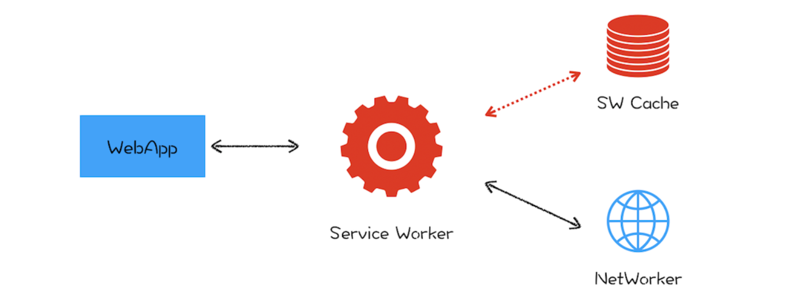

# PWA
PWA，全称是 Progressive Web App，翻译过来就是渐进式网页应用。根据字面意思，它就是“渐进式 +Web 应用”。对于 Web 应用很好理解了，就是目前我们普通的 Web 页面，所以 PWA 所支持的首先是一个 Web 页面。至于“渐进式”，就需要从下面两个方面来理解：

- 站在 Web 应用开发者来说，PWA 提供了一个渐进式的过渡方案，让 Web 应用能逐步具有本地应用的能力。采取渐进式可以降低站点改造的代价，使得站点逐步支持各项新技术，而不是一步到位。
- 站在技术角度来说，PWA 技术也是一个渐进式的演化过程，在技术层面会一点点演进，比如逐渐提供更好的设备特性支持，不断优化更加流畅的动画效果，不断让页面的加载速度变得更快，不断实现本地应用的特性。
> 它是一套理念，渐进式增强 Web 的优势，并通过技术手段渐进式缩短和本地应用或者小程序的距离。

# Web 应用 VS 本地应用

那相对于本地应用，Web 页面到底缺少了什么？

- 首先，Web 应用缺少离线使用能力，在离线或者在弱网环境下基本上是无法使用的。而用户需要的是沉浸式的体验，在离线或者弱网环境下能够流畅地使用是用户对一个应用的基本要求。
- 其次，Web 应用还缺少了消息推送的能力，因为作为一个 App 厂商，需要有将消息送达到应用的能力。
- 最后，Web 应用缺少一级入口，也就是将 Web 应用安装到桌面，在需要的时候直接从桌面打开 Web 应用，而不是每次都需要通过浏览器来打开。
-  

针对以上 Web 缺陷，PWA 提出了两种解决方案：通过引入 Service Worker 来试着解决离线存储和消息推送的问题，通过引入 manifest.json 来解决一级入口的问题

# 什么是 Service Worker
它的主要思想是在页面和网络之间增加一个拦截器，用来缓存和拦截请求。整体结构如下图所示：
在没有安装 Service Worker 之前，WebApp 都是直接通过网络模块来请求资源的。安装了 Service Worker 模块之后，WebApp 请求资源时，会先通过 Service Worker，让它判断是返回 Service Worker 缓存的资源还是重新去网络请求资源。一切的控制权都交由 Service Worker 来处理。

## 架构

通过前面页面循环系统的分析，我们已经知道了 JavaScript 和页面渲染流水线的任务都是在页面主线程上执行的，如果一段 JavaScript 执行时间过久，那么就会阻塞主线程，使得渲染一帧的时间变长，从而让用户产生卡顿的感觉，这对用户来说体验是非常不好的。

为了避免 JavaScript 过多占用页面主线程时长的情况，浏览器实现了 Web Worker 的功能。Web Worker 的目的是让 JavaScript 能够运行在页面主线程之外，不过由于 Web Worker 中是没有当前页面的 DOM 环境的，所以在 Web Worker 中只能执行一些和 DOM 无关的 JavaScript 脚本，并通过 postMessage 方法将执行的结果返回给主线程。所以说在 Chrome 中， Web Worker 其实就是在渲染进程中开启的一个新线程，它的生命周期是和页面关联的。

**“让其运行在主线程之外”就是 Service Worker 来自 Web Worker 的一个核心思想。**

另外，由于 Service Worker 还需要会为多个页面提供服务，所以还**不能把 Service Worker 和单个页面绑定起来**。在目前的 Chrome 架构中，**Service Worker 是运行在浏览器进程中的**，因为浏览器进程生命周期是最长的，所以在浏览器的生命周期内，**能够为所有的页面提供服务。**

## 消息推送
消息推送也是基于 Service Worker 来实现的。因为消息推送时，浏览器页面也许并没有启动，这时就需要 Service Worker 来接收服务器推送的消息，并将消息通过一定方式展示给用户。

## 安全
HTTP 采用的是明文传输信息，存在被窃听、被篡改和被劫持的风险，在项目中使用 HTTP 来传输数据无疑是“裸奔”。所以在设计之初，就考虑对 Service Worker 采用 HTTPS 协议，因为采用 HTTPS 的通信数据都是经过加密的，即便拦截了数据，也无法破解数据内容，而且 HTTPS 还有校验机制，通信双方很容易知道数据是否被篡改。

所以要使站点支持 Service Worker，首先必要的一步就是要将站点升级到 HTTPS。

# 总结
PWA，它是由很多技术组成的一个理念，其核心思想是渐进式。对于开发者，它提供了非常温和的方式，让开发者将普通的站点逐步过渡到 Web 应用。对于技术本身而言，它是渐进式演进，逐渐将 Web 技术发挥到极致的同时，也逐渐缩小和本地应用的差距。在此基础上，我们又分析了 PWA 中的 Service Worker 的设计思路。

另外，PWA 还提供了 manifest.json 配置文件，可以让开发者自定义桌面的图标、显示名称、启动方式等信息，还可以设置启动画面、页面主题颜色等信息。

添加桌面标、增加离线缓存、增加消息推送等功能是 PWA 走向设备的必备功能，但我认为真正决定 PWA 能否崛起的还是底层技术，比如页面渲染效率、对系统设备的支持程度、WebAssembly 等

# 参考
浏览器工作原理-李兵
