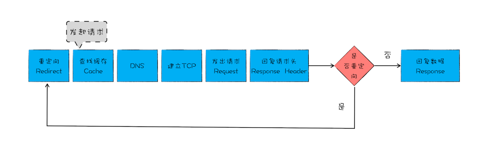
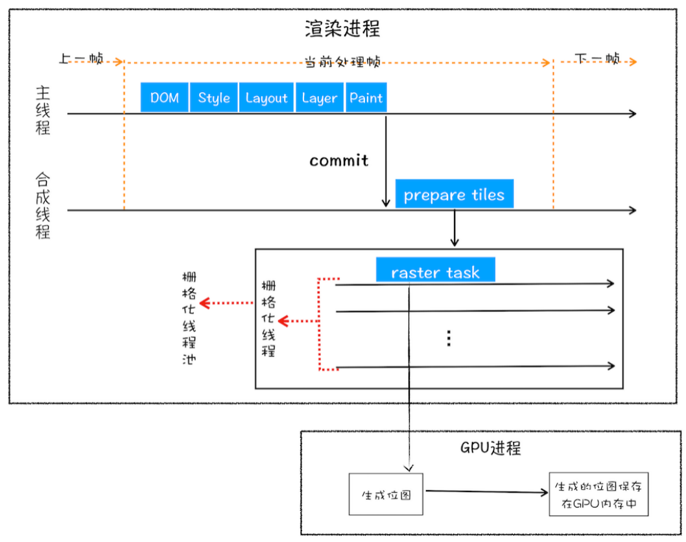
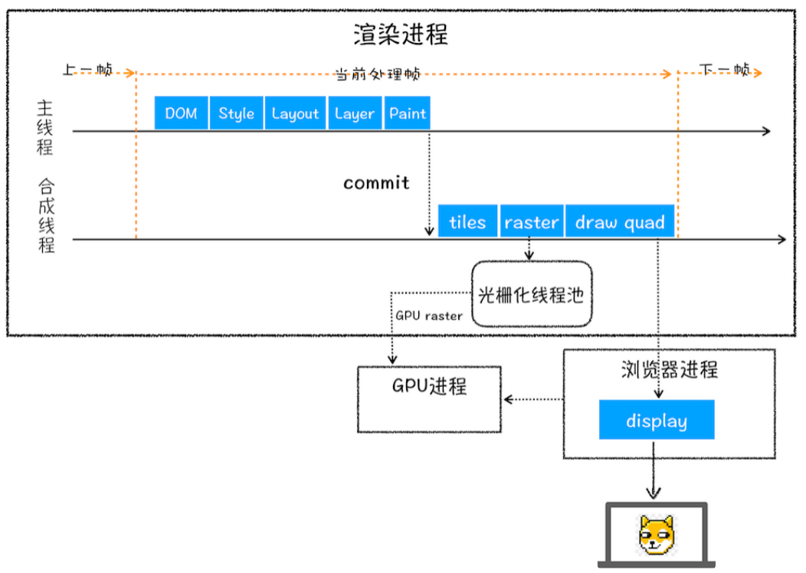
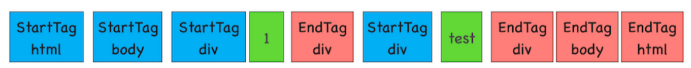
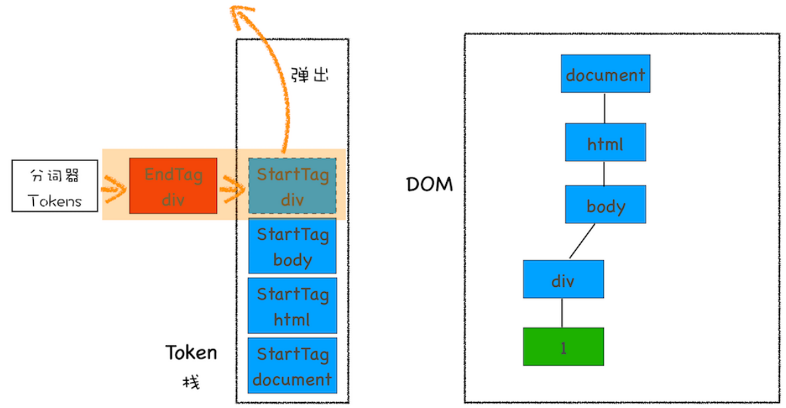
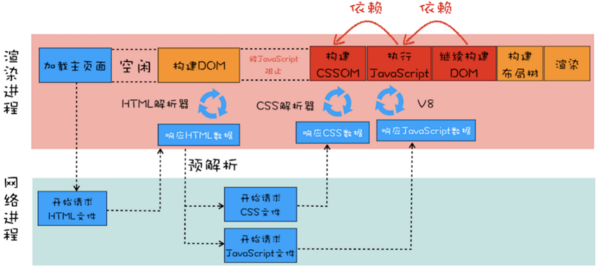
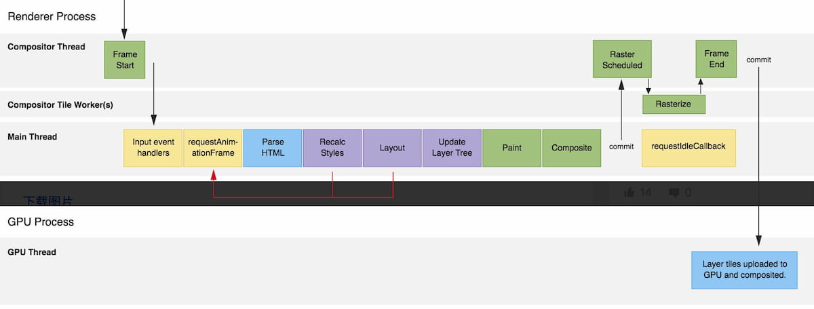
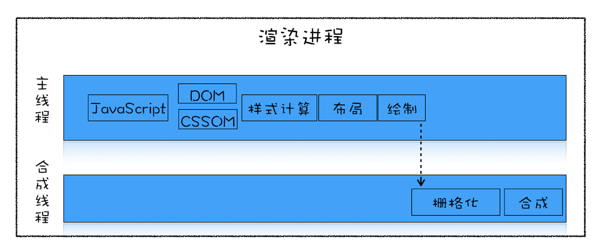
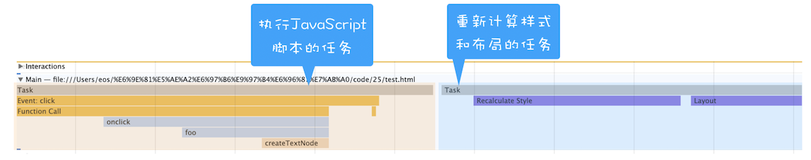
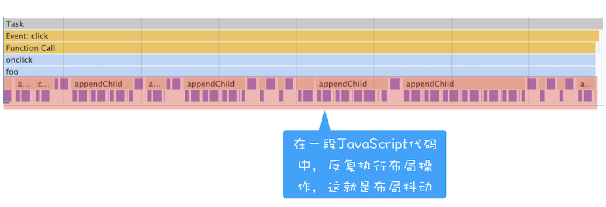

# 从输入URL到页面展示，这中间发生了什么？


1. 首先，浏览器进程接收到用户输入的 URL 请求，浏览器进程便将该 URL 转发给网络进程。
1. 然后，在网络进程中发起真正的 URL 请求。
1. 接着网络进程接收到了响应头数据，便解析响应头数据，并将数据转发给浏览器进程。
1. 浏览器进程接收到网络进程的响应头数据之后，发送“提交导航 (CommitNavigation)”消息到渲染进程；
1. 渲染进程接收到“提交导航”的消息之后，便开始准备接收 HTML 数据，接收数据的方式是直接和网络进程建立数据管道；
1. 最后渲染进程会向浏览器进程“确认提交”，这是告诉浏览器进程：“已经准备好接受和解析页面数据了”。
1. 浏览器进程接收到渲染进程“提交文档”的消息之后，便开始移除之前旧的文档，然后更新浏览器进程中的页面状态。

这其中，用户发出 URL 请求到页面开始解析的这个过程，就叫做导航。


# 一、导航流程

## 1. 用户输入
【主进程处理】<br />（1）判断输入是否符合URL规则<br />不符合判断是搜索内容的关键词，用默认 搜索引擎 搜索；<br />符合的话，加上协议拼成完成URL，浏览器进程会通过进程间通信（IPC）把 URL 请求转发给网络进程；<br />（2）有一个beforeunload 事件，让用户确认是否离开；

## 2. URL 请求


### 浏览器进程 通过 进程间通信 (IPC) 把URL 请求发至网络进程


### 查找缓存，没有才真正发起请求


### 请求前需要解析域名
解析前查找缓存
> 在浏览器DNS缓存中搜索<br />在操作系统DNS缓存中搜索<br />读取系统hosts文件，查找其中是否有对应的ip

若找不到缓存再通过DNS解析，如果是HPPTS，还需要建立TLS连接
> 向本地配置的DNS服务器发起域名解析请求（递归查询），发送UDP（**传输层**）数据包到默认网关，默认网关判断是否需要下一跳，如果需要则传送的吓一跳，否则，根据arp（数据链路层）协议解析出mac地址，然后将udp数据包交付给dns服务器。<br />本地域名服务器向根域名服务器，顶级域名服务器，权限域名服务器发起请求（迭代查询） 

如果缓存过期了，浏览器则会继续发起网络请求，并且在 HTTP 请求头中带上：If-None-Match。

### 等待 TCP 队列
同一个域名同时最多只能建立 6 个 TCP 连接<br />当前请求书大于6就要等待，小于6进入下一步；

### TCP连接
三次握手

###  HTTP请求
（1）请求行<br />包括：请求方法、请求 URI（Uniform Resource Identifier），HTTP 版本协议<br />POST请求，数据放在请求体传给服务器；<br />（2）请求头：<br />包含了浏览器所使用的操作系统、浏览器内核等信息，当前请求域名信息、浏览器 Cookie 信息等等

### HTTP响应
（1）响应行，包括：协议版本和状态码<br />（2）响应头，包括：服务器生成返回数据的时间、返回的数据类型（JSON、HTML、流媒体等类型），以及服务器要在客户端保存的 Cookie 等信息<br />（3）响应体，我们请求的真正内容；
> 如果有If-None-Match，服务器会根据 请求头中的If-None-Match 的值来判断请求的资源是否被更新，如果没有更新，就返回304状态码，相当于告诉浏览器之前的缓存还可以使用，就不返回新数据了


### 重定向
如果状态码是301永久重定向或302临时重定向，读取响应头的 Location 字段里面读取重定向的地址，重新发请求一切从头来；

### 根据响应头的 Content-Type，判断响应数据的类型
application/octet-stream交给下载管理器下载<br />text/html 才是渲染页面；

### 提交文档阶段
> 浏览器进程获取到通知，根据当前页面B是否是从页面A打开的并且和页面A是否是同一个站点（根域名和协议一样就被认为是同一个站点），如果满足上述条件，**就复用之前网页的进程**，否则，新创建一个单独的渲染进程

浏览器进程接收到网络进程的响应头数据之后，便向渲染进程发起“提交文档”的消息；<br />渲染进程接收到消息后，会和网络进程建立传输数据的“管道”；<br />等文档数据传输完成之后，渲染进程会返回“确认提交”的消息给浏览器进程；<br />浏览器进程在收到后，会更新浏览器界面状态，包括安全状态、地址栏 URL、前进后退的历史状态，更新 Web 页

# 二、 渲染阶段
【渲染进程处理】

## 3.1 构建DOM树
将HTML 转换为浏览器能够理解的结构——DOM 树<br />（1）HTML词法、语法的解析、<br />词法分析：把字符流初步解析成我们可理解的”词”，学名叫token。<br />语法分析：把开始结束标签配对、属性赋值好、父子关系连接好、构成dom树。<br />（2）请求js，css

## 3.2 样式计算

#### （1）把 CSS 转换为浏览器能够理解的结构—styleSheets；

#### （2）转换样式表中的属性值，使其标准化；
比如2em、blue、bold

#### （3）计算出 DOM 树中每个节点的具体样式
CSS 继承，包含父节点的样式；<br />样式层叠的规则<br />!important 无限高 > 内联 1000> id 100> class 10> tag > 继承 >浏览器默认


## 3.3布局阶段

#### （1） 创建布局树Layout tree
构建一棵只包含可见元素布局树，比如 head标签，不可见元素 都不包含；

#### （2） 布局计算
有个不合理的地方，布局阶段并没有清晰地将输入内容和输出内容区分开来。<br />针对这个问题，Chrome 团队正在重构布局代码，下一代布局系统叫 LayoutNG，试图更清晰地分离输入和输出，


## 4.分层

#### （1）图层树（LayerTree）
页面中有复杂效果，如 3D 变换、页面滚动，或者使用 z-indexing 做 z 轴排序等，渲染引擎还需要为特定的节点生成专用的图层，并生成一棵对应的图层树。

#### （2）图层树和布局树的关系
布局树的每一个节点自己没有单独的图层，就属于父节点的图层，反正所有的节点都会直接或者间接地从属于一个层，

#### （3）哪些节点会创建新的图层
1）拥有 层叠上下文属性 的元素会被提升为单独的一层。<br />比如：明确定位属性position：fixed、定义透明属性opacity、使用 CSS 滤镜filter的元素、z-index<br />2）需要 剪裁（clip） 的地方也会被创建为图层。<br />比如div内容的文字超出div范围，会被裁剪，渲染引擎单独为文字部分单独创建一个层；<br />如果出现滚动条，滚动条也会被提升为单独的层；

## 5.图层绘制
图层的绘制拆分成很多小的绘制指令，然后再把这些指令按照顺序组成一个待绘制列表；<br />可以在开发者工具的Layers点击document的 profiler 查看到绘制列表；

## 6.合成线程进行分块
（1）主线程会把该绘制列表提交（commit）给合成线程，进行真正的绘制；<br />（2）合成线程会将图层划分为 图块（tile），这些图块的大小通常是 256x256 或者 512x512，

## 7.栅格化
（1）栅格化，是指将图块转换为 位图 。图块是栅格化执行的最小单位。渲染进程维护了一个栅格化的线程池，所有的图块栅格化都是在线程池内执行的；<br />（2）按照 视口附近 的图块来优先生成位图;<br />（3）栅格化过程都会使用 GPU 来加速生成，使用 GPU 生成位图的过程叫 快速栅格化 ，或者 GPU 栅格化，生成的位图被保存在 GPU 内存中；这是跨进程操作，渲染进程到GPU进程；



## 8.合成和显示
（1）一旦所有图块都被光栅化，合成线程就会生成一个绘制图块的命令——“DrawQuad”，然后将该命令提交给浏览器进程。

（2）浏览器进程里面有一个叫 viz 的组件，用来接收合成线程发过来的 DrawQuad 命令，然后根据 DrawQuad 命令，将其页面内容绘制到内存中，最后再将内存显示在屏幕上。


结合上图，一个完整的渲染流程大致可总结为如下：

1. 渲染进程将 HTML 内容转换为能够读懂的 **DOM 树** 结构。
1. 渲染引擎将 CSS 样式表转化为浏览器可以理解的 **styleSheets**，计算出 DOM 节点的样式。
1. 创建**布局树**，并计算元素的布局信息。
1. 对布局树进行**分层**，并生成分层树。
1. 为每个图层生成**绘制列表**，并将其提交到合成线程。
1. 合成线程将图层分成**图块**，并在光栅化线程池中将图块转换成位图。
1. 合成线程发送绘制图块命令 **DrawQuad **给浏览器进程。
1. 浏览器进程根据 DrawQuad 消息**生成页面**，并**显示**到显示器上。相关概念
> 渲染引擎还有一个安全检查模块叫 XSSAuditor，是用来检测词法安全的。在分词器解析出来 Token 之后，它会检测这些模块是否安全，比如是否引用了外部脚本，是否符合 CSP 规范，是否存在跨站点请求等。如果出现不符合规范的内容，XSSAuditor 会对该脚本或者下载任务进行拦截。


# 三.重排重绘
上面整个渲染过程：<br />DOM、Style、layout、layer、paint、tiles、raster、draw quad、display

## (1)重排：
修改几何属性，影响layout后面全部；

## (2)重绘：
修改绘制属性，影响paint之后；

## (3)合成：
1.修改不要布局不要绘制的属性，只影响后续合成操作 tiles后面；性能好；<br />2.最常见的就是 CSS3 硬件加速（GPU加速），四点<br />transform: translateZ(0)、opacity、filters、will-change<br />Will-change提前告诉浏览器元素会发生什么变化；


# 四. 浏览器加载中会发出哪些事件，执行顺序

## 1.document readystatechange事件
（1）readyState 属性<br />描述了当前文档的加载状态，在整个加载过程中 document.readyState会不断变化，每次变化都会触发readystatechange事件。<br />（2）readyState 有以下状态：<br />uninitialized - 还未开始载入；<br />loading - 载入中；<br />interactive - 互动文档已经完成加载，文档已被解析，但是诸如图像，样式表和框架之类的子资源仍在加载，文档与用户可以开始交互；<br />complete - 载入完成

## 2.DOMContentLoaded事件
（1）DOMContentLoaded事件是docoment对象上的事件。指的是DOM已经加载完毕。<br />（2）DOM树渲染完成时触发DOMContentLoaded事件，此时外部资源可能并未加载完成。

## 3.window.load事件
load事件是window对象上的事件。指的是网页资源已经加载完毕（包括但不限于DOM、图片、音频、脚本、插件资源以及CSS）<br />所有的资源 全部加载完成会触发window 的 load事件。


# 五.渲染阻塞相关的问题

## 1.DOM的解析
html文档 边加载边解析 的；网络进程和渲染进程之间会建立一个共享数据的管道，网络进程接收到数据实时传递给渲染进程，渲染进程的 HTML 解析器，它会动态接收字节流，并将其解析为 DOM

## 2.字节流转换为 DOM 需要三个阶段
（0）字节流转 tokens ，tokens 生成节点node，最后生成DOM；<br />最关键是第一点；<br />（1）通过分词器将字节流转换为 Token。<br />Tag Token 又分 StartTag ， EndTag，文本token；<br />分别对应下图的蓝、红、绿；

靠一个 栈结构 来维护；<br />注意，文本 Token 是不需要压入到栈


## 3.JS影响

### （1）script脚本
会暂停DOM解析<br />因为接下来的 JavaScript 可能要修改当前已经生成的 DOM 结构

### （2）引入外部JS文件
会阻塞DOM解析，需要等待下载完成才行；<br />浏览器有个优化，渲染进程有个预解析线程，提前下载JS和css文件<br />所以不用操作dom的js文件，可以设置为异步加载， async和defer ，async加载完立即执行还是会阻塞渲染，最好用defer；

### （3）JS代码上面的CSS文件
因为不知道JS是否要处理CSS，所以不管怎样都会等待CSS文件加载好；再继续执行JS；

### （4）script放在页面底部的影响
不影响DOM解析，但会影响渲染；

## 4.CSS加载

### （1）CSS加载
CSS代码下面如果没有script代码段，就不会影响DOMContentLoaded；<br />如果有JS代码，会等待CSS加载完成，会阻塞DOM解析；

### （2）含有 JavaScript 文件和 CSS 文件页面的渲染流水线
预解析器同时发出两个文件请求，不管 CSS 文件和 JavaScript 文件谁先到达，都要先等到 CSS 文件下载完成并生成 CSSOM，然后再执行 JavaScript 脚本，最后再继续构建 DOM，构建布局树，绘制页面

> 
#### 预解析
> WebKit 和 Firefox 都进行了这项优化。在执行脚本时，其他线程会解析文档的其余部分，找出并加载需要通过网络加载的其他资源。通过这种方式，资源可以在并行连接上加载，从而提高总体速度。请注意，预解析器不会修改 DOM 树，而是将这项工作交由主解析器处理；预解析器只会解析外部资源（例如外部脚本、样式表和图片）的引用。


# 六.浏览器的帧原理剖析
浏览器每一帧，简单理解为一次事件循环，一图胜千言


## 一．每一帧只要涉及两个进程

### 1.渲染进程。
（1）可以有多个；默认每个tab一个，同一站点的tab共父元素的一个渲染进程；<br />（2）包裹标签页的容器。包含了多个线程，这些线程一起负责了页面显示到屏幕上的各个方面。<br />（3）有合成线程（Compositor），合成图块栅格化线程（Compositor Tile Worker），和主线程。

### 2.GPU 进程。
这是一个单一的进程，为所有标签页和浏览器周边进程服务。<br />当帧被提交时，GPU 进程会将分为图块的位图和其他数据（比如四边形顶点和矩阵）上传到 GPU 中，真正将像素显示到屏幕上。GPU 进程只有一个的线程，叫 GPU 线程。

## 二．具体过程

### 1.渲染进程的合成线程（Compositor Thread）
（1）在显卡中有一块叫着前缓冲区的地方，存放着显示器要显示的图像，显示器会按照一定的频率来读取这块前缓冲区，并将前缓冲区中的图像显示在显示器上，不同的显示器读取的频率是不同的，通常情况下是 60HZ ，也就是说显示器会每间隔 1/60 秒就读取一次前缓冲区。<br />（2）当显示器将一帧画面绘制完成后，并在准备读取下一帧之前，显示器会发出一个垂直同步信号（vertical synchronization），简称 VSync 。<br />（3）操作系统告知浏览器刷新一帧图像的信号，合成进程是最先被告知垂直同步事件vsync event，。

### 2.处理事件输入
从合成线程将输入的数据，传递到主线程的事件处理函数。

### 3.RAF~requestAnimation 调用
RAF在每一帧的开始，确切的说是raf的回调任务会在每一帧的开始执行；

### 4.上面的渲染过程
DOM、sytle、layout、layers、paint、tiles、raster、draw quad、display

### 5.帧结束还有时间调用requestIdleCallback
理想的一帧时间是 16ms (1000ms / 60)，如果浏览器处理完上述的任务(布局和绘制之后)，还有盈余时间，浏览器就会调用 requestIdleCallback 的回调

# 七. 页面优化
通常一个页面有三个阶段：**加载阶段、交互阶段和关闭阶段**

- 加载阶段，是指从发出请求到渲染出完整页面的过程，影响到这个阶段的主要因素有网络和 JavaScript 脚本。
- 交互阶段，主要是从页面加载完成到用户交互的整合过程，影响到这个阶段的主要因素是 JavaScript 脚本。
- 关闭阶段，主要是用户发出关闭指令后页面所做的一些清理操作。

## 加载阶段
> 并非所有的资源都会阻塞页面的首次绘制，比如图片、音频、视频等文件就不会阻塞页面的首次渲染；而 JavaScript、首次请求的 HTML 资源文件、CSS 文件是会阻塞首次渲染的，因为在构建 DOM 的过程中需要 HTML 和 JavaScript 文件，在构造渲染树的过程中需要用到 CSS 文件。


为尽快完成首次渲染，我们需要最大限度减小以下三种可变因素:

- 关键资源的数量：可能阻止网页首次渲染的资源。
- 关键资源的大小：实现网页首次渲染所需的总字节数，它是所有关键资源传送文件大小的总和。
- 关键路径长度：获取所有关键资源所需的往返次数或总时间（RTT）。
> RTT 就是这里的往返时延。它是网络中一个重要的性能指标，表示从发送端发送数据开始，到发送端收到来自接收端的确认，总共经历的时延

JavaScript 和 CSS 文件，这里需要注意一点，由于渲染引擎有一个预解析的线程，在接收到 HTML 数据之后，预解析线程会快速扫描 HTML 数据中的关键资源，一旦扫描到了，会立马发起请求，你可以认为 JavaScript 和 CSS 是同时发起请求的，所以它们的请求是重叠的，那么计算它们的 RTT 时，只需要计算体积最大的那个数据就可以了。

**总的优化原则就是减少关键资源个数，降低关键资源大小，降低关键资源的 RTT 次数。**

- 如何减少关键资源的个数？一种方式是可以将 JavaScript 和 CSS 改成内联的形式，另一种方式，如果 JavaScript 代码没有 DOM 或者 CSSOM 的操作，则可以改成 async 或者 defer 属性；同样对于 CSS，如果不是在构建页面之前加载的，则可以添加媒体取消阻止显现的标志。当 JavaScript 标签加上了 async 或者 defer、CSSlink 属性之前加上了取消阻止显现的标志后，它们就变成了非关键资源了。
- 如何减少关键资源的大小？可以压缩 CSS 和 JavaScript 资源，移除 HTML、CSS、JavaScript 文件中一些注释内容，也可以通过前面讲的取消 CSS 或者 JavaScript 中关键资源的方式。
- 如何减少关键资源 RTT 的次数？可以通过减少关键资源的个数和减少关键资源的大小搭配来实现。除此之外，还可以使用 CDN 来减少每次 RTT 时长。

## 交互阶段
交互阶段的渲染流水线（如下图）。和加载阶段的渲染流水线有一些不同的地方是，在交互阶段没有了加载关键资源和构建 DOM、CSSOM 流程，通常是由 JavaScript 触发交互动画的。

大部分情况下，生成一个新的帧都是由 JavaScript 通过修改 DOM 或者 CSSOM 来触发的。还有另外一部分帧是由 CSS 来触发的。

如果在计算样式阶段发现有布局信息的修改，那么就会触发重排操作，然后触发后续渲染流水线的一系列操作，这个代价是非常大的。

同样如果在计算样式阶段没有发现有布局信息的修改，只是修改了颜色一类的信息，那么就不会涉及到布局相关的调整，所以可以跳过布局阶段，直接进入绘制阶段，这个过程叫重绘。不过重绘阶段的代价也是不小的。

还有另外一种情况，通过 CSS 实现一些变形、渐变、动画等特效，这是由 CSS 触发的，并且是在合成线程上执行的，这个过程称为合成。因为它不会触发重排或者重绘，而且合成操作本身的速度就非常快，所以执行合成是效率最高的方式。

### 减少JavaScript脚本执行时间

- 一种是将一次执行的函数分解为多个任务，使得每次的执行时间不要过久。
- 另一种是采用 Web Workers。你可以把 Web Workers 当作主线程之外的一个线程，在 Web Workers 中是可以执行 JavaScript 脚本的，不过 Web Workers 中没有 DOM、CSSOM 环境，这意味着在 Web Workers 中是无法通过 JavaScript 来访问 DOM 的，所以我们可以把一些和 DOM 操作无关且耗时的任务放到 Web Workers 中去执行。

### 避免强制同步布局
在介绍强制同步布局之前，我们先来聊聊正常情况下的布局操作。通过 DOM 接口执行添加元素或者删除元素等操作后，是需要重新计算样式和布局的，不过正常情况下这些操作都是在另外的任务中异步完成的，这样做是为了避免当前的任务占用太长的主线程时间。
```javascript
<html>
<body>
    <div id="mian_div">
        <li id="time_li">time</li>
        <li>geekbang</li>
    </div>

    <p id="demo">强制布局demo</p>
    <button onclick="foo()">添加新元素</button>

    <script>
        function foo() {
            let main_div = document.getElementById("mian_div")      
            let new_node = document.createElement("li")
            let textnode = document.createTextNode("time.geekbang")
            new_node.appendChild(textnode);
            document.getElementById("mian_div").appendChild(new_node);
        }
    </script>
</body>
</html>
```

从图中可以看出来,执行 JavaScript 添加元素是在一个任务中执行的，重新计算样式布局是在另外一个任务中执行

**所谓强制同步布局，是指 JavaScript 强制将计算样式和布局操作提前到当前的任务中**

为了直观理解，这里我们对上面的代码做了一点修改，让它变成强制同步布局，修改后的代码如下所示：
```javascript
function foo() {
    let main_div = document.getElementById("mian_div")
    let new_node = document.createElement("li")
    let textnode = document.createTextNode("time.geekbang")
    new_node.appendChild(textnode);
    document.getElementById("mian_div").appendChild(new_node);
    //由于要获取到offsetHeight，
    //但是此时的offsetHeight还是老的数据，
    //所以需要立即执行布局操作
    console.log(main_div.offsetHeight)
}
```
将新的元素添加到 DOM 之后，我们又调用了main_div.offsetHeight来获取新 main_div 的高度信息。如果要获取到 main_div 的高度，就需要重新布局，所以这里在获取到 main_div 的高度之前，JavaScript 还需要强制让渲染引擎默认执行一次布局操作。我们把这个操作称为强制同步布局。

从上图可以看出来，计算样式和布局都是在当前脚本执行过程中触发的，这就是强制同步布局。

为了避免强制同步布局，我们可以调整策略，在修改 DOM 之前查询相关值。代码如下所示：
```javascript
function foo() {
    let main_div = document.getElementById("mian_div")
    //为了避免强制同步布局，在修改DOM之前查询相关值
    console.log(main_div.offsetHeight)
    let new_node = document.createElement("li")
    let textnode = document.createTextNode("time.geekbang")
    new_node.appendChild(textnode);
    document.getElementById("mian_div").appendChild(new_node);
    
}
```

### 避免布局抖动
还有一种比强制同步布局更坏的情况，那就是布局抖动。所谓布局抖动，是指在一次 JavaScript 执行过程中，多次执行强制布局和抖动操作。为了直观理解，你可以看下面的代码：
```javascript

function foo() {
    let time_li = document.getElementById("time_li")
    for (let i = 0; i < 100; i++) {
        let main_div = document.getElementById("mian_div")
        let new_node = document.createElement("li")
        let textnode = document.createTextNode("time.geekbang")
        new_node.appendChild(textnode);
        new_node.offsetHeight = time_li.offsetHeight;
        document.getElementById("mian_div").appendChild(new_node);
    }
}
```
我们在一个 for 循环语句里面不断读取属性值，每次读取属性值之前都要进行计算样式和布局。执行代码之后，使用 Performance 记录的状态如下所示：

这种情况的避免方式和强制同步布局一样，都是尽量不要在修改 DOM 结构时再去查询一些相关值。

### 合理利用 CSS 合成动画
合成动画是直接在合成线程上执行的，这和在主线程上执行的布局、绘制等操作不同，如果主线程被 JavaScript 或者一些布局任务占用，CSS 动画依然能继续执行。所以要尽量利用好 CSS 合成动画，如果能让 CSS 处理动画，就尽量交给 CSS 来操作。另外，如果能提前知道对某个元素执行动画操作，那就最好将其标记为 will-change，这是告诉渲染引擎需要将该元素单独生成一个图层。

### 避免频繁的垃圾回收
我们知道 JavaScript 使用了自动垃圾回收机制，如果在一些函数中频繁创建临时对象，那么垃圾回收器也会频繁地去执行垃圾回收策略。这样当垃圾回收操作发生时，就会占用主线程，从而影响到其他任务的执行，严重的话还会让用户产生掉帧、不流畅的感觉。所以要尽量避免产生那些临时垃圾数据。那该怎么做呢？可以尽可能优化储存结构，尽可能避免小颗粒对象的产生。

## 总结
在加载阶段，核心的优化原则是：优化关键资源的加载速度，减少关键资源的个数，降低关键资源的 RTT 次数。在交互阶段，核心的优化原则是：尽量减少一帧的生成时间。可以通过减少单次 JavaScript 的执行时间、避免强制同步布局、避免布局抖动、尽量采用 CSS 的合成动画、避免频繁的垃圾回收等方式来减少一帧生成的时长。

# 参考文章
《浏览器工作原理与实践》 --李兵
