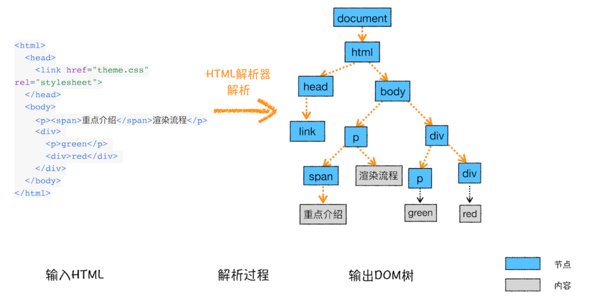

# HTML、CSS和JavaScript，是如何变成页面的？
按照渲染的时间顺序，流水线可分为如下几个子阶段：构建 DOM 树、样式计算、布局阶段、分层、绘制、分块、光栅化和合成。

min： 

1. 渲染进程将 HTML 内容转换为能够读懂的 DOM 树结构。
1. 渲染引擎将 CSS 样式表转化为浏览器可以理解的 styleSheets，计算出 DOM 节点的样式。
1. 创建布局树，并计算元素的布局信息。
1. 对布局树进行分层，并生成分层树。
1. 为每个图层生成绘制列表，并将其提交到合成线程。
1. 合成线程将图层分成图块，并在光栅化线程池中将图块转换成位图。
1. 合成线程发送绘制图块命令 DrawQuad 给浏览器进程。
1. 浏览器进程根据 DrawQuad 消息生成页面，并显示到显示器上。

# 构建DOM树

因为浏览器无法直接理解和使用 HTML，所以需要将 HTML 转换为浏览器能够理解的结构——DOM 树。

# 样式计算（Recalculate Style）

- 当渲染引擎接收到 CSS 文本时，会执行一个转换操作，将 CSS 文本转换为浏览器可以理解的结构——styleSheets。
- 转换样式表中的属性值，使其标准化
- 计算出 DOM 树中每个节点的具体样式（CSS 的继承规则和层叠规则）

# 布局阶段
计算出 DOM 树中可见元素的几何位置，我们把这个计算过程叫做布局。

1. 创建布局树
- 遍历 DOM 树中的所有可见节点，并把这些节点加到布局树中；
- 而不可见的节点会被布局树忽略掉，如 head 标签下面的全部内容，再比如 body.p.span 这个元素，因为它的属性包含 dispaly:none，所以这个元素也没有被包进布局树。
2. 布局计算

 计算每个元素的几何坐标位置，并将这些信息保存在布局树中。

# 分层

1. 特定节点生成专用图层，生成一棵图层树（层叠上下文、Clip，类似 PhotoShop 里的图层）；
1. 拥有层叠上下文属性（明确定位属性、透明属性、CSS 滤镜、z-index 等）的元素会创建单独图层；
1. 没有图层的 DOM 节点属于父节点图层；
1. 需要剪裁的地方也会创建图层。

# 绘制指令

1. 输入：图层树；
1. 渲染引擎对图层树中每个图层进行绘制；
1. 拆分成绘制指令，生成绘制列表，提交到合成线程；
1. 输出：绘制列表。
:::info
**js阻塞渲染的问题** 
JS执行与Paint任务都发生在主线程。
渲染被阻塞的原因：因为Paint任务没有及时执行，即绘制列表没有及时提交给合成线程。
之所以没有及时执行，可能是因为JS执行时间过长，导致这一帧没有时间执行Paint。
参考：[js阻塞渲染](https://segmentfault.com/a/1190000041729574)
:::

# 分块

1. 合成线程会将较大、较长的图层（一屏显示不完，大部分不在视口内）划分为图块（tile, 256_256, 512_512）。

# 光栅化（栅格化）
> 合成线程会按照视口附近的图块来优先生成位图，实际生成位图的操作是由栅格化来执行的。所谓栅格化，是指将图块转换为位图

1. 在光栅化线程池中，将视口附近的图块优先生成位图（栅格化执行该操作）；
1. 快速栅格化：GPU 加速，生成位图（GPU 进程）。

# 合成绘制

1. 绘制图块命令——DrawQuad，提交给浏览器进程；
1. 浏览器进程的 viz 组件，根据DrawQuad命令，绘制在屏幕上。

相关概念

重排

1. 更新了元素的几何属性（如宽、高、边距）；
1. 触发重新布局，解析之后的一系列子阶段；
1. 更新完成的渲染流水线，开销最大。

重绘

1. 更新元素的绘制属性（元素的颜色、背景色、边框等）；
1. 布局阶段不会执行（无几何位置变换），直接进入绘制阶段。

合成

1. 直接进入合成阶段（例如CSS 的 transform 动画）；
1. 直接执行合成阶段，开销最小。

# 减少重排重绘, 方法很多：

1. 使用 class 操作样式，而不是频繁操作 style
1. 避免使用 table 布局
1. 批量dom 操作，例如 createDocumentFragment，或者使用框架，例如 React
1. Debounce window resize 事件
1. 对 dom 属性的读写要分离
1. will-change: transform 做优化
