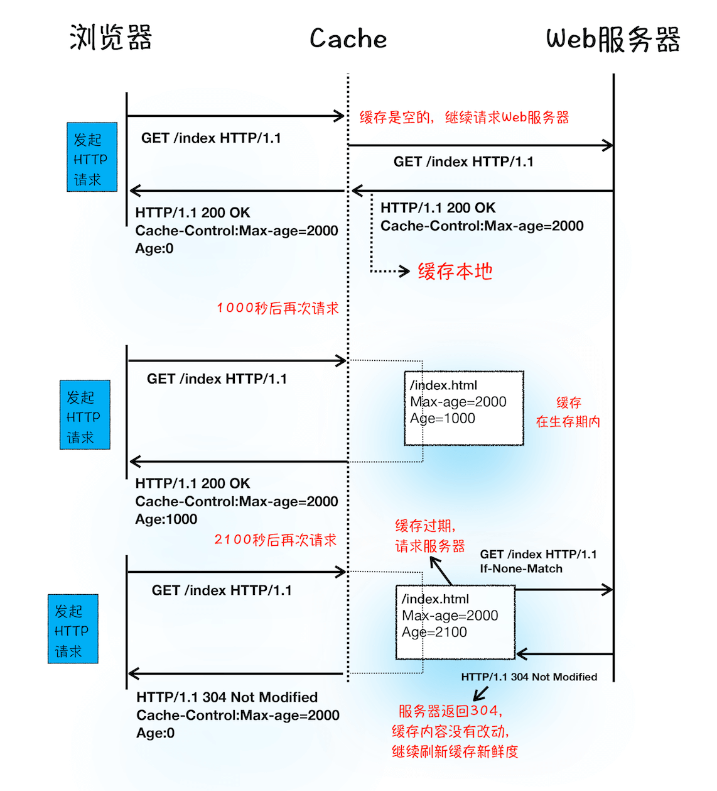
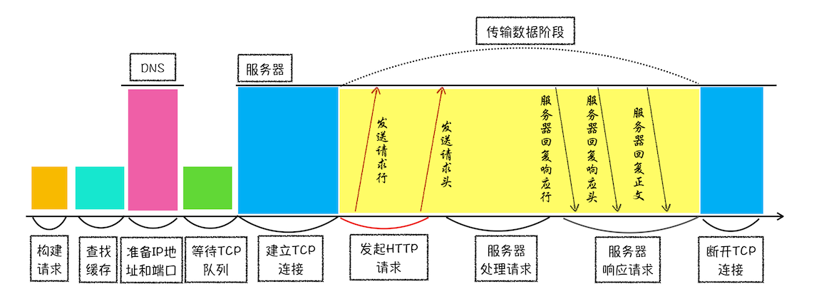

# 作用域链和闭包 ：代码中出现相同的变量，JavaScript引擎是如何选择的？
**DNS 缓存和页面资源缓存**


## 服务器是通过什么方式让浏览器缓存数据的？
当服务器返回 HTTP 响应头给浏览器时，浏览器是通过响应头中的 Cache-Control 字段来设置是否缓存该资源。通常，我们还需要为这个资源设置一个缓存过期时长，而这个时长是通过 Cache-Control 中的 Max-age 参数来设置的，比如上图设置的缓存过期时间是 2000 秒。
```javascript
Cache-Control:Max-age=2000
```
这也就意味着，在该缓存资源还未过期的情况下, 如果再次请求该资源，会直接返回缓存中的资源给浏览器。但如果缓存过期了，浏览器则会继续发起网络请求，并且在 HTTP 请求头中带上：
```javascript
If-None-Match:"4f80f-13c-3a1xb12a"
```
服务器收到请求头后，会根据 If-None-Match 的值来判断请求的资源是否有更新。

- 如果没有更新，就返回 304 状态码，相当于服务器告诉浏览器：“这个缓存可以继续使用，这次就不重复发送数据给你了。”
- 如果资源有更新，服务器就直接返回最新资源给浏览器。

简要来说，很多网站第二次访问能够秒开，是因为这些网站把很多资源都缓存在了本地，浏览器缓存直接使用本地副本来回应请求，而不会产生真实的网络请求，从而节省了时间。同时，DNS 数据也被浏览器缓存了，这又省去了 DNS 查询环节。

## 登录状态是如何保持的？
浏览器在接收到服务器的响应头后，开始解析响应头，如果遇到响应头里含有 Set-Cookie 字段的情况，浏览器就会把这个字段信息保存到本地。比如把UID=3431uad保持到本地。
```javascript
Set-Cookie: UID=3431uad;
```
当用户再次访问时，浏览器会发起 HTTP 请求，但在发起请求之前，浏览器会读取之前保存的 Cookie 数据，并把数据写进请求头里的 Cookie 字段里（如下所示），然后浏览器再将请求头发送给服务器。
```javascript
Cookie: UID=3431uad;
```
服务器在收到 HTTP 请求头数据之后，就会查找请求头里面的“Cookie”字段信息，当查找到包含UID=3431uad的信息时，服务器查询后台，并判断该用户是已登录状态，然后生成含有该用户信息的页面数据，并把生成的数据发送给浏览器。浏览器在接收到该含有当前用户的页面数据后，就可以正确展示用户登录的状态信息了。

## HTTP 请求示意图


从图中可以看到，浏览器中的 HTTP 请求从发起到结束一共经历了如下八个阶段：构建请求、查找缓存、准备 IP 和端口、等待 TCP 队列、建立 TCP 连接、发起 HTTP 请求、服务器处理请求、服务器返回请求和断开连接。


## 问题
1、没有 keep-alive 时，http数据传输完成后，是由浏览器主动发起断开TCP连接，还是由服务器主动发起断开 TCP 连接？<br /> 	一般是浏览器，4次挥手主动发起方需要处理TIME_WAIT 状态，服务器不适合发起

2、设置了 keep-alive 时，当关闭页面时，浏览器会发起断开 TCP 连接吗？如果不关闭页面，浏览器会一直保持这个 TCP 连接吗？<br />进程关闭会清理资源，此时会关闭TCP

3、设置了 keep-alive 时，如果浏览器出现故障时了（挂掉了），此时服务器保持的 TCP 连接多久会释放？     <br />根据你设置的timeout决定 node服务器默认5S

