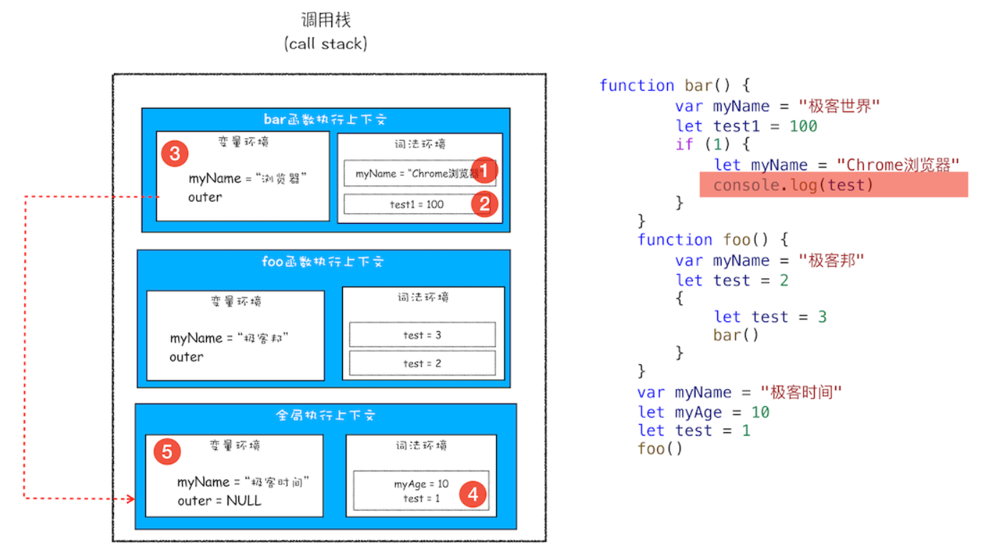
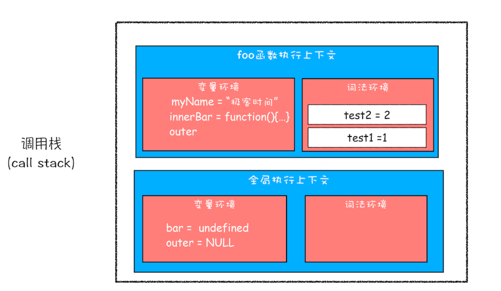
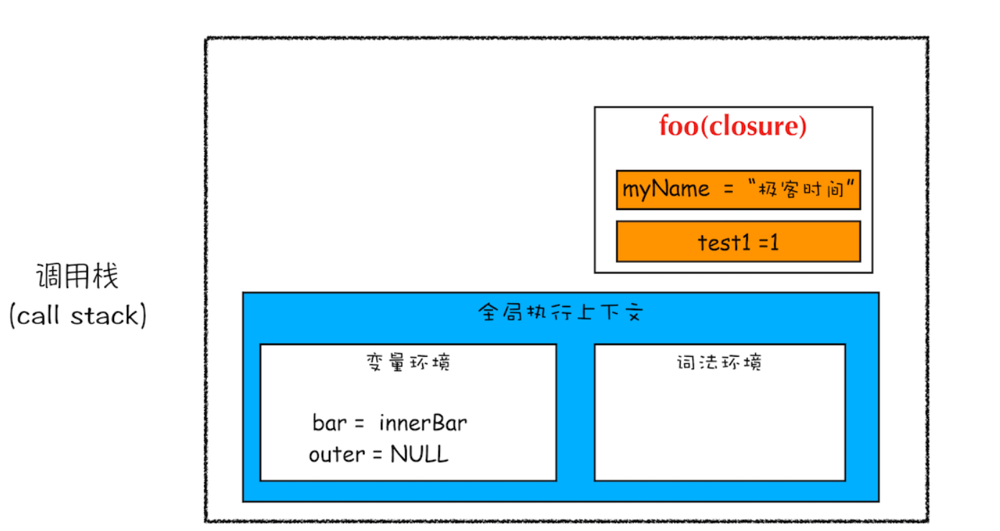
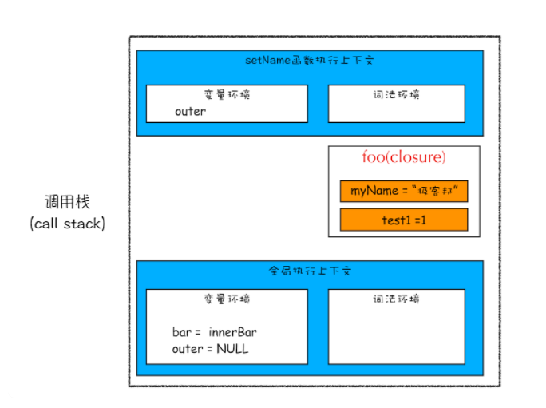
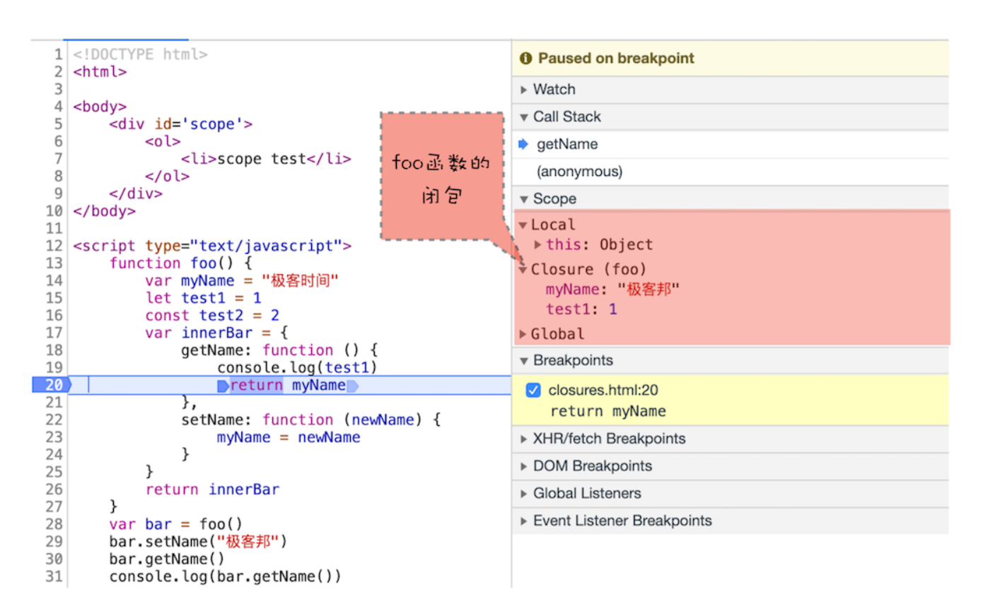

# 作用域链和闭包:代码中出现相同的变量，JavaScript 引擎是如何选择的？

```javascript
function bar() {
  console.log(myName)
}
function foo() {
  var myName = 'bbb'
  bar()
}
var myName = 'aaa'
foo() //aaa
```

# 词法作用域

词法作用域就是指作用域是由代码中**函数声明的位置**来决定的，所以词法作用域是**静态的作用域**，通过它就能够预测代码在执行过程中如何查找标识符。

这是因为根据词法作用域，foo 和 bar 的上级作用域都是全局作用域，所以如果 foo 或者 bar 函数使用了一个它们没有定义的变量，那么它们会到全局作用域去查找。也就是说，词法作用域是代码编译阶段就决定好的，和函数是怎么调用的没有关系。

## 块级作用域中的变量查找

```javascript
function bar() {
  var myName = '极客世界'
  let test1 = 100
  if (1) {
    let myName = 'Chrome浏览器'
    console.log(test)
  }
}
function foo() {
  var myName = '极客邦'
  let test = 2
  {
    let test = 3
    bar()
  }
}
var myName = '极客时间'
let myAge = 10
let test = 1
foo()
```


首先是在 bar 函数的执行上下文中查找，但因为 bar 函数的执行上下文中没有定义 test 变量，所以根据词法作用域的规则，下一步就在 bar 函数的外部作用域中查找，也就是全局作用域。

# 闭包

```javascript
function foo() {
  var myName = '极客时间'
  let test1 = 1
  const test2 = 2
  var innerBar = {
    getName: function () {
      console.log(test1)
      return myName
    },
    setName: function (newName) {
      myName = newName
    },
  }
  return innerBar
}
var bar = foo()
bar.setName('极客邦')
bar.getName()
console.log(bar.getName())
```

首先我们看看当执行到 foo 函数内部的 return innerBar 这行代码时调用栈的情况，你可以参考下图：

从上面的代码可以看出，innerBar 是一个对象，包含了 getName 和 setName 的两个方法（通常我们把对象内部的函数称为方法）。你可以看到，这两个方法都是在 foo 函数内部定义的，并且这两个方法内部都使用了 myName 和 test1 两个变量。

根据词法作用域的规则，内部函数 getName 和 setName 总是可以访问它们的外部函数 foo 中的变量，所以当 innerBar 对象返回给全局变量 bar 时，虽然 foo 函数已经执行结束，但是 getName 和 setName 函数依然可以使用 foo 函数中的变量 myName 和 test1。所以当 foo 函数执行完成之后，其整个调用栈的状态如下图所示：

从上图可以看出，foo 函数执行完成之后，其执行上下文从栈顶弹出了，但是由于返回的 setName 和 getName 方法中使用了 foo 函数内部的变量 myName 和 test1，所以这两个变量依然保存在内存中。这像极了 setName 和 getName 方法背的一个专属背包，无论在哪里调用了 setName 和 getName 方法，它们都会背着这个 foo 函数的专属背包。

之所以是专属背包，是因为除了 setName 和 getName 函数之外，其他任何地方都是无法访问该背包的，我们就可以把这个背包称为 foo 函数的闭包。

好了，现在我们终于可以给闭包一个正式的定义了。**在 JavaScript 中，根据词法作用域的规则，内部函数总是可以访问其外部函数中声明的变量，当通过调用一个外部函数返回一个内部函数后，即使该外部函数已经执行结束了，但是内部函数引用外部函数的变量依然保存在内存中，我们就把这些变量的集合称为闭包。比如外部函数是 foo，那么这些变量的集合就称为 foo 函数的闭包。**

那这些闭包是如何使用的呢？当执行到 bar.setName 方法中的 myName = "极客邦"这句代码时，JavaScript 引擎会沿着“当前执行上下文–>foo 函数闭包–> 全局执行上下文”的顺序来查找 myName 变量，你可以参考下面的调用栈状态图：

从图中可以看出，setName 的执行上下文中没有 myName 变量，foo 函数的闭包中包含了变量 myName，所以调用 setName 时，会修改 foo 闭包中的 myName 变量的值。

同样的流程，当调用 bar.getName 的时候，所访问的变量 myName 也是位于 foo 函数闭包中的。

你也可以通过“开发者工具”来看看闭包的情况，打开 Chrome 的“开发者工具”，在 bar 函数任意地方打上断点，然后刷新页面，可以看到如下内容：


从图中可以看出来，当调用 bar.getName 的时候，右边 Scope 项就体现出了作用域链的情况：Local 就是当前的 getName 函数的作用域，Closure(foo) 是指 foo 函数的闭包，最下面的 Global 就是指全局作用域，从“Local–>Closure(foo)–>Global”就是一个完整的作用域链。

# 闭包是怎么回收的

通常，如果引用闭包的函数是一个全局变量，那么闭包会一直存在直到页面关闭；但如果这个闭包以后不再使用的话，就会造成内存泄漏。

如果引用闭包的函数是个局部变量，等函数销毁后，在下次 JavaScript 引擎执行垃圾回收时，判断闭包这块内容如果已经不再被使用了，那么 JavaScript 引擎的垃圾回收器就会回收这块内存。

所以在使用闭包的时候，你要尽量注意一个原则：如果该闭包会一直使用，那么它可以作为全局变量而存在；但如果使用频率不高，而且占用内存又比较大的话，那就尽量让它成为一个局部变量。

# 思考题

```javascript
var bar = {
  myName: 'aaa',
  printName: function () {
    console.log(myName)
  },
}
function foo() {
  let myName = 'bbb'
  return bar.printName
}
let myName = 'ccc'
let _printName = foo()
_printName()
bar.printName()
```

两个都是 ccc

bar 不是一个函数，因此 bar 当中的 printName 其实是一个全局声明的函数，bar 当中的 myName 只是对象的一个属性，也和 printName 没有联系，如果要产生联系，需要使用 this 关键字，表示这里的 myName 是对象的一个属性，不然的话，printName 会通过词法作用域链去到其声明的环境，也就是全局，去找 myName<br /> foo 函数返回的 printName 是全局声明的函数，因此和 foo 当中定义的变量也没有任何联系，这个时候 foo 函数返回 printName 并不会产生闭包

这道题其实是个障眼法，只需要确定好函数调用栈就可以很轻松的解答，调用了 foo()后，返回的是 bar.printName，后续就跟 foo 函数没有关系了，所以结果就是调用了两次 bar.printName()，根据词法作用域，结果都是“极客邦”，也不会形成闭包。 闭包还可以这样理解：当函数嵌套时，内层函数引用了外层函数作用域下的变量，并且内层函数在全局作用域下可访问时，就形成了闭包。
