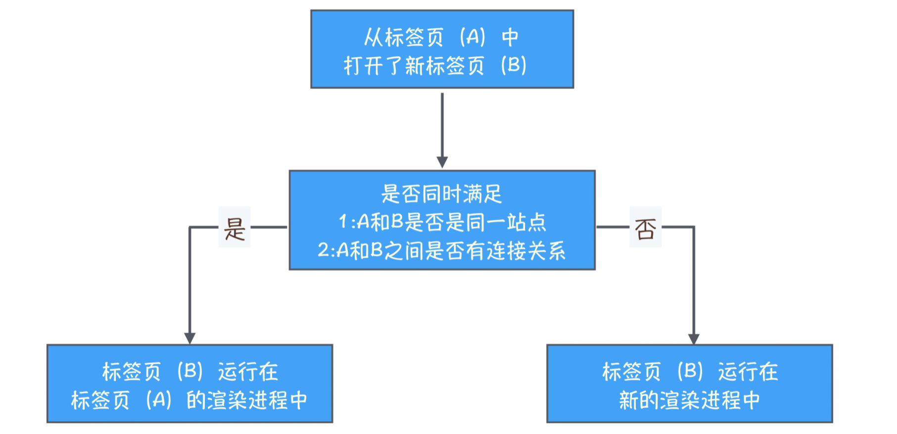
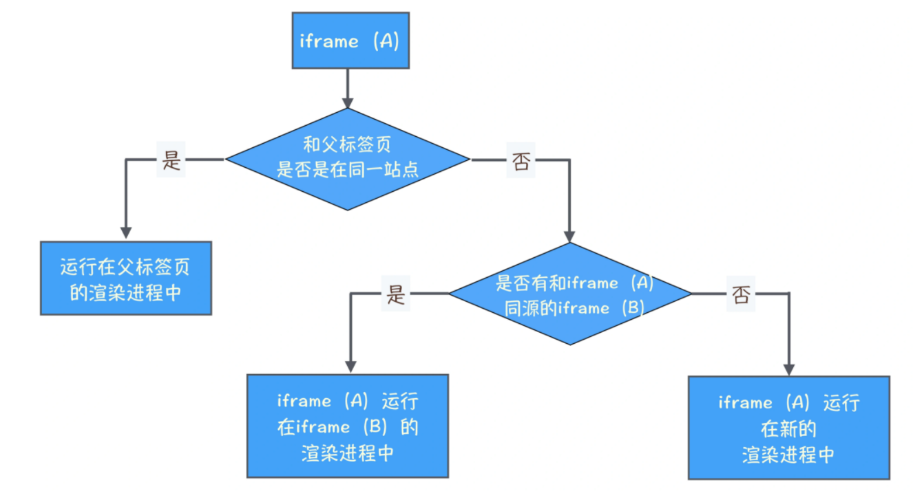

# 浏览上下文组：如何计算 Chrome 中渲染进程的个数？

- 通过`<a>` 标签来和新标签建立连接
- 通过 JavaScript 中的 window.open 方法来和新标签页建立连接

通过上述两种方式打开的新标签页，不论这两个标签页是否属于同一站点，他们之间都能通过 opener 来建立连接，所以他们之间是有联系的。在 WhatWG 规范中，把这一类具有相互连接关系的标签页称为**浏览上下文组 **( browsing context group)。

> 既然提到浏览上下文组，就有必要提下浏览上下文，通常情况下，我们把一个标签页所包含的内容，诸如 window 对象，历史记录，滚动条位置等信息称为浏览上下文。这些通过脚本相互连接起来的浏览上下文就是浏览上下文组。如果你有兴趣，可以参开下规范文档。

**Chrome 浏览器会将浏览上下文组中属于同一站点的标签分配到同一个渲染进程中**


- 如果两个标签页都位于同一个浏览上下文组，且属于同一站点，那么这两个标签页会被浏览器分配到同一个渲染进程中。
- 如果这两个条件不能同时满足，那么这两个标签页会分别使用不同的渲染进程来渲染。

**例外：**<br />a 链接的 rel 属性值使用了 noopener 和 noreferrer

将 noopener 的值引入 rel 属性中，就是告诉浏览器通过这个链接打开的标签页中的 opener 值设置为 null，引入 noreferrer 是告诉浏览器，新打开的标签页不要有引用关系。

**站点隔离**


**Chrome 为什么使用同一站点划分渲染进程，而不是使用同源策略来划分渲染进程？**

> 我们将“同一站点”定义为根域名（例如，baolingq.org）加上协议（例如，https:// 或者 http://），还包含了该根域名下的所有子域名和不同的端口，比如下面这三个：

```javascript
https://byte.bowlingq.org
https://www.bowlingq.org
https://www.bowlingq.org:8080
```

> 同源要求协议、域名以及端口均一样才行；同一站点只要求协议，根域名相同即可

答：<br />**通常同一站点安全性是有保障的**<br />**同源要求太高**
