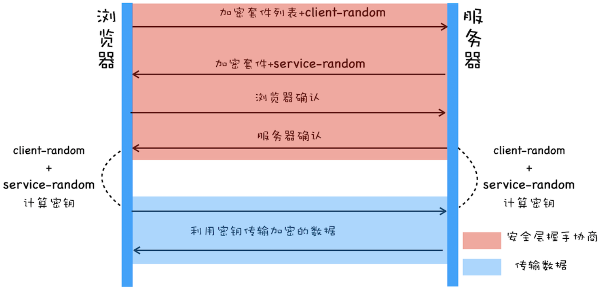
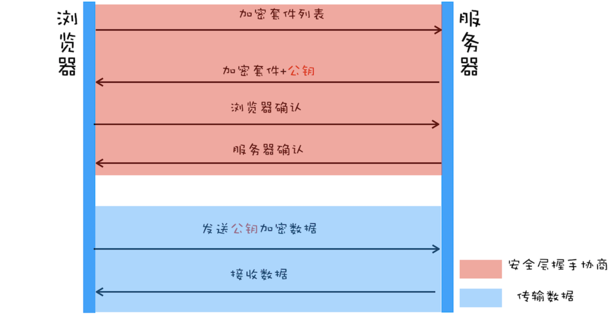

# HTTPS
# 对称加密
1. 浏览器向服务器发送加密套件列表 、client-random
1. 服务器返回加密套件、serve-random
1. 浏览器向服务器发送确认。

两者用 client random、serve random 和相同加密方法生成密钥。 由于可被外界拦截，所以不安全

## 非对称加密

1. 浏览器向服务器发送加密套件列表
1. 服务器返回加密套件、公钥

浏览器发送的信息通过公钥加密 服务器通过私钥解密 缺点: 一个效率低 二是无法保证服务器发送到浏览器的数据安全

# 对称+非对称加密

1. 首先浏览器向服务器发送 `**加密套件列表**`、和随机数 `**client-random**`；
1. 服务器保存随机数 `**client-random**`，选择加密的套件，然后生成随机数 `**service-random**`，向浏览器发送选择的加密套件、`**service-random**` 和**公钥**；
1. 浏览器保存公钥，并生成随机数 `**pre-master**`，然后利用公钥对 pre-master 加密，并向服务器发送加密后的数据；
1. 最后服务器拿出自己的私钥，解密出 `**pre-master**` 数据，并返回确认消息。

服务器和浏览器就有了共同的 `**client-random**`、`**service-random**` 和 `**pre-master**`，然后服务器和浏览器会使用这三组随机数生成对称密钥

DNS劫持 如何保证服务器是可信的

# 数字证书
相较于第三版的 HTTPS 协议，这里主要有两点改变：

1. 服务器没有直接返回公钥给浏览器，而是返回了数字证书，而公钥正是包含在数字证书中的；
1. 在浏览器端多了一个证书验证的操作，验证了证书之后，才继续后续流程。
