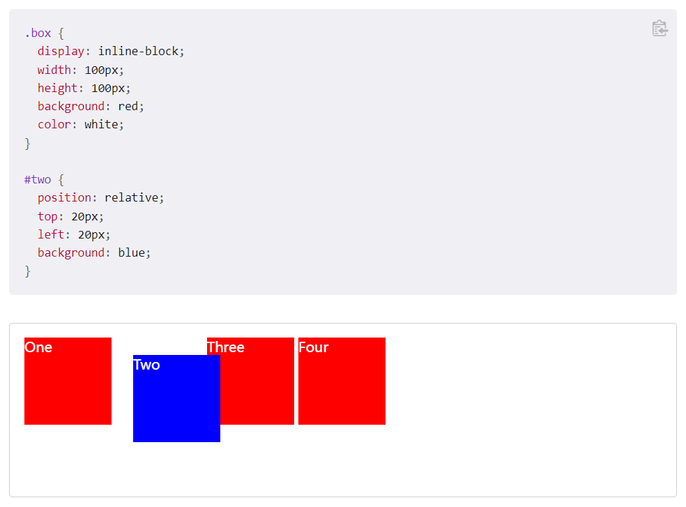
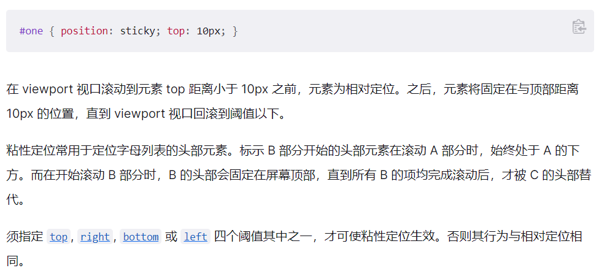

# 定位

> static [|](https://developer.mozilla.org/zh-CN/docs/Web/CSS/Value_definition_syntax#single_bar) relative [|](https://developer.mozilla.org/zh-CN/docs/Web/CSS/Value_definition_syntax#single_bar) absolute [|](https://developer.mozilla.org/zh-CN/docs/Web/CSS/Value_definition_syntax#single_bar) sticky [|](https://developer.mozilla.org/zh-CN/docs/Web/CSS/Value_definition_syntax#single_bar) fixed

# static

该关键字指定元素使用正常的布局行为，即元素在文档常规流中当前的布局位置。此时 top, right, bottom, left 和 z-index 属性无效。

# relative

该关键字下，元素先放置在未添加定位时的位置，再在不改变页面布局的前提下调整元素位置（因此会在此元素未添加定位时所在位置留下空白）。position:relative 对 table-\*-group, table-row, table-column, table-cell, table-caption 元素无效。

# absolute

元素会被移出正常文档流，并不为元素预留空间，通过指定元素相对于最近的非 static 定位祖先元素的偏移，来确定元素位置。绝对定位的元素可以设置外边距（margins），且不会与其他边距合并。

# fixed

元素会被移出正常文档流，并不为元素预留空间，而是通过指定元素相对于屏幕视口（viewport）的位置来指定元素位置。元素的位置在屏幕滚动时不会改变。打印时，元素会出现在的每页的固定位置。fixed 属性会创建新的层叠上下文。当元素祖先的 transform, perspective 或 filter 属性非 none 时，容器由视口改为该祖先。

# sticky

元素根据正常文档流进行定位，然后相对它的*最近滚动祖先（nearest scrolling ancestor）*和 [containing block](https://developer.mozilla.org/en-US/docs/Web/CSS/Containing_block) (最近块级祖先 nearest block-level ancestor)，包括 table-related 元素，基于 top, right, bottom, 和 left 的值进行偏移。偏移值不会影响任何其他元素的位置。 该值总是创建一个新的[层叠上下文（stacking context](https://developer.mozilla.org/en/docs/Web/CSS/CSS_Positioning/Understanding_z_index/The_stacking_context)）。注意，一个 sticky 元素会“固定”在离它最近的一个拥有“滚动机制”的祖先上（当该祖先的 overflow 是 hidden, scroll, auto, 或 overlay 时），即便这个祖先不是最近的真实可滚动祖先。这有效地抑制了任何“sticky”行为（详情见[Github issue on W3C CSSWG](https://github.com/w3c/csswg-drafts/issues/865)）。

粘性定位可以被认为是相对定位和固定定位的混合。元素在跨越特定阈值前为相对定位，之后为固定定位。例如：

