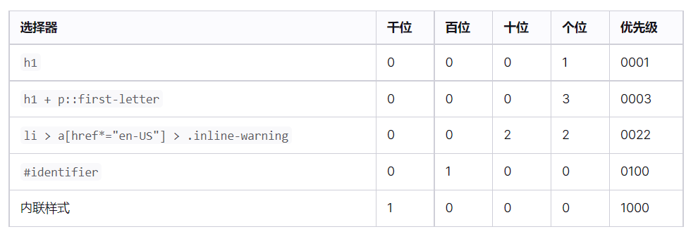

# 层叠与继承、优先级
[层叠与继承、优先级](https://developer.mozilla.org/zh-CN/docs/Learn/CSS/Building_blocks/Cascade_and_inheritance)

## [理解层叠](https://developer.mozilla.org/zh-CN/docs/Learn/CSS/Building_blocks/Cascade_and_inheritance#%E7%90%86%E8%A7%A3%E5%B1%82%E5%8F%A0)
层叠如何定义在不止一个元素的时候怎么应用css规则。 有三个因素需要考虑，根据重要性排序如下，前面的更重要：

1. 重要程度（h1  <  .h1）
1. 优先级
1. 资源顺序

一个选择器的优先级可以说是由四个部分相加 (分量)，可以认为是个十百千 — 四位数的四个位数：

1. **千位**： 如果声明在 [style](https://developer.mozilla.org/zh-CN/docs/Web/HTML/Global_attributes#attr-style) 的属性（内联样式）则该位得一分。这样的声明没有选择器，所以它得
1. 分总是1000。
1. **百位**： 选择器中包含ID选择器则该位得一分。
1. **十位**： 选择器中包含类选择器、属性选择器或者伪类则该位得一分。
1. **个位**：选择器中包含元素、伪元素选择器则该位得一分。

> 从0开始，一个行内样式+1000，一个id选择器+100，一个属性选择器、class或者伪类+10，一个元素选择器，或者伪元素+1，通配符+0

### [!important](https://developer.mozilla.org/zh-CN/docs/Learn/CSS/Building_blocks/Cascade_and_inheritance#!important)
有一个特殊的 CSS 可以用来覆盖所有上面所有优先级计算，不过需要很小心的使用 — !important。用于修改特定属性的值， 能够覆盖普通规则的层叠。

