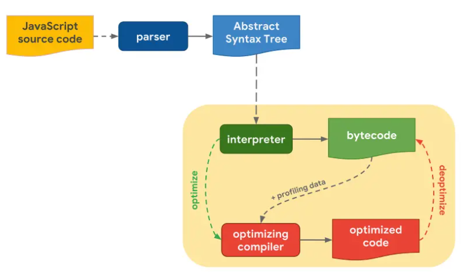
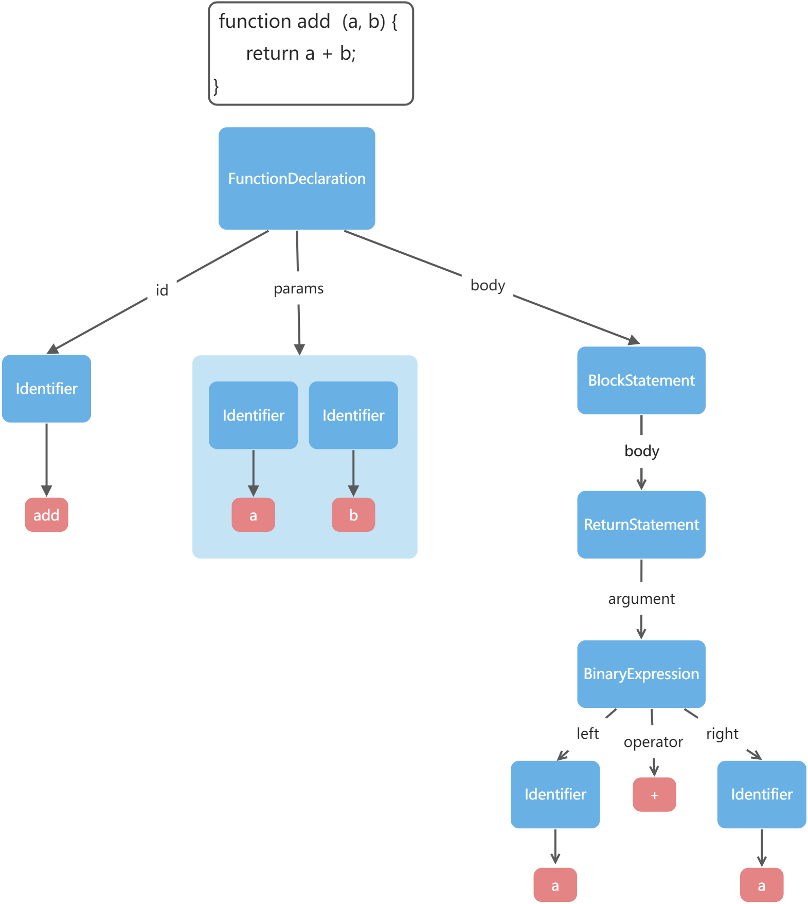
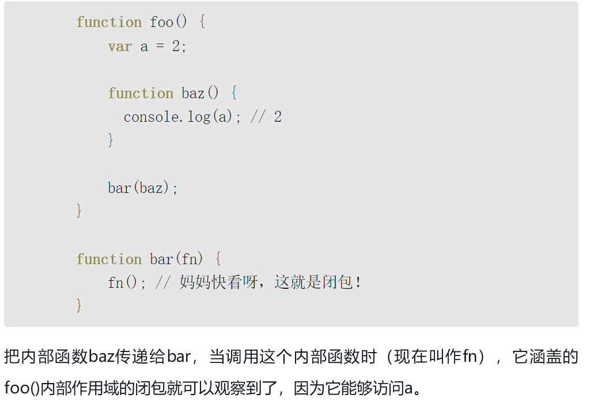

# babel 实现 js 解释器

> 通过本文基于 babel，利用“js 解释 js”，可以帮助你更好的理解 JavaScript 运行过程，也可以举一反三，手写一个 babel 插件。

## 前言

看了简介你可能会有一个疑问：怎么感觉 js 可以解释自己了。。。

其实 tsc 就是 ts 写的么，自己编译自己，这种叫做自举。 js 解释器一般都是用 c++ 写，那样的话所有的 js 特性都要用 c ++ 实现，用 js 解释 js 则不用实现函数上下文、闭包、对象的内容分配、原型链等等 。 而且一般的解释器都会先转成字节码，然后解释执行字节码，解释执行 AST 的解释器少一些。我们直接解释执行 AST 是为了简单，方便理解。

如果你对 babel 不是很了解，建议先学习一下 babel

## v8 的编译流程



1. 将 Javascript 代码解析为 ATS（抽象语法树）。
1. 基于 AST， 解释器（interpreter ）将 AST 转化为字节码（bytecode），这一步 js 引擎实际上已经在执行 js 代码了。
1. 为了进一步的优化，优化编译器（optimizing compiler）将热点函数优化编译为机器指令（machine code）执行。
1. 如果优化假设失败，优化编译器会将机器码回退到字节码。

不过最早的 V8 是没有字节码的，就是直接解释执行 AST：<br />
这种直接解释执行 AST 的解释器叫做 tree walker 解释器，这一节，我们来实现一下这种 js 解释器。

## 思路分析

当 parser 把 源码 parse 成 AST 之后，其实已经能够拿到源码的各部分信息了，比如

```javascript
function add(a, b) {
  return a + b
}
```

对应的 AST 是这样的,AST 将与本文无关的部分进行了删除精简，具体的 AST 可在该网站进行查看[astexplorer](https://astexplorer.net/)


```json
{
  "type": "File",
  "program": {
    "type": "Program",
    "sourceType": "module",
    "body": [
      {
        "type": "FunctionDeclaration",
        "id": {
          "type": "Identifier",
          "name": "add"
        },
        "params": [
          {
            "type": "Identifier",
            "name": "a"
          },
          {
            "type": "Identifier",
            "name": "b"
          }
        ],
        "body": {
          "type": "BlockStatement",
          "body": [
            {
              "type": "ReturnStatement",
              "argument": {
                "type": "BinaryExpression",
                "left": {
                  "type": "Identifier",
                  "name": "a"
                },
                "operator": "+",
                "right": {
                  "type": "Identifier",
                  "name": "b"
                }
              }
            }
          ]
        }
      }
    ]
  }
}
```

## 代码实现

先搭建一个基本的结构

```javascript
const parser = require('@babel/parser')
//高亮输出库
const { codeFrameColumns } = require('@babel/code-frame')
//颜色打印库
const chalk = require('chalk')

const sourceCode = `
   const  a = 2;
   function add(a, b) {
      return a + b;
   }
   console.log(add(1, 2));
`
/*parser 需要指定代码是不是包含 import、export 等，
  需要设置 moduleType 为 module 或者 script，
  我们干脆设置为 unambiguous，让它根据内容是否包含 
  import、export 来自动设置 moduleType。
*/
const ast = parser.parse(sourceCode, {
  sourceType: 'unambiguous',
})

/*
要支持函数调用，首先要支持作用域链，
因为函数执行会生成一个新的作用域，并且会按照作用域链查找变量。
*/
//定义作用域
class Scope {
  constructor(parentScope) {
    this.parent = parentScope
    this.declarations = []
  }

  set(name, value) {
    this.declarations[name] = value
  }

  getLocal(name) {
    return this.declarations[name]
  }

  get(name) {
    let res = this.getLocal(name)
    if (res === undefined && this.parent) {
      res = this.parent.get(name)
    }
    return res
  }

  has(name) {
    return !!this.getLocal(name)
  }
}

function getIdentifierValue(node, scope) {
  if (node.type === 'Identifier') {
    return scope.get(node.name)
  } else {
    return evaluate(node, scope)
  }
}

const evaluator = (function () {
  const astInterpreters = {
    Program(node, scope) {
      node.body.forEach((item) => {
        evaluate(item, scope)
      })
    },
    VariableDeclaration(node, scope) {},
    VariableDeclarator(node, scope) {},
    ExpressionStatement(node, scope) {},
    MemberExpression(node, scope) {},
    FunctionDeclaration(node, scope) {},
    ReturnStatement(node, scope) {},
    BlockStatement(node, scope) {},
    CallExpression(node, scope) {},
    BinaryExpression(node, scope) {},
    Identifier(node) {},
    NumericLiteral(node) {},
  }

  const evaluate = (node, scope) => {
    try {
      return astInterpreters[node.type](node, scope)
    } catch (e) {
      if (
        e &&
        e.message &&
        e.message.indexOf('astInterpreters[node.type] is not a function') != -1
      ) {
        console.error('unsupported ast type: ' + node.type)
        console.error(
          codeFrameColumns(sourceCode, node.loc, {
            highlightCode: true,
          })
        )
      } else {
        console.error(node.type + ':', e.message)
        console.error(
          codeFrameColumns(sourceCode, node.loc, {
            highlightCode: true,
          })
        )
      }
    }
  }
  return {
    evaluate,
  }
})()

const globalScope = new Scope()
globalScope.set('console', {
  log: function (...args) {
    console.log(chalk.green(...args))
  },
  error: function (...args) {
    console.log(chalk.red(...args))
  },
  error: function (...args) {
    console.log(chalk.orange(...args))
  },
})
evaluator.evaluate(ast.program, globalScope)
```

作用域 **Scope** ，有 `declarations` 属性，代表这个 scope 中声明的变量，并且还有 `parentScope` 属性指向父 **scope**，通过 `set` 方法在作用域中声明变量，通过 `getLocal` 查找本作用域的变量，通过 `get` 方法支持按照作用域链不断向上查找变量。

---

AST 解释器 **evaluator**，从根节点来执行，最外层是 `File` 节点，取 `program` 属性，`Program` 有 `body` 属性，是 AST 的数组，遍历执行。如果有不支持的节点类型，通过 **code frame** 来打印 AST 对应的代码，并且提示不支持。

创建一个全局作用域传入每个 evaluate 方法，用于作用域中变量的声明和取值。<br />在 **astInterpreters** 添加了 **VariableDeclarator 等**节点的支持

## 完整代码

```javascript
const parser = require('@babel/parser')
const { codeFrameColumns } = require('@babel/code-frame')
const chalk = require('chalk')

const sourceCode = `
   const  a = 2;
   function add(a, b) {
        return a + b;
   }
   console.log(add(1, 2));
`

const ast = parser.parse(sourceCode, {
  sourceType: 'unambiguous',
})

class Scope {
  constructor(parentScope) {
    this.parent = parentScope
    this.declarations = []
  }

  set(name, value) {
    this.declarations[name] = value
  }

  getLocal(name) {
    return this.declarations[name]
  }

  get(name) {
    let res = this.getLocal(name)
    if (res === undefined && this.parent) {
      res = this.parent.get(name)
    }
    return res
  }

  has(name) {
    return !!this.getLocal(name)
  }
}

function getIdentifierValue(node, scope) {
  if (node.type === 'Identifier') {
    return scope.get(node.name)
  } else {
    return evaluate(node, scope)
  }
}

const evaluator = (function () {
  const astInterpreters = {
    Program(node, scope) {
      node.body.forEach((item) => {
        evaluate(item, scope)
      })
    },
    //const  a = 2;
    VariableDeclaration(node, scope) {
      node.declarations.forEach((item) => {
        evaluate(item, scope)
      })
    },
    //a = 2;
    VariableDeclarator(node, scope) {
      const declareName = evaluate(node.id)
      if (scope.get(declareName)) {
        throw Error('duplicate declare variable：' + declareName)
      } else {
        scope.set(declareName, evaluate(node.init, scope))
      }
    },
    //console.log(add(1, 2))
    ExpressionStatement(node, scope) {
      return evaluate(node.expression, scope)
    },

    MemberExpression(node, scope) {
      const obj = scope.get(evaluate(node.object))
      return obj[evaluate(node.property)]
    },
    // function add(a, b) {
    //     return a + b;
    // }
    FunctionDeclaration(node, scope) {
      const declareName = evaluate(node.id) //add
      if (scope.get(declareName)) {
        throw Error('duplicate declare variable：' + declareName)
      } else {
        //将add添加到作用域中，当函数执行时内部作用域产生
        //闭包：内部函数对外部词法作用域的引用，编译时产生
        scope.set(declareName, function (...args) {
          const funcScope = new Scope()
          funcScope.parent = scope
          node.params.forEach((item, index) => {
            funcScope.set(item.name, args[index])
          })
          funcScope.set('this', this)
          return evaluate(node.body, funcScope)
        })
      }
    },
    ReturnStatement(node, scope) {
      return evaluate(node.argument, scope)
    },
    BlockStatement(node, scope) {
      for (let i = 0; i < node.body.length; i++) {
        if (node.body[i].type === 'ReturnStatement') {
          return evaluate(node.body[i], scope)
        }
        evaluate(node.body[i], scope)
      }
    },
    CallExpression(node, scope) {
      const args = node.arguments.map((item) => {
        if (item.type === 'Identifier') {
          return scope.get(item.name)
        }
        return evaluate(item, scope)
      })
      if (node.callee.type === 'MemberExpression') {
        const fn = evaluate(node.callee, scope)
        const objName = evaluate(node.callee.object, scope)
        const obj = scope.get(objName)
        return fn.apply(obj, args)
      } else {
        const fn = scope.get(evaluate(node.callee, scope))
        return fn.apply(null, args)
      }
    },
    //a+b
    BinaryExpression(node, scope) {
      const leftValue = getIdentifierValue(node.left, scope)
      const rightValue = getIdentifierValue(node.right, scope)
      switch (node.operator) {
        case '+':
          return leftValue + rightValue
        case '-':
          return leftValue - rightValue
        case '*':
          return leftValue * rightValue
        case '/':
          return leftValue / rightValue
        default:
          throw Error('upsupported operator：' + node.operator)
      }
    },
    Identifier(node) {
      return node.name
    },
    NumericLiteral(node) {
      return node.value
    },
  }

  const evaluate = (node, scope) => {
    try {
      return astInterpreters[node.type](node, scope)
    } catch (e) {
      if (
        e &&
        e.message &&
        e.message.indexOf('astInterpreters[node.type] is not a function') != -1
      ) {
        console.error('unsupported ast type: ' + node.type)
        console.error(
          codeFrameColumns(sourceCode, node.loc, {
            highlightCode: true,
          })
        )
      } else {
        console.error(node.type + ':', e.message)
        console.error(
          codeFrameColumns(sourceCode, node.loc, {
            highlightCode: true,
          })
        )
      }
    }
  }
  return {
    evaluate,
  }
})()

const globalScope = new Scope()
globalScope.set('console', {
  log: function (...args) {
    console.log(chalk.green(...args))
  },
  error: function (...args) {
    console.log(chalk.red(...args))
  },
  error: function (...args) {
    console.log(chalk.orange(...args))
  },
})
evaluator.evaluate(ast.program, globalScope)

// console.log(globalScope);
```

## 运行结果


## 题外话

可以用该代码走一下解释器，更好理解闭包



## 总结

v8 最早的实现方式也是直接解释执行 AST，但是现在多了一层，会先转成字节码，然后再解释执行。但是解释执行的思路和 AST 的方式类似。

我们是用 js 解释的 js，所以 funciton 的 apply 方法、全局 api 等都可以直接用，实际上一般 js 引擎都是 c++ 写的，没有这些东西，所有的都要自己去实现，包括内存分配（堆、调用栈）、全局 api 等。

希望本文能够让你对解释器的实现有所理解。

[后续完善可参考](https://github.com/jrainlau/canjs)
