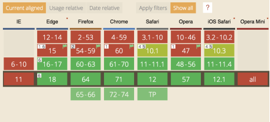
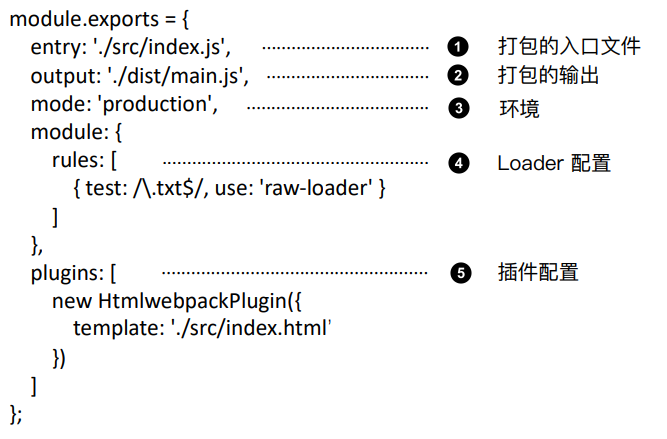
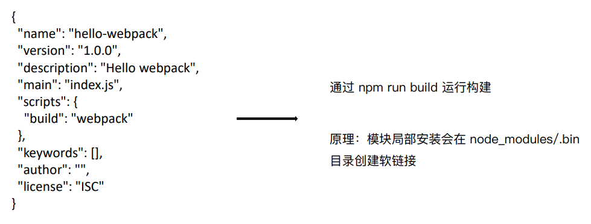
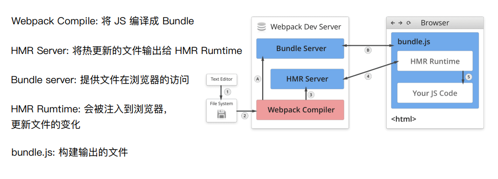
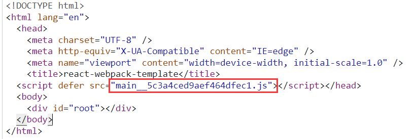
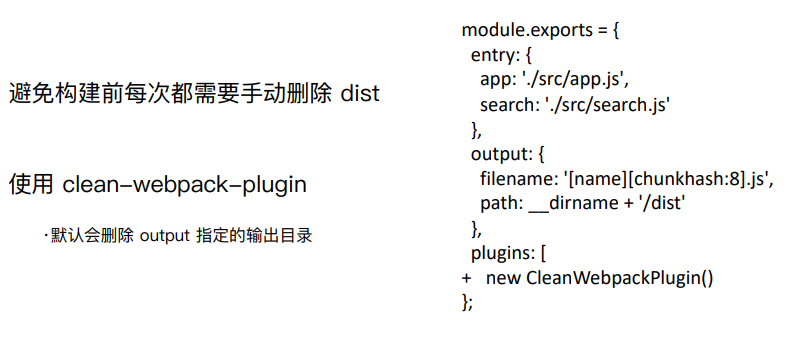
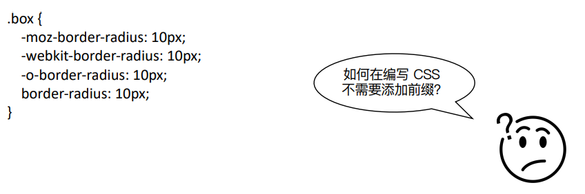
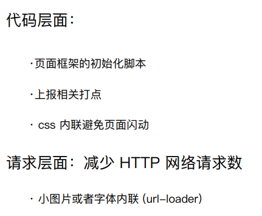
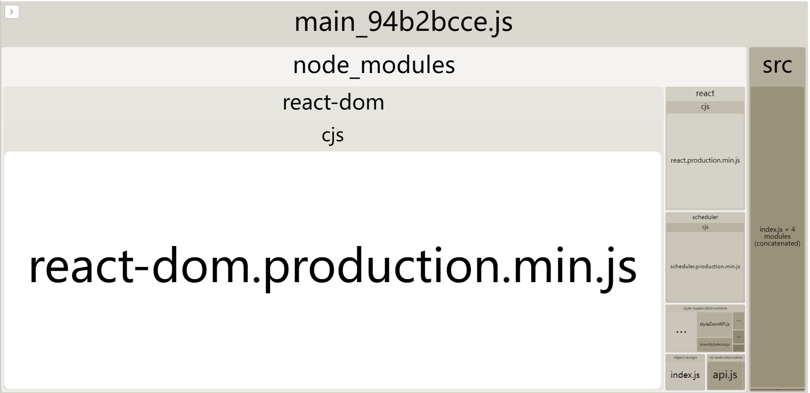

# webpack 历史

## 构建工具的作用

主流浏览器 ES6 module 支持情况


- 转换 ES6 语法
- 转换 JSX 、VUE
- CSS 预处理器 / 前缀补全
- 压缩混淆
- 图片压缩

## webpack 配置文件

webpack 默认配置文件 webpack.config.js<br />通过 webpack --config 指定配置文件


## 环境搭建

```javascript
mkdir my-webpack-project
cd my-webpack-project
npm -y

npm i webpack webpack-cli --save-dev
```

## 运行



# webpack 基础

## entry

entry 用来指定 webpack 打包入口

### 用法

单入口：entry 是一个字符串

```javascript
moule.exports = {
  entry: './src/index.js',
}
```

多入口：entry 是个对象

```javascript
moule.exports = {
  entry: {
    app: './src/index.js',
    admin: './src/admin.js',
  },
}
```

## output

output 用来告诉 webpack 如何将编译后的文件输出到磁盘

### 单入口配置

```javascript
module.exports = {
  entry: './src/index.js',
  output: {
    path: path.join(__dirname, 'dist'),
    filename: 'bundle.js',
  },
}
```

### 多入口配置

通过占位符确保文件名的唯一

```javascript
module.exports = {
  entry: './src/index.js',
  output: {
    path: path.join(__dirname, 'dist'),
    filename: '[name].js',
  },
}
```

## loader

webpack 开箱即用只支持 JS 和 JSON 两种文件类型，通过 Loaders 去支持其它文 件类型并且把它们转化成有效的模块，并且可以添加到依赖图中。 本身是一个函数，接受源文件作为参数，返回转换的结果。

### 常见的 loader

| 名称          | 描述                       |
| ------------- | -------------------------- |
| babel-loader  | 转换 ES6、ES7 等 JS 新语法 |
| style-loader  | 将 css 加到 style 标签内   |
| css-loader    | 支持 .css 文件的加载和解析 |
| less-loader   | 将 less 文件转换成 css     |
| ts-loader     | 将 TS 转换成 JS            |
| file-loader   | 进行图片、字体的打包       |
| raw-loader    | 将文件以字符串的形式导入   |
| thread-loader | 多进程打包 JS 和 CSS       |

### loader 的用法

```javascript
module.exports = {
  entry: './src/index.tsx',
  output: {
    path: path.join(__dirname, 'dist'),
    filename: 'bundle.js',
  },
  module: {
    rules: [
      {
        test: /\.css$/,
        use: ['style-loader', 'css-loader'],
      },
      {
        test: /\.less$/,
        use: ['style-loader', 'css-loader', 'less-loader'],
      },
      { test: /\.(js|jsx)$/, loader: 'babel-loader', exclude: /node_modules/ },
      { test: /\.(ts|tsx)$/, loader: 'ts-loader', exclude: /node_modules/ },
    ],
  },
}
```

> exclude: /node_modules/ 排除 node_modules 的文件

### webpack asset module

[资源模块](https://webpack.docschina.org/guides/asset-modules/#inlining-assets)(asset module)是一种模块类型，它允许使用资源文件（字体，图标等）而无需配置额外 loader。<br />在 webpack 5 之前，通常使用：

- [raw-loader](https://v4.webpack.js.org/loaders/raw-loader/) 将文件导入为字符串
- [url-loader](https://v4.webpack.js.org/loaders/url-loader/) 将文件作为 data URI 内联到 bundle 中
- [file-loader](https://v4.webpack.js.org/loaders/file-loader/) 将文件发送到输出目录

资源模块类型(asset module type)，通过添加 4 种新的模块类型，来替换所有这些 loader：

- asset/resource 发送一个单独的文件并导出 URL。之前通过使用 file-loader 实现。
- asset/inline 导出一个资源的 data URI。之前通过使用 url-loader 实现。
- asset/source 导出资源的源代码。之前通过使用 raw-loader 实现。
- asset 在导出一个 data URI 和发送一个单独的文件之间自动选择。之前通过使用 url-loader，并且配置资源体积限制实现。

当在 webpack 5 中使用旧的 assets loader（如 file-loader/url-loader/raw-loader 等）和 asset 模块时，你可能想停止当前 asset 模块的处理，并再次启动处理，这可能会导致 asset 重复，你可以通过将 asset 模块的类型设置为 'javascript/auto' 来解决。

```javascript
{
  test: /.(woff|woff2|eot|ttf|otf)$/,
    type:'asset/resource'
},
 {
   test: /\.(png|svg|jpg|gif)$/,
   type:'asset',
   parser: {
        dataUrlCondition: {
          maxSize: 10 * 1024 // 100kb
        }
   }
},
```

## plugins

插件用于 bundle 文件的优化，资源管理和环境变量注入<br />作用于整个构建过程

| 名称                     | 描述                                                                  |
| ------------------------ | --------------------------------------------------------------------- |
| HtmlWebpackPlugin        | 创建 html 标签 去承载输出的 bundle                                    |
| CleanWebpackPlugin       | 清理构建目录                                                          |
| CommonsChunkPlugin       | 将 chunks 相同的模块代码提取成公共 js 将块相同的模块代码提取成公共 js |
| ExtractTextWebpackPlugin | 将 css 从 bunlde 文件里提取成一个独立的 css 文件                      |
| uglifyjsWebpackPlugin    | 压缩 JS                                                               |

### 用法

```javascript
module.exports = {
  entry: './src/index.js',
  mode: 'production',
  output: {
    filename: 'bundle.js',
  },
  plugins: [new HtmlWebpackPlugin()],
}
```

## mode

Mode ⽤来指定当前的构建环境是：production、development 还是 none <br />设置 mode 可以使⽤ webpack 内置的函数，默认值为 production

mode 的内置函数功能

| development | 会将 DefinePlugin 中 process.env.NODE_ENV 的值设置为 development. 为模块和 chunk 启用有效的名。                                                                                                                               |
| ----------- | ----------------------------------------------------------------------------------------------------------------------------------------------------------------------------------------------------------------------------- |
| production  | 会将 DefinePlugin 中 process.env.NODE_ENV 的值设置为 production。为模块和 chunk 启用确定性的混淆名称，FlagDependencyUsagePlugin，FlagIncludedChunksPlugin，ModuleConcatenationPlugin，NoEmitOnErrorsPlugin 和 TerserPlugin 。 |
| none        | 不使用任何默认优化选项                                                                                                                                                                                                        |

如果没有设置，webpack 会给 mode 的默认值设置为 production

## 解析 ES6

使⽤ babel-loader babel 的配置⽂件是：.babelrc

```javascript
module.exports = {
  entry: './src/index.tsx',
  output: {
    path: path.join(__dirname, 'dist'),
    filename: '[name]__[chunkhash].js',
  },
  module: {
    rules: [{ test: /\.js$/, loader: 'babel-loader', exclude: /node_modules/ }],
  },
}
```

增加 ES6 的 babel preset 配置

> @babel/preset-env 是一个智能预设，允许您使用最新的 JavaScript，而无需微观管理目标环境需要哪些语法转换（以及可选的浏览器 polyfill）。这既让你的工作更轻松，也让 JavaScript 包更小！

> @babel/preset-env 利用一些很棒的开源项目，比如[browserslist](https://github.com/browserslist/browserslist)、[compat-table](https://github.com/kangax/compat-table)和[electron-to-chromium](https://github.com/Kilian/electron-to-chromium).
> 我们利用这些数据源来维护我们支持的目标环境[的哪个版本](https://github.com/babel/babel/blob/main/packages/babel-compat-data/data/plugins.json)获得了对 JavaScript 语法或浏览器功能的支持的映射，以及这些语法和功能到 Babel 转换插件和 core-js polyfills 的映射

```javascript
{
  "presets": ["@babel/preset-env"]
}

```

## 解析 React JSX

新建 `.babelrc`

```javascript
{
  "presets": ["@babel/preset-env", "@babel/preset-react"]
}
```

> 此预设（preset）始终包含以下插件：
>
> - [@babel/plugin-syntax-jsx](https://www.babeljs.cn/docs/babel-plugin-syntax-jsx)
> - [@babel/plugin-transform-react-jsx](https://www.babeljs.cn/docs/babel-plugin-transform-react-jsx)
> - [@babel/plugin-transform-react-display-name](https://www.babeljs.cn/docs/babel-plugin-transform-react-display-name)
>
> 如果开启了 development 参数，还将包含以下插件：
> Classic runtime adds:
>
> - [@babel/plugin-transform-react-jsx-self](https://www.babeljs.cn/docs/babel-plugin-transform-react-jsx-self)
> - [@babel/plugin-transform-react-jsx-source](https://www.babeljs.cn/docs/babel-plugin-transform-react-jsx-source)

## 解析 CSS

css-loader ⽤于加载 .css ⽂件，并且转换成 commonjs 对象 style-loader 将样式通过 `style` 标签插入到 head 中, loader 是从后到前执行的。
 
```javascript
module.exports = {
  entry: './src/index.tsx',
  output: {
    path: path.join(__dirname, 'dist'),
    filename: 'bundle.js',
  },
  module: {
    rules: [
      {
        test: /\.css$/,
        use: ['style-loader', 'css-loader'],
      },
    ],
  },
}
```

```javascript
module.exports = {
  entry: './src/index.tsx',
  output: {
    path: path.join(__dirname, 'dist'),
    filename: 'bundle.js',
  },
  module: {
    rules: [
      {
        test: /\.less$/,
        use: ['style-loader', 'css-loader', 'less-loader'],
      },
    ],
  },
}
```

## 解析图片

file-loader ⽤于处理⽂件

```javascript
module.exports = {
  entry: './src/index.tsx',
  output: {
    path: path.join(__dirname, 'dist'),
    filename: 'bundle.js',
  },
  module: {
    rules: [
      {
        test: /\.(png|svg|jpg|gif)$/,
        use: ['file-loader'],
      },
    ],
  },
}
```

## 解析字体

file-loader 也可以处理字体

```javascript
module.exports = {
  entry: './src/index.tsx',
  output: {
    path: path.join(__dirname, 'dist'),
    filename: 'bundle.js',
  },
  module: {
    rules: [
      {
        test: /\.(png|svg|jpg|gif)$/,
        use: ['file-loader'],
      },
    ],
  },
}
```

## 处理小资源

url-loader 可以处理图片 设置指定文件的最大大小 (以字节为单位) 自动转 base64,作为 data url 内嵌<br />目的：小文件使用 Data URL，减少请求次数。

> url-loader 不可和 file-loader 同时使用 url-loader 具有 file-loader 的功能

```javascript
module.exports = {
  entry: './src/index.tsx',
  output: {
    path: path.join(__dirname, 'dist'),
    filename: 'bundle.js',
  },
  module: {
    rules: [
      {
        test: /\.(png|svg|jpg|gif)$/,
        use: [
          {
            loader: 'url-loader',
            options: {
              limit: 10240,
            },
          },
        ],
      },
    ],
  },
}
```

## 文件监听

⽂件监听是在发现源码发⽣变化时，⾃动重新构建出新的输出⽂件。<br /> webpack 开启监听模式，有两种⽅式：

- 启动 webpack 命令时，带上 --watch 参数
- 在配置 webpack.config.js 中设置 watch: true

```javascript
webpack --watch
```

缺点：每次需要手动刷新浏览器

### 原理分析

轮询判断⽂件的最后编辑时间是否变化 某个⽂件发⽣了变化，并不会⽴刻告诉监听者，⽽是先缓存起来，等 aggregateTimeout

```javascript
module.export = {
  //默认 false，也就是不开启
  watch: true,
  //只有开启监听模式时，watchOptions才有意义
  wathcOptions: {
    //默认为空，不监听的文件或者文件夹，支持正则匹配
    ignored: /node_modules/,
    //监听到变化发生后会等300ms再去执行，默认300ms aggregateTimeout: 300,
    //判断文件是否发生变化是通过不停询问系统指定文件有没有变化实现的，默认每秒问1000次 poll: 1000
  },
}
```

## HMR 热更新

**webpack-dev-server** 可用于快速开发应用程序 , wds 不用手动刷新浏览器，不输出文件，而是放在内存中

```javascript
npm i webpack-dev-server
```

### devServer.hot

` 'only'` `boolean` = `true`<br />启用 webpack 的 [热模块替换](https://webpack.docschina.org/concepts/hot-module-replacement/) 特性：<br />**webpack.config.js**

```javascript
module.exports = {
  //...
  devServer: {
    hot: true,
  },
}
```

```javascript
"scripts": {
    "dev": "webpack-dev-server --config webpack.dev.js",
}
```

也可以使用通过 CLI 调用 webpack-dev-server

```javascript
"scripts": {
    "dev": "webpack server --config webpack.dev.js",
}
```

>

###### Tip

> 从 webpack-dev-server v4 开始，HMR 是默认启用的。它会自动应用 [webpack.HotModuleReplacementPlugin](https://webpack.docschina.org/plugins/hot-module-replacement-plugin/)，这是启用 HMR 所必需的。因此当 hot 设置为 true 或者通过 CLI 设置 --hot，你不需要在你的 webpack.config.js 添加该插件。查看 [HMR concepts page](https://webpack.docschina.org/concepts/hot-module-replacement/) 以获取更多信息。

### 原理分析


初次构建 1 -> 2 -> A -> B<br />热更新 1 -> 2 -> 3 -> 4

HMR Server 是服务端，用来将变化的 js 模块通过 websocket 的消息通知给浏览器端。

HMR Runtime 是浏览器端，用于接受 HMR Server 传递的模块数据，浏览器端可以看到 .hot-update.json 的文件过来。

> Runtime 可以理解为 js 运行环境

Webpack 的热更新又称热替换（Hot Module Replacement），缩写为 HMR。 这个机制可以做到不用刷新浏览器而将新变更的模块替换掉旧的模块。

HMR 的核心就是客户端从服务端拉去更新后的文件，准确的说是 chunk diff (chunk 需要更新的部分)，实际上 WDS 与浏览器之间维护了一个 Websocket，当本地资源发生变化时，WDS 会向浏览器推送更新，并带上构建时的 hash，让客户端与上一次资源进行对比。客户端对比出差异后会向 WDS 发起 Ajax 请求来获取更改内容(文件列表、hash)，这样客户端就可以再借助这些信息继续向 WDS 发起 jsonp 请求获取该 chunk 的增量更新。<br />后续的部分(拿到增量更新之后如何处理？哪些状态该保留？哪些又需要更新？)由 HotModulePlugin 来完成，提供了相关 API 以供开发者针对自身场景进行处理，像 react-hot-loader 和 vue-loader 都是借助这些 API 实现 HMR。

> [Webpack HMR 原理解析](https://zhuanlan.zhihu.com/p/30669007)

## 文件指纹

打包文件后输出的文件名的后缀


- **Hash**：和整个项目的构建相关，只要项目文件有修改，整个项目构建的 hash 值就会更改
- **Chunkhash**：和 Webpack 打包的 chunk 有关，不同的 entry 会生出不同的 chunkhash
- **Contenthash**：根据文件内容来定义 hash，文件内容不变，则 contenthash 不变

### js 的文件指纹设置

设置 output 的 filename，用 chunkhash。

```javascript
module.exports = {
  entry: {
    app: './scr/app.js',
    search: './src/search.js',
  },
  output: {
    filename: '[name][chunkhash:8].js',
    path: __dirname + '/dist',
  },
}
```

### css 的文件指纹设置

设置 MiniCssExtractPlugin 的 filename，使用 contenthash。

```javascript
module.exports = {
  entry: {
    app: './scr/app.js',
    search: './src/search.js',
  },
  output: {
    filename: '[name][chunkhash:8].js',
    path: __dirname + '/dist',
  },
  plugins: [
    new MiniCssExtractPlugin({
      filename: `[name][contenthash:8].css`,
    }),
  ],
}
```

图片的文件指纹设置<br />设置 file-loader 的 name，使用 hash。<br />占位符名称及含义

- ext 资源后缀名
- name 文件名称
- path 文件的相对路径
- folder 文件所在的文件夹
- contenthash 文件的内容 hash，默认是 md5 生成
- hash 文件内容的 hash，默认是 md5 生成
- emoji 一个随机的指代文件内容的 emoj

```javascript
const path = require('path')
module.exports = {
  entry: './src/index.js',
  output: {
    filename: 'bundle.js',
    path: path.resolve(__dirname, 'dist'),
  },
  module: {
    rules: [
      {
        test: /\.(png|svg|jpg|gif)$/,
        use: [
          {
            loader: 'file-loader',
            options: {
              name: 'img/[name][hash:8].[ext]',
            },
          },
        ],
      },
    ],
  },
}
```

## 代码压缩

- HTML 压缩
- CSS 压缩
- JS 压缩

## HTML 压缩

使用 HtmlMinimizerWebpackPlugin

| **Name**                                                                                                  | **类型**                                          | **默认**                                                                                                                                                                                                                             | **描述**                                                                                           |
| --------------------------------------------------------------------------------------------------------- | ------------------------------------------------- | ------------------------------------------------------------------------------------------------------------------------------------------------------------------------------------------------------------------------------------ | -------------------------------------------------------------------------------------------------- |
| [test](https://webpack.docschina.org/plugins/html-minimizer-webpack-plugin/#test)                         | String&#124;RegExp&#124;Array<String&#124;RegExp> | /\\.html(\\?.\*)?$/i                                                                                                                                                                                                                 | 测试以匹配文件。                                                                                   |
| [include](https://webpack.docschina.org/plugins/html-minimizer-webpack-plugin/#include)                   | String&#124;RegExp&#124;Array<String&#124;RegExp> | undefined                                                                                                                                                                                                                            | 要包括的文件。                                                                                     |
| [exclude](https://webpack.docschina.org/plugins/html-minimizer-webpack-plugin/#exclude)                   | String&#124;RegExp&#124;Array<String&#124;RegExp> | undefined                                                                                                                                                                                                                            | 要排除的文件。                                                                                     |
| [parallel](https://webpack.docschina.org/plugins/html-minimizer-webpack-plugin/#parallel)                 | Boolean&#124;Number                               | true                                                                                                                                                                                                                                 | 使用多进程并行运行来提高构建速度。                                                                 |
| [minify](https://webpack.docschina.org/plugins/html-minimizer-webpack-plugin/#minify)                     | Function&#124;Array`<Function>`                   | HtmlMinimizerPlugin.htmlMinifierTerser                                                                                                                                                                                               | 允许您覆盖默认的缩小功能。                                                                         |
| [minimizerOptions](https://webpack.docschina.org/plugins/html-minimizer-webpack-plugin/#minimizeroptions) | Object&#124;Array`<Object>`                       | { caseSensitive: true, collapseWhitespace: true, conservativeCollapse: true, keepClosingSlash: true, minifyCSS: true, minifyJS: true, removeComments: true, removeScriptTypeAttributes: true, removeStyleLinkTypeAttributes: true, } | Html-minifier-terser[选项](https://github.com/terser/html-minifier-terser#options-quick-reference) |
| 优化。                                                                                                    |

```javascript
const HtmlWebpackPlugin = require('html-webpack-plugin')
const HtmlMinimizerPlugin = require('html-minimizer-webpack-plugin')

module.exports = {
  entry: './src/index.js',
  mode: 'production',
  output: {
    filename: 'bundle.js',
  },
  optimization: {
    minimizer: [new HtmlMinimizerPlugin()],
  },
}
```

这将仅在生产环境开启 CSS 优化。<br />如果还想在开发环境下启用 CSS 优化，请将 optimization.minimize 设置为 true:<br />**webpack.config.js**

```javascript
// [...]
module.exports = {
  optimization: {
    // [...]
    minimize: true,
  },
}
```

## CSS 压缩

使用 `css-minimizer-webpack-plugin` and `mini-css-extract-plugin`

> 这个插件使用 [cssnano](https://cssnano.co/) 优化和压缩 CSS。

```javascript
const MiniCssExtractPlugin = require('mini-css-extract-plugin')
const CssMinimizerPlugin = require('css-minimizer-webpack-plugin')

module.exports = {
  module: {
    rules: [
      {
        test: /.less$/,
        use: [MiniCssExtractPlugin.loader, 'css-loader', 'less-loader'],
      },
    ],
  },
  optimization: {
    minimizer: [
      // 在 webpack@5 中，你可以使用 `...` 语法来扩展现有的 minimizer（即 `terser-webpack-plugin`），将下一行取消注释
      // `...`,
      new CssMinimizerPlugin(),
    ],
  },
  plugins: [new MiniCssExtractPlugin()],
}
```

## JS 压缩

V5 内置了<br />`terser-webpack-plugin`，如果需要特殊配置 仍然需要安装

```javascript
const TerserPlugin = require('terser-webpack-plugin')

module.exports = {
  optimization: {
    minimize: true,
    minimizer: [new TerserPlugin()],
  },
}
```

# webpack 进阶

## 自动清理构建目录



## 自动补全前缀


PostCSS 插件 autoprefixer 自动补全 css3 前缀

> [postcss-preset-env](https://github.com/csstools/postcss-preset-env)_ 包含 _[autoprefixer](https://github.com/postcss/autoprefixer)

```javascript
npm install --save-dev postcss-loader postcss postcss-preset-env
```

```javascript
  module: {
    rules: [
      {
        test: /\.less$/,
        use: [
          'style-loader',
          {
            loader: 'css-loader',
            options: {
              importLoaders: 2,
            },
          },
          {
            loader: 'postcss-loader',
            options: {
              postcssOptions: {
                plugins: [['postcss-preset-env']],
              },
            },
          },
          'less-loader',
        ],
      },
    ],
  },
```

## 多设备同步

px2rem-loader 和 [lib-flexible](https://github.com/amfe/lib-flexible) 自动实现多设备同步

## 资源内联


HTML 和 js 内联

```javascript
<%= require('raw-loader!./meta.html').default %>

<script><%= require('raw-loader!babel-loader!../node_modules/amfe-flexible/index.min.js').default %></script>
```

CSS 内联采用 `style-loader`

## 多页面打包

...

## source map

作用：通过 source map 定位到源代码<br />[sourmap 科普文](http://www.ruanyifeng.com/blog/2013/01/javascript_source_map.html)

```javascript
devtool: 'source-map'
```

| **devtool** | **performance**    | **production** | **quality** | **comment** |
| ----------- | ------------------ | -------------- | ----------- | ----------- |
| (none)      | **build**: fastest |

**rebuild**: fastest | yes | bundle | Recommended choice for production builds with maximum performance. |
| **eval** | **build**: fast

**rebuild**: fastest | no | generated | Recommended choice for development builds with maximum performance. |
| eval-cheap-source-map | **build**: ok

**rebuild**: fast | no | transformed | Tradeoff choice for development builds. |
| **eval-source-map** | **build**: slowest

**rebuild**: ok | no | original | Recommended choice for development builds with high quality SourceMaps. |
| cheap-source-map | **build**: ok

**rebuild**: slow | no | transformed | |
| **source-map** | **build**: slowest

**rebuild**: slowest | yes | original | Recommended choice for production builds with high quality SourceMaps. |

> more : [Devtool](https://webpack.docschina.org/configuration/devtool/#root)

##

## 基础库分离

...

## tree shaking

`production`时默认开启<br />概念：<br /> 1 个模块可能有多个⽅法，只要其中的某个⽅法使⽤到了，则整个⽂件都会被打到 bundle ⾥⾯去，tree shaking 就是只把⽤到的⽅法打⼊ bundle ，没⽤到的⽅法会在 uglify 阶段被擦除掉

## scope hoisting

webpack3 以后`production`时默认开启<br /> 原理：将所有模块的代码按照引⽤顺序放在⼀个函数作⽤域⾥，然后适当的重命名⼀ 些变量以防⽌变量名冲突 对⽐: 通过 scope hoisting 可以减少函数声明代码和内存开销

## 动态 import

需要安装 babel 插件@babel/plugin-syntax-dynamic-import

```javascript
"plugins": ["@babel/plugin-syntax-dynamic-import"]
```

```javascript
import React, { useState } from 'react'
export function Hello() {
  const [text, useText] = useState('before')

  const loadimport = () => {
    import('./web.js').then((data) => {
      useText(data.default)
    })
  }
  return (
    <div className='contain'>
      <button onClick={loadimport}>hello react</button>
      {text}
    </div>
  )
}
```

## SSR

...

# 优化打包速度

## webpack 内置的 stats

```javascript
"build:stats": "webpack --config webpack.prod.js --json > stats.json"
```

## loader plugin 速度分析

`speed-measure-webpack-plugin `

## bundle 分析

[**webpack-bundle-analyzer**](https://github.com/webpack-contrib/webpack-bundle-analyzer)：一个 plugin 和 CLI 工具，它将 bundle 内容展示为一个便捷的、交互式、可缩放的树状图形式。


## 多进程打包

thread-loader

```javascript
{
  test: /\.(tsx?|js|jsx)$/,
  include: [SRC_PATH],
  exclude: [/node_modules/, /public/, /(.|_)min\.js$/],
  use: [
        'cache-loader',
+       {
+          loader: 'thread-loader',
+          options: {
+            workers: 3,
+          },
+        },
        'babel-loader?cacheDirectory=true',
       ],
},
```

## 并行压缩

默认开启

## DLL

**webpack.dll.js**

```javascript
const path = require('path')
const webpack = require('webpack')
const { CleanWebpackPlugin } = require('clean-webpack-plugin')

module.exports = {
  entry: {
    vendor: ['react', 'react-dom'],
    //other:['a','b','c']
  },
  mode: 'production',
  output: {
    path: path.join(__dirname, 'build'),
    filename: '[name].dll.js',
    library: '[name]_[hash]',
  },
  plugins: [
    new CleanWebpackPlugin(),
    new webpack.DllPlugin({
      path: path.join(__dirname, 'build', '[name]_manifest.json'),
      name: '[name]_[hash]',
    }),
  ],
}
```

**webpack.prod.js**

```javascript
new webpack.DllReferencePlugin({
      context: path.join(__dirname),
      manifest: require('./build/vendor_manifest.json'),
    }),
new AddAssetHtmlPlugin({
    filepath: path.resolve(__dirname, './build/*.dll.js'),
    includeSourcemap: false,
    //html导入目录
    publicPath: './library/js',
    //输出目录
    outputPath: './library/js',
}),
```

## 缓存

目的：提升二次构建速度<br />思路：<br />babel-loader<br />hard-source-webpack-plugin 或者 cache-loader

## 缩小构建目标

比如 babel-loader 不解析 `node_modules `

```javascript
{
        test: /\.js$/,
+       exclude: /node_modules/,
        use: [
          'cache-loader',
          {
            loader: 'thread-loader',
            options: {
              workers: 3,
            },
          },
          'babel-loader?cacheDirectory=true',
        ],
      },
```

## 图片压缩

image-webpack-loader<br />新版本 window 不支持

## PurifyCSS

`purgecss-webpack-plugin` remove unused css.

```javascript
const path = require('path')
const glob = require('glob')
const MiniCssExtractPlugin = require('mini-css-extract-plugin')
const PurgeCSSPlugin = require('purgecss-webpack-plugin')

const PATHS = {
  src: path.join(__dirname, 'src'),
}

module.exports = {
  entry: './src/index.js',
  output: {
    filename: 'bundle.js',
    path: path.join(__dirname, 'dist'),
  },
  optimization: {
    splitChunks: {
      cacheGroups: {
        styles: {
          name: 'styles',
          test: /\.css$/,
          chunks: 'all',
          enforce: true,
        },
      },
    },
  },
  module: {
    rules: [
      {
        test: /\.css$/,
        use: [MiniCssExtractPlugin.loader, 'css-loader'],
      },
    ],
  },
  plugins: [
    new MiniCssExtractPlugin({
      filename: '[name].css',
    }),
    new PurgeCSSPlugin({
      paths: glob.sync(`${PATHS.src}/**/*`, { nodir: true }),
    }),
  ],
}
```

## 动态 polyfill

polyfill server

```javascript
{
  "presets": ["@babel/preset-env"],
  "plugins": [
    [
      '@babel/plugin-transform-runtime',
      {
        corejs: 3,
        regenerator: true,
      },
    ],
  ]
}

```

# 代码质量

- 抽离成 npm 包
- 测试
  - 冒烟测试
  - 单元测试
  - 测试覆盖率
- eslint
- ci
- git 规范
- changelog 文档
- husky
  - lint-staged -> [Prettier](https://prettier.io/)
  - commitlint
- 版本号
  > alpha：是内部测试版，一般不向外部发布，会有很多 Bug。一般只有测试人员使用。
  > beta：也是测试版，这个阶段的版本会一直加入新的功能。在 Alpha 版之后推出
  > rc：Release Candidate) 系统平台上就是发行候选版本。RC 版不会再加入新的功能了，主 要着重于除错
