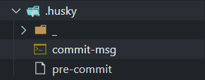

# 代码质量

# init

## eslint

```javascript
npm install eslint --save-dev
npm init @eslint/config
```

### tips

react ts 项目需要安装 eslint-config-airbnb-typescript 配合使用

```javascript
 extends: ['plugin:react/recommended', 'airbnb', 'airbnb-typescript', 'prettier'],
```

## prettier

```javascript
npm install --save-dev --save-exact prettier
echo {}> .prettierrc.json

```

.prettierrc.json 例子 ：

```javascript
{
  "printWidth": 100,
  "tabWidth": 2,
  "useTabs": false,
  "semi": true,
  "singleQuote": true,
  "trailingComma": "all",
  "arrowParens": "avoid",
  "endOfLine": "auto"
}
```

新建一个 .prettierignore ,例子：

```javascript
# Ignore artifacts:
node_modules
dist/

```

配合[eslint-config-prettier](https://github.com/prettier/eslint-config-prettier) 解决和 eslint 的冲突

```javascript
npm i prettier eslint-config-prettier -D
```

在.eslintrc.js: 最后新加个 prettier

```javascript
extends: [/..more.../ , 'prettier'],
```

##

## 提交验证

- **husky**
  - 操作 git 钩子的工具
- **lint-staged**
  - 本地暂存代码检查工具
- **commitlint**
  - commit 信息校验工具

### husky

```javascript
npm install husky -D
npm set-script prepare "husky install"
npx husky-init
```

目录和内容如下：


```javascript
commit-msg

#!/bin/sh
. "$(dirname "$0")/_/husky.sh"

npx  commitlint --edit

```

```javascript
pre-commit

#!/bin/sh
. "$(dirname "$0")/_/husky.sh"

npx lint-staged


```

### lint-staged

新建 .lintstagedrc.json :

```javascript
{
  "*.{js,jsx,ts,tsx}": ["prettier --write .", "eslint  --fix"],
  "*.md": ["prettier --write"]
}

```

### commitlint

新建 commitlint.config.js
