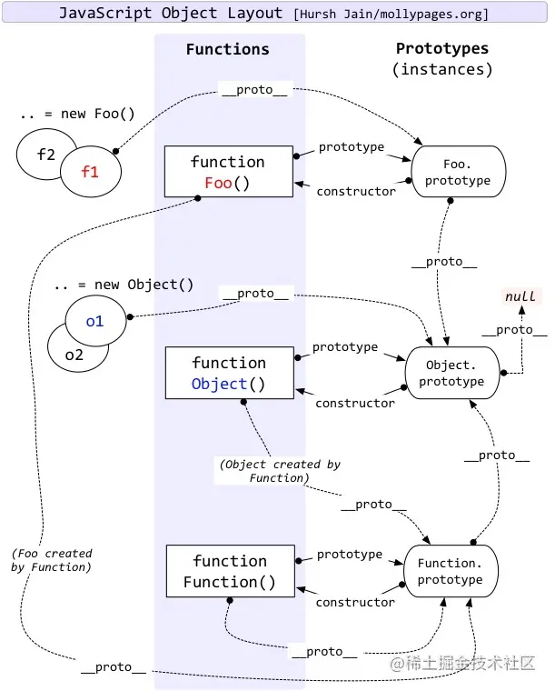
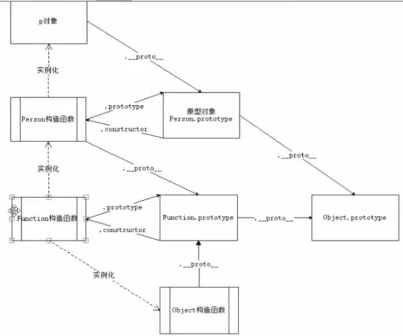

## 1.原型对象和构造函数有何关系？

在JavaScript中，每当定义一个函数数据类型(普通函数、类)时候，都会天生自带一个prototype属性，这个属性指向函数的原型对象。

当函数经过new调用时，这个函数就成为了构造函数，返回一个全新的实例对象，这个实例对象有一个**proto**属性，指向构造函数的原型对象。

## 2.能不能描述一下原型链？

JavaScript对象通过prototype指向父类对象，直到指向Object对象为止，这样就形成了一个原型指向的链条, 即原型链。 

- 对象的 hasOwnProperty() 来检查对象自身中是否含有该属性
- 使用 in 检查对象中是否含有某个属性时，如果对象中没有但是原型链中有，也会返回 true

---

分割线
> 只有函数才有prototype(原型)属性。但不是所有的函数都有prototype属性，用 Function.prototype.bind 创建的函数对象没有 prototype 属性。

## prototype
> prototype对象是实现面向对象的一个重要机制。每个函数也是一个对象，它们对应的类就是Function，每个函数对象都具有一个子对象prototype。Prototype 表示了该函数的原型，prototype表示了一个类的属性的集合。当通过new来生成一个类的对象时，prototype对象的属性就会成为实例化对象的属性。

## __proto__
> 每个JS对象一定对应一个原型对象，并从原型对象继承属性和方法。

## 实例对象
把实例和对象对比来看，或许更容易理解。 实例对象和对象的区别，从定义上来讲： 1、实例是类的具象化产品， 2、而对象是一个具有多种属性的内容结构。 3、实例都是对象，而对象（比如说Object.prototype）不全是实例。
## 参考图

参考文章 [JavaScript深入之从原型到原型链](https://github.com/mqyqingfeng/Blog/issues/2)
[从探究Function.__proto__===Function.prototype过程中的一些收获](https://github.com/jawil/blog/issues/13)
[https://github.com/yygmind/blog/issues/35](https://github.com/yygmind/blog/issues/35)
[undefined-vs-null](http://www.ruanyifeng.com/blog/2014/03/undefined-vs-null.html)
