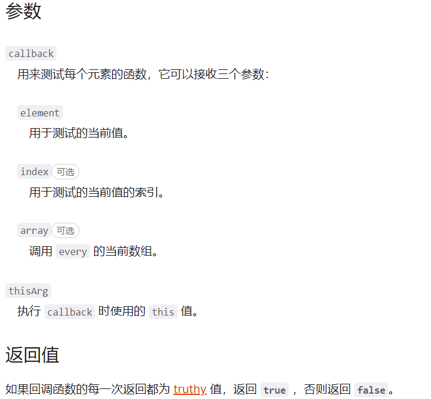

## 1.什么是高阶函数

概念非常简单，如下:

> `一个函数`就可以接收另一个函数作为参数或者返回值为一个函数，`这种函数`就称之为高阶函数。

那对应到数组中有哪些方法呢？

## 2.数组中的高阶函数

### 1.map

- 参数:接受两个参数，一个是回调函数，一个是回调函数的 this 值(可选)。

其中，回调函数被默认传入三个值，依次为当前元素、当前索引、整个数组。

- 创建一个新数组，其结果是该数组中的每个元素都调用一个提供的函数后返回的结果
- 对原来的数组没有影响

```javascript
let nums = [1, 2, 3]
let obj = { val: 5 }
let newNums = nums.map(function (item, index, array) {
  return item + index + array[index] + this.val
  //对第一个元素，1 + 0 + 1 + 5 = 7
  //对第二个元素，2 + 1 + 2 + 5 = 10
  //对第三个元素，3 + 2 + 3 + 5 = 13
}, obj)
console.log(newNums) //[7, 10, 13]
```

当然，后面的参数都是可选的 ，不用的话可以省略。

### 2. reduce

- 参数: 接收两个参数，一个为回调函数，另一个为初始值。回调函数中三个默认参数，依次为积累值、当前值、整个数组。

```javascript
let nums = [1, 2, 3]
// 多个数的加和
let newNums = nums.reduce(function (preSum, curVal, array) {
  return preSum + curVal
}, 0)
console.log(newNums) //6
```

不传默认值会怎样？

不传默认值会自动以第一个元素为初始值，然后从第二个元素开始依次累计。

### 3. filter

参数: 一个函数参数。这个函数接受一个默认参数，就是当前元素。这个作为参数的函数返回值为一个布尔类型，决定元素是否保留。

filter 方法返回值为一个新的数组，这个数组里面包含参数里面所有被保留的项。

```javascript
let nums = [1, 2, 3]
// 保留奇数项
let oddNums = nums.filter((item) => item % 2)
console.log(oddNums)
```

### 4. sort

参数: 一个用于比较的函数，它有两个默认参数，分别是代表比较的两个元素。

举个例子:

```javascript
let nums = [2, 3, 1]
//两个比较的元素分别为a, b
nums.sort(function (a, b) {
  if (a > b) return 1
  else if (a < b) return -1
  else if (a == b) return 0
})
```

当比较函数返回值大于 0，则 a 在 b 的后面，即 a 的下标应该比 b 大。

反之，则 a 在 b 的后面，即 a 的下标比 b 小。

整个过程就完成了一次升序的排列。

当然还有一个需要注意的情况，就是比较函数不传的时候，是如何进行排序的？

> 答案是将数字转换为字符串，然后根据字母 unicode 值进行升序排序，也就是根据字符串的比较规则进行升序排序。

### 5. every

**every()** 方法测试一个数组内的所有元素是否都能通过某个指定函数的测试。它返回一个布尔值。


### 6. some

**some()** 方法测试数组中是不是至少有 1 个元素通过了被提供的函数测试。它返回的是一个 Boolean 类型的值。
