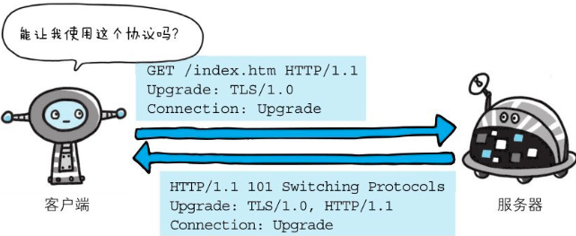
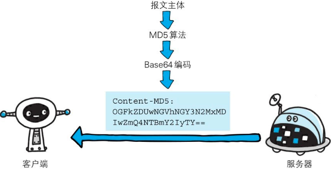

# 报文结构

HTTP协议的请求和响应报文中必定包含HTTP首部。首部内容为客户端和服务器分别处理请求和响应提供所需要的信息。


## HTTP 请求报文

在请求中，HTTP报文由方法、URI、HTTP版本、HTTP首部字段等部分构成。


下面的示例是访问 https://www.zhangbaolin.cn/ 时，请求报文的首部信息。


## HTTP 响应报文

在响应中，HTTP报文由HTTP版本、状态码（数字和原因短语）、HTTP首部字段3部分构成。


下面示例是请求访问 https://www.zhangbaolin.cn/ 时，返回的响应报文的首部信息。


在报文众多的字段当中，HTTP首部字段包含的信息最为丰富。首部字段同时存在于请求和响应报文内，并涵盖HTTP报文相关的内容信息。

## HTTP 首部字段

使用首部字段是为了给浏览器和服务器提供报文主体大小、所使用的语言、认证信息等内容。

## 4种HTTP首部字段类型

**通用首部字段（General Header Fields）**

请求报文和响应报文两方都会使用的首部。

**请求首部字段（Request Header Fields）**

从客户端向服务器端发送请求报文时使用的首部。补充了请求的附加内容、客户端信息、响应内容相关优先级等信息。

**响应首部字段（Response Header Fields）**

从服务器端向客户端返回响应报文时使用的首部。补充了响应的附加内容，也会要求客户端附加额外的内容信息。

**实体首部字段（Entity Header Fields）**

针对请求报文和响应报文的实体部分使用的首部。补充了资源内容更新时间等与实体有关的信息。

## HTTP/1.1 首部字段一览

**通用首部字段**


**请求首部字段**


**响应首部字段**


**实体首部字段：**


## 非HTTP/1.1首部字段

在HTTP协议通信交互中使用到的首部字段，不限于RFC2616中定义的47种首部字段。还有Cookie、Set-Cookie和Content-Disposition等在其他RFC中定义的首部字段，它们的使用频率也很高。这些非正式的首部字段统一归纳在RFC4229 HTTP Header Field Registrations中。

## End-to-end首部和Hop-by-hop首部

HTTP首部字段将定义成缓存代理和非缓存代理的行为，分成2种类型。

端到端首部（End-to-end Header）

分在此类别中的首部会转发给请求/响应对应的最终接收目标，且必须保存在由缓存生成的响应中，另外规定它必须被转发。

逐跳首部（Hop-by-hop Header）

分在此类别中的首部只对单次转发有效，会因通过缓存或代理而不再转发。

HTTP/1.1和之后版本中，如果要使用hop-by-hop首部，需提供Connection首部字段。下面列举了HTTP/1.1中的逐跳首部字段。除这8个首部字段之外，其他所有字段都属于端到端首部。

- Connection
- Keep-Alive
- Proxy-Authenticate
- Proxy-Authorization
- Trailer
- TE
- Transfer-Encoding
- Upgrade

## HTTP/1.1 通用首部字段

## Cache-Control

首部字段Cache-Control能够控制缓存的行为:


指令的参数是可选的，多个指令之间通过“,”分隔。首部字段Cache-Control的指令可用于请求及响应时。

```
Cache-Control: private, max-age=0, no-cache
```

**可用的指令按请求和响应分类如下所示 :** 

缓存请求指令：


缓存响应指令：


### 表示是否能缓存的指令

### **public **

```
Cache-Control: public
```

当指定使用public指令时，则明确表明其他用户也可利用缓存。

### **private **


```
Cache-Control: private
```

当指定private指令后，响应只以特定的用户作为对象，这与public指令的行为相反。

缓存服务器会对该特定用户提供资源缓存的服务，对于其他用户发送过来的请求，代理服务器则不会返回缓存。

### **no-cache **


```
Cache-Control: no-cache
```

使用no-cache指令的目的是为了防止从缓存中返回过期的资源。

**客户端发送的请求中如果包含no-cache指令**，则表示客户端将不会接收缓存过的响应。于是，“中间”的缓存服务器必须把客户端请求转发给源服务器。( 缓存服务器如果有缓存，则向源服务器请求缓存的有效性，做对应的返回。)

如果**服务器返回的响应中包含no-cache指令**，那么缓存服务器不能对资源进行缓存。源服务器以后也将不再对缓存服务器请求中提出的资源有效性进行确认，且禁止其对响应资源进行缓存操作。

```
Cache-Control: no-cache=Locationn
```

由服务器返回的响应中，若报文首部字段Cache-Control中对no-cache字段名具体**指定参数值**，那么客户端在接收到这个被**指定参数值的首部字段**对应的响应报文后，就不能使用缓存。换言之，**无参数值的首部字段可以使用缓存**。**只能在响应指令中指定该参数。**

### 控制可执行缓存的对象的指令

### no-store

```
Cache-Control: no-store
```

当使用no-store指令时，暗示请求（和对应的响应）或响应中包含机密信息。因此，该指令规定缓存不能在本地存储请求或响应的任一部分。指定缓存期限和认证的指令

> 从字面意思上很容易把no-cache误解成为不缓存，但事实上no-cache代表不缓存过期的资源，缓存会向源服务器进行有效期确认后处理资源，也许称为do-not-serve-from-cache-without-revalidation更合适。no-store才是真正地不进行缓存。

### s-maxage 

```
Cache-Control: s-maxage=604800 (单位：秒)
```

s-maxage指令的功能和max-age指令的相同，它们的不同点是s-maxage指令只适用于供多位用户使用的公共缓存服务器。也就是说，对于向同一用户重复返回响应的服务器来说，这个指令没有任何作用。另外，当使用s-maxage指令后，则直接忽略对Expires首部字段及max-age指令的处理。

### max-age 


```
Cache-Control: max-age=604800 (单位：秒)
```

当客户端发送的请求中包含max-age指令时，如果判定缓存资源的缓存时间数值比指定时间的数值更小，那么客户端就接收缓存的资源。另外，当指定max-age值为0，那么缓存服务器通常需要将请求转发给源服务器。

当服务器返回的响应中包含max-age指令时，缓存服务器将不对资源的有效性再作确认，而max-age数值代表资源保存为缓存的最长时间。

应用HTTP/1.1版本的缓存服务器遇到同时存在Expires首部字段的情况时，会优先处理max-age指令，而忽略掉Expires首部字段。而HTTP/1.0版本的缓存服务器的情况却相反，max-age指令会被忽略掉。

### min-fresh 


```
Cache-Control: min-fresh=60 (单位：秒)
```

min-fresh指令要求缓存服务器返回至少还未过指定时间的缓存资源。

比如，当指定min-fresh为60秒后，在这60秒以内如果有超过有效期限的资源都无法作为响应返回了。

### max-stale

```
Cache-Control: min-stale=3600 (单位：秒)
```

使用max-stale可指示缓存资源，即使过期也照常接收。如果指令未指定参数值，那么无论经过多久，客户端都会接收响应；

如果指令中指定了具体数值，那么即使过期，只要仍处于max-stale指定的时间内，仍旧会被客户端接收。

[更多字段参考 图解 HTTP ](https://weread.qq.com/web/reader/3da32b505dd9f43da9a1acakd9d320f022ed9d4f495e456)

## Connection

Connection首部字段具备如下两个作用。

- 控制不再转发给代理的首部字段

- 管理持久连接

### 控制不再转发给代理的首部字段


```
Connection: 不再转发的字段名
```


在客户端发送请求和服务器返回响应内，使用Connection首部字段，可控制不再转发给代理的首部字段（即Hop-by-hop首部）。

### 管理持久连接


```
Connection: close
```

HTTP/1.1版本的默认连接都是持久连接。为此，客户端会在持久连接上连续发送请求。当服务器端想明确断开连接时，则指定Connection首部字段的值为Close。


```
Connection: Keep-Alive
```

HTTP/1.1之前的HTTP版本的默认连接都是非持久连接。为此，如果想在旧版本的HTTP协议上维持持续连接，则需要指定Connection首部字段的值为Keep-Alive。

## Date

首部字段Date表明创建HTTP报文的日期和时间。

## Upgrade

首部字段Upgrade用于检测HTTP协议及其他协议是否可使用更高的版本进行通信，其参数值可以用来指定一个完全不同的通信协议。



上图用例中，首部字段Upgrade指定的值为TLS/1.0。请注意此处两个字段首部字段的对应关系，Connection的值被指定为Upgrade。Upgrade首部字段产生作用的Upgrade对象仅限于客户端和邻接服务器之间。因此，使用首部字段Upgrade时，还需要额外指定Connection:Upgrade。

对于附有首部字段Upgrade的请求，服务器可用101 Switching Protocols状态码作为响应返回。

## Via

使用首部字段Via是为了追踪客户端与服务器之间的请求和响应报文的传输路径。报文经过代理或网关时，会先在首部字段Via中附加该服务器的信息，然后再进行转发。

首部字段Via不仅用于追踪报文的转发，还可避免请求回环的发生。所以必须在经过代理时附加该首部字段内容。


Via首部是为了追踪传输路径，所以经常会和TRACE方法一起使用。比如，代理服务器接收到由TRACE方法发送过来的请求（其中Max-Forwards: 0）时，代理服务器就不能再转发该请求了。这种情况下，代理服务器会将自身的信息附加到Via首部后，返回该请求的响应。

[更多字段请参考](https://weread.qq.com/web/reader/3da32b505dd9f43da9a1acakd9d320f022ed9d4f495e456)

## 请求首部字段

## Accept


Accept首部字段可通知服务器，用户代理能够处理的媒体类型及媒体类型的相对优先级。可使用type/subtype这种形式，一次指定多种媒体类型。

### 文本文件

text/html, text/plain, text/css ...

application/xhtml+xml, application/xml ...

### 图片文件

image/jpeg, image/gif, image/png ...

### 视频文件

video/mpeg, video/quicktime ...

### 应用程序使用的二进制文件

application/octet-stream, application/zip ...

比如，如果浏览器不支持PNG图片的显示，那Accept就不指定image/png，而指定可处理的image/gif和image/jpeg等图片类型。若想要给显示的媒体类型增加优先级，则使用q=来额外表示权重值[插图]，用分号（;）进行分隔。权重值q的范围是0～1（可精确到小数点后3位），且1为最大值。不指定权重q值时，默认权重为q=1.0。

> q : quality 质量

当服务器提供多种内容时，将会首先返回权重值最高的媒体类型。

## Accept-Encoding

```
Accept-Encoding: gzip, deflate
```

Accept-Encoding首部字段用来告知服务器用户代理支持的内容编码及内容编码的优先级顺序。可一次性指定多种内容编码。

下面试举出几个内容编码的例子：

### gzip

压缩编码格式

### compress

压缩编码格式

### deflate

压缩编码格式

### identity

不执行压缩或不会变化的默认编码格式

---

采用权重q值来表示相对优先级，这点与首部字段Accept相同。另外，也可使用星号（*）作为通配符，指定任意的编码格式

## Accept-Language


```
Accept-Language: zh-ch, zh;q=0/7, en-us, en;q=0.3
```

首部字段Accept-Language用来告知服务器用户代理能够处理的自然语言集（指中文或英文等），以及自然语言集的相对优先级。可一次指定多种自然语言集。

和Accept首部字段一样，按权重值q来表示相对优先级。在上述图例中，客户端在服务器有中文版资源的情况下，会请求其返回中文版对应的响应，没有中文版时，则请求返回英文版响应。

##  Authorization

首部字段Authorization是用来告知服务器，用户代理的认证信息（证书值）。通常，想要通过服务器认证的用户代理会在接收到返回的401状态码响应后，把首部字段Authorization加入请求中。共用缓存在接收到含有Authorization首部字段的请求时的操作处理会略有差异。

## From

首部字段From用来告知服务器使用用户代理的用户的**电子邮件**地址。通常，其使用目的就是为了显示搜索引擎等用户代理的负责人的电子邮件联系方式。使用代理时，应尽可能包含From首部字段（但可能会因代理不同，将电子邮件地址记录在User-Agent首部字段内）。

## Host


首部字段Host会告知服务器，**请求的资源所处的互联网主机名和端口号**。Host首部字段在HTTP/1.1规范内是唯一一个**必须**被包含在请求内的首部字段。

若服务器未设定主机名, 那直接发送一个空值即可。

## If-Match

形如If-xxx这种样式的请求首部字段，都可称为条件请求。服务器接收到附带条件的请求后，只有判断指定条件为真时，才会执行请求。


只有当If-Match的字段值跟ETag值匹配一致时，服务器才会接受请求

```
If-Match: '123456'
```

首部字段If-Match，属附带条件之一，它会告知服务器匹配资源所用的实体标记（ETag）值。这时的服务器无法使用弱ETag值。

服务器会比对If-Match的字段值和资源的ETag值，仅当两者一致时，才会执行请求。反之，则返回状态码412 Precondition Failed的响应。

还可以使用星号（*）指定If-Match的字段值。针对这种情况，服务器将会忽略ETag的值，只要资源存在就处理请求。

## If-Modified-Since


图：如果在If-Modified-Since字段指定的日期时间后，资源发生了更新，服务器会接受请求

```
If-Modified-Since: Thu, 15 Apr 2004 00:00:00:00 GMT
```

首部字段If-Modified-Since，属附带条件之一，它会告知服务器若If-Modified-Since字段值早于资源的更新时间，则希望能处理该请求。而在指定If-Modified-Since字段值的日期时间之后，如果请求的资源都没有过更新，则返回状态码304Not Modified的响应。

If-Modified-Since用于确认代理或客户端拥有的本地资源的有效性。**获取资源的更新日期时间**，可通过确认首部字段 **Last-Modified** 来确定。

##  If-None-Match

只有在If-None-Match的字段值与ETag值不一致时，可处理该请求。与If-Match首部字段的作用相反

首部字段If-None-Match属于附带条件之一。它和首部字段If-Match作用相反。用于指定If-None-Match字段值的实体标记（ETag）值与请求资源的ETag不一致时，它就告知服务器处理该请求。

在GET或HEAD方法中使用首部字段If-None-Match可获取最新的资源。因此，这与使用首部字段If-Modified-Since时有些类似。

## If-Range


首部字段If-Range属于附带条件之一。它告知服务器若指定的If-Range字段值（ETag值或者时间）和请求资源的ETag值或时间相一致时，则作为范围请求处理。反之，则返回全体资源。

下面我们思考一下不使用首部字段If-Range发送请求的情况。服务器端的资源如果更新，那客户端持有资源中的一部分也会随之无效，当然，范围请求作为前提是无效的。这时，服务器会暂且以状态码412 Precondition Failed作为响应返回，其目的是催促客户端再次发送请求。这样一来，与使用首部字段If-Range比起来，就需要花费两倍的功夫。


## If-Unmodified-Since

首部字段If-Unmodified-Since和首部字段If-Modified-Since的作用相反。它的作用的是告知服务器，指定的请求资源只有在字段值内指定的日期时间之后，未发生更新的情况下，才能处理请求。如果在指定日期时间后发生了更新，则以状态码412 Precondition Failed作为响应返回。

## Max-Forwards

```
Max-Forwards: 10
```

通过TRACE方法或OPTIONS方法，发送包含首部字段Max-Forwards的请求时，该字段以十进制整数形式指定可经过的服务器最大数目。服务器在往下一个服务器转发请求之前，会将Max-Forwards的值减1后重新赋值。当服务器接收到Max-Forwards值为0的请求时，则不再进行转发，而是直接返回响应。

## Proxy-Authorization

```
Proxy-Authorization: Basic dwqjndjkqnkdjwqndq
```

接收到从代理服务器发来的认证质询时，客户端会发送包含首部字段Proxy-Authorization的请求，以告知服务器认证所需要的信息。这个行为是与客户端和服务器之间的HTTP访问认证相类似的，不同之处在于，**认证行为发生在客户端与代理之间**。客户端与服务器之间的认证，使用首部字段Authorization可起到相同作用。

## Range

```
Range: bytes=5001-10000
```

对于只需获取部分资源的范围请求，包含首部字段Range即可告知服务器资源的指定范围。上面的示例表示请求获取从第5001字节至第10000字节的资源。接收到附带Range首部字段请求的服务器，会在处理请求之后返回状态码为206Partial Content的响应。无法处理该范围请求时，则会返回状态码200 OK的响应及全部资源。

## Referer

首部字段Referer会告知服务器请求的原始资源的URI。客户端一般都会发送Referer首部字段给服务器。但当直接在浏览器的地址栏输入URI，或出于安全性的考虑时，也可以不发送该首部字段。

因为原始资源的URI中的查询字符串可能含有ID和密码等保密信息，要是写进Referer转发给其他服务器，则有可能导致保密信息的泄露。

另外，Referer的正确的拼写应该是Referrer，但不知为何，大家一直沿用这个错误的拼写。

## User-Agent

首部字段User-Agent会将创建请求的浏览器和用户代理名称等信息传达给服务器。由网络爬虫发起请求时，有可能会在字段内添加爬虫作者的电子邮件地址。

此外，如果请求经过代理，那么中间也很可能被添加上代理服务器的名称。

## 响应首部字段

响应首部字段是由服务器端向客户端返回响应报文中所使用的字段，用于补充响应的附加信息、服务器信息，以及对客户端的附加要求等信息。

## Accept-Ranges

```
Accept-Ranges: bytes
```

首部字段Accept-Ranges是用来告知客户端服务器是否能处理范围请求，以指定获取服务器端某个部分的资源。

可指定的字段值有两种，可处理范围请求时指定其为**bytes**，反之则指定其为**none**。

## Age

```
Age: 600 ( 单位 S )
```

首部字段Age能告知客户端，源服务器在多久前创建了响应。字段值的单位为秒。若创建该响应的服务器是缓存服务器，Age值是指缓存后的响应再次发起认证到认证完成的时间值。代理创建响应时必须加上首部字段Age。

## ETag

```
ETag: "21343543rfegrtfdcsv"
```

首部字段ETag能告知客户端实体标识。它是一种可将资源以字符串形式做唯一性标识的方式。服务器会为每份资源分配对应的ETag值。

另外，当资源更新时，ETag值也需要更新。**生成ETag值时，并没有统一的算法规则，而仅仅是由服务器来分配。**

### 强ETag值和弱Tag值

ETag中有强ETag值和弱ETag值之分。

### 强ETag值

强ETag值，不论实体发生多么细微的变化都会改变其值。

### 弱ETag值

弱ETag值只用于提示资源是否相同。只有资源发生了根本改变，产生差异时才会改变ETag值。这时，会在字段值最开始处附加W/。

```
ETag: W/"bgf234354"
```

## Location

```
Location: https://zhangbaolin.cn
```


使用首部字段Location可以将响应接收方引导至某个与请求URI位置不同的资源。基本上，该字段会配合**3xx:Redirection**的响应，提供重定向的URI。

几乎所有的浏览器在接收到包含首部字段Location的响应后，都会强制性地尝试对已提示的重定向资源的访问。

## Proxy-Authenticate

```
Proxy-Authenticate: Basic realm="dbweywhnufub34bgr"
```

首部字段Proxy-Authenticate会把由代理服务器所要求的认证信息发送给客户端。

它与客户端和服务器之间的HTTP访问认证的行为相似，不同之处在于其认证行为是在客户端与代理之间进行的。而客户端与服务器之间进行认证时，首部字段WWW-Authorization有着相同的作用。

##  Retry-After

首部字段Retry-After告知客户端应该在多久之后再次发送请求。

主要配合状态码**503** Service Unavailable响应，或**3xx** Redirect响应一起使用。字段值可以指定为**具体的日期时间**（Wed, 04 Jul 2012 06:34:24 GMT等格式），也可以是**创建响应后的秒数**。

## Server

```
Server: Apache/2.2.17 (Unix)
```

首部字段Server告知客户端当前服务器上安装的HTTP服务器应用程序的信息。不单单会标出服务器上的软件应用名称，还有可能包括版本号和安装时启用的可选

## WWW-Authenticate

```
WWW-Authenticate: Basic realm="ignjfdkvcoanijbfe213"
```

首部字段WWW-Authenticate用于HTTP访问认证。它会告知客户端适用于访问请求URI所指定资源的认证方案（**Basic或是Digest**）和带参数提示的质询（challenge）。状态码**401** Unauthorized响应中，**肯定带有首部字段WWW-Authenticate**。

上述示例中，**realm**字段的字符串是为了辨别请求URI指定资源所受到的保护策略。

## 实体首部字段

实体首部字段是包含在请求报文和响应报文中的实体部分所使用的首部，用于补充内容的更新时间等与实体相关的信息。

## Allow

```
Allow: GET, HEAD
```

首部字段Allow用于通知客户端能够支持Request-URI指定资源的所有HTTP方法。当服务器接收到不支持的HTTP方法时，会以状态码**405** Method Not Allowed作为响应返回。与此同时，还会把所有能支持的**HTTP方法写入首部字段Allow**后返回。

## Content-Encoding

```
Content-Encoding: gzip
```

首部字段Content-Encoding会告知客户端服务器对实体的主体部分选用的内容编码方式。内容编码是指在不丢失实体信息的前提下所进行的压缩。

主要采用以下4种内容编码的方式:

- gzip
- compress
- deflate
- identity

## Content-Language

```
Content-Language: zh-CN
```

首部字段Content-Language会告知客户端，实体主体使用的自然语言（指中文或英文等语言）。

##  Content-Length

```
 Content-Length: 1500
```

首部字段Content-Length表明了实体主体部分的大小（单位是字节）。对实体主体进行内容编码传输时，不能再使用Content-Length首部字段。由于实体主体大小的计算方法略微复杂。

## Content-Location

```
Content-Location: https://zhangbaolin.cn
```

首部字段Content-Location给出与报文主体部分相对应的URI。和首部字段Location不同，**Content-Location表示的是报文主体返回资源对应的UR**I。比如，对于使用首部字段Accept-Language的服务器驱动型请求，当返回的页面内容与实际请求的对象**不同**时，首部字段Content-Location内会写明URI。（访问http://www.zhangbaolin.cn/返回的对象却是http://www.zhangbaolin.cn/index.html等类似情况）

## Content-MD5

```
Content-MD5: DHBJSAKFNBHEUFBANDSWHdbehj234==
```



客户端会对接收的报文主体执行相同的MD5算法，然后与首部字段Content-MD5的字段值比较。

对报文主体执行MD5算法获得的128位二进制数，再通过Base64编码后将结果写入Content-MD5字段值。由于HTTP首部无法记录二进制值，所以要通过Base64编码处理。为确保报文的有效性，作为接收方的客户端会对报文主体再执行一次相同的MD5算法。计算出的值与字段值作比较后，即可判断出报文主体的准确性。

采用这种方法，对内容上的偶发性改变是无从查证的，也无法检测出恶意篡改。其中一个原因在于，内容如果能够被篡改，那么同时意味着Content-MD5也可重新计算然后被篡改。所以处在接收阶段的客户端是无法意识到报文主体以及首部字段Content-MD5是已经被篡改过的。

## Content-Range

```
Content-Range: bytes 5001-10000/10000
```

针对范围请求，返回响应时使用的首部字段Content-Range，能告知客户端作为响应返回的实体的哪个部分符合范围请求。字段值以字节为单位，表示当前发送部分及整个实体大小。

## Content-Type

```
Content-Type: text/html; charset=UTF-8
```

首部字段Content-Type说明了实体主体内对象的媒体类型。和首部字段Accept一样，字段值用type/subtype形式赋值。

## Expires

```
Expires: Wed, 04 Jul 2012 08:26:05 GMT
```

首部字段Expires会将资源失效的日期告知客户端。缓存服务器在接收到含有首部字段Expires的响应后，会以缓存来应答请求，在Expires字段值指定的时间之前，响应的副本会一直被保存。当超过指定的时间后，缓存服务器在请求发送过来时，会转向源服务器请求资源。

源服务器不希望缓存服务器对资源缓存时，最好在Expires字段内写入与首部字段Date相同的时间值。

但是，当首部字段Cache-Control有指定max-age指令时，比起首部字段Expires，会优先处理max-age指令。

## Last-Modified

```
Last-Modified: Wed, 23 May 2012 0:00:00 GMT
```

首部字段Last-Modified指明资源最终修改的时间。一般来说，这个值就是Request-URI指定资源被修改的时间。但类似使用CGI脚本进行动态数据处理时，该值有可能会变成数据最终修改时的时间。

## Cookie


### Set-Cookie

```
Set-Cookie: status=enable; expires=Tue, 05 Jul 2011 07:26:31 GMT; path=/; domain=.hackr.jp;
```


### Cookie

```
Cookie: status=enable
```

首部字段Cookie会告知服务器，当客户端想获得HTTP状态管理支持时，就会在请求中包含从服务器接收到的Cookie。接收到多个Cookie时，同样可以以多个Cookie形式发送。

## 其他首部字段

## X-Frame-Options

```
X-Frame-Options: DENY
```

首部字段X-Frame-Options属于HTTP响应首部，用于控制网站内容在其他Web网站的Frame标签内的显示问题。其主要目的是为了防止点击劫持（clickjacking）攻击。

首部字段X-Frame-Options有以下两个可指定的字段值。

- DENY：拒绝
- SAMEORIGIN：仅同源域名下的页面（Top-level-browsing-context）匹配时许可。（比如，当指定http://zhangbaolin.cn/sample.html页面为SAMEORIGIN时，那么zhangbaolin.cn上所有页面的frame都被允许可加载该页面，而example.com等其他域名的页面就不行了）

## X-XSS-Protection

首部字段X-XSS-Protection属于HTTP响应首部，它是针对跨站脚本攻击（XSS）的一种对策，用于控制浏览器XSS防护机制的开关。

首部字段X-XSS-Protection可指定的字段值如下。

- 0 ：将XSS过滤设置成无效状态
- 1 ：将XSS过滤设置成有效状态

## DNT

```
DNT: 1
```

首部字段DNT属于HTTP请求首部，其中DNT是Do Not Track的简称，意为拒绝个人信息被收集，是表示拒绝被精准广告追踪的一种方法。

首部字段DNT可指定的字段值如下。

- 0 ：同意被追踪
- 1 ：拒绝被追踪

## P3P

```
P3P: CP="CAO DSP LAW CURa ADMa DEVa TAIa PSAa PSDa =>    IVAa IVDa OUR BUS IND UNI COM NAV INT"
```

首部字段P3P属于HTTP响应首部，通过利用P3P（The Platform for Privacy Preferences，在线隐私偏好平台）技术，可以让Web网站上的个人隐私变成一种仅供程序可理解的形式，以达到保护用户隐私的目的。

要进行P3P的设定，需按以下操作步骤进行。

步骤1： 创建P3P隐私

步骤2： 创建P3P隐私对照文件后，保存命名在/w3c/p3p.xml

步骤3： 从P3P隐私中新建Compact policies后，输出到HTTP响应中

[P3P规范](http://www.w3.org/TR/P3P/)
