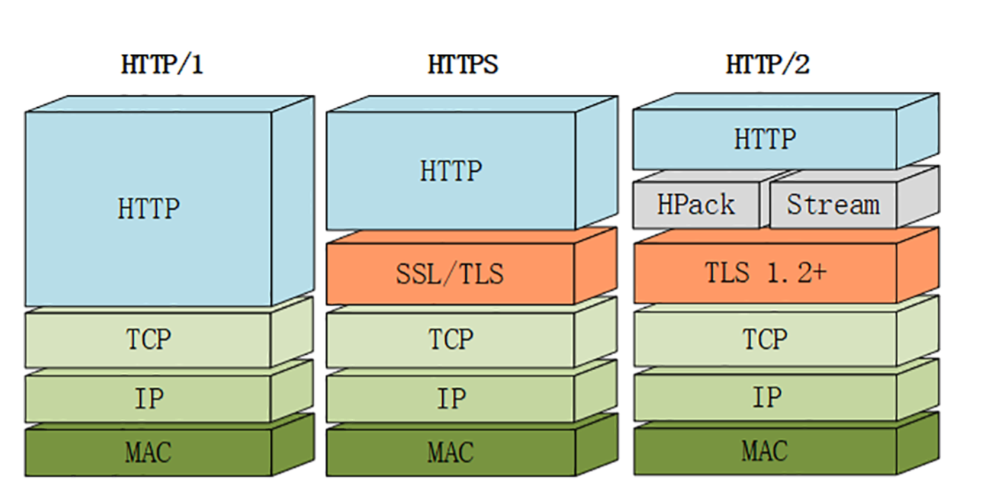

优点：

1. 多路复用
1. 设置请求优先级
1. 服务器推送
1. 头部压缩

缺点：

1. HTTP/2 依然是基于 TCP 协议的，而 TCP 协议依然存在数据包级别的队头阻塞问题

# 多路复用
 HTTP 队头阻塞的问题，其根本原因在于HTTP 基于请求-响应的模型，在同一个 TCP 长连接中，前面的请求没有得到响应，后面的请求就会被阻塞。

HTTP 1.1 用**并发连接**和**域名分片**的方式来解决这个问题，但这并没有真正从 HTTP 本身的层面解决问题，只是增加了 TCP 连接，分摊风险而已。而且这么做也有弊端，多条 TCP 连接会竞争**有限的带宽**，让真正优先级高的请求不能优先处理。

### 二进制分帧

首先，HTTP/2 认为明文传输对机器而言太麻烦了，不方便计算机的解析，因为对于文本而言会有多义性的字符，比如回车换行到底是内容还是分隔符，在内部需要用到状态机去识别，效率比较低。于是 HTTP/2 干脆把报文全部换成二进制格式，全部传输01串，方便了机器的解析。

原来Headers + Body的报文格式如今被拆分成了一个个二进制的帧，用**Headers帧**存放头部字段，**Data帧**存放请求体数据。分帧之后，服务器看到的不再是一个个完整的 HTTP 请求报文，而是一堆乱序的二进制帧。这些二进制帧不存在先后关系，因此也就不会排队等待，也就没有了 HTTP 的队头阻塞问题。

二进制帧到达后对方会将 Stream ID 相同的二进制帧组装成完整的**请求报文**和**响应报文**。

通信双方都可以给对方发送二进制帧，这种二进制帧的**双向传输的序列**，也叫做流(Stream)。HTTP/2 用流来在一个 TCP 连接上来进行多个数据帧的通信，这就是**多路复用**的概念。
> **流传输的特性**
> - 并发性。一个 HTTP/2 连接上可以同时发多个帧，这一点和 HTTP/1 不同。这也是实现**多路**复用的基础。
> - 自增性。流 ID 是不可重用的，而是会按顺序递增，达到上限之后又新开 TCP 连接从头开始。
> - 双向性。客户端和服务端都可以创建流，互不干扰，双方都可以作为发送方或者接收方。
> - 可设置优先级。可以设置数据帧的优先级，让服务端先处理重要资源，优化用户体验。

# 服务器推送
另外值得一说的是 HTTP/2 的服务器推送(Server Push)。在 HTTP/2 当中，服务器已经不再是完全被动地接收请求，响应请求，它也能新建 stream 来给客户端发送消息，当 TCP 连接建立之后，比如浏览器请求一个 HTML 文件，服务器就可以在返回 HTML 的基础上，将 HTML 中引用到的其他资源文件（CSS、JS 等）一起返回给客户端，减少客户端的等待。

# 头部压缩
在 HTTP/1.1 及之前的时代，**请求体**一般会有响应的压缩编码过程，通过Content-Encoding头部字段来指定，但你有没有想过头部字段本身的压缩呢？当请求字段非常复杂的时候，尤其对于 GET 请求，请求报文几乎全是请求头，这个时候还是存在非常大的优化空间的。HTTP/2 针对头部字段，也采用了对应的压缩算法——HPACK，对请求头进行压缩。

HPACK 算法是专门为 HTTP/2 服务的，它主要的亮点有两个：

- 首先是在服务器和客户端之间**建立哈希表**，将用到的字段存放在这张表中，那么在传输的时候对于之前出现过的值，只需要把**索引**(比如0，1，2，...)传给对方即可，对方拿到索引查表就行了。这种**传索引**的方式，可以说让请求头字段得到极大程度的精简和复用。

:::success
**小贴士 ** HTTP/2 当中废除了起始行的概念，将起始行中的请求方法、URI、状态码转换成了头字段，不过这些字段都有一个":"前缀，用来和其它请求头区分开。
:::

其次是对于整数和字符串进行**哈夫曼编码**，哈夫曼编码的原理就是先将所有出现的字符建立一张索引表，然后让出现次数多的字符对应的索引尽可能短，传输的时候也是传输这样的**索引序列**，可以达到非常高的压缩率。

# 总结
HTTP/1.1 效率的三个主要因素：TCP 的慢启动、多条 TCP 连接竞争带宽和队头阻塞。

HTTP/2 是采用多路复用机制来解决这些问题

多路复用是通过在协议栈中添加二进制分帧层来实现的，有了二进制分帧层还能够实现请求的优先级、服务器推送、头部压缩等特性，从而大大提升了文件传输效率。

虽然 HTTP/2 解决了 HTTP/1.1 中的队头阻塞问题，但是 HTTP/2 依然是基于 TCP 协议的，而 TCP 协议依然存在数据包级别的队头阻塞问题

