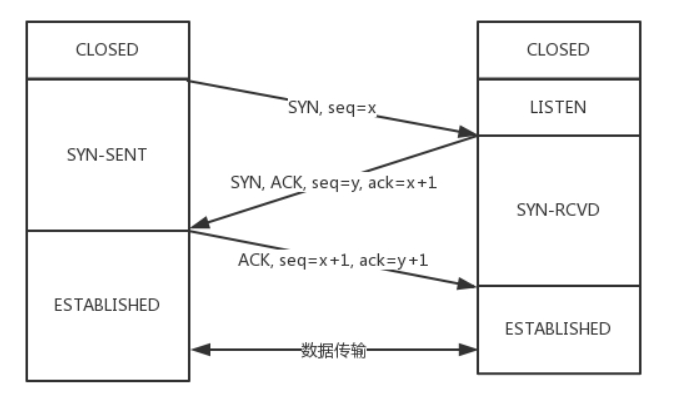

# 三次握手、四次挥手

## 恋爱模拟

以谈恋爱为例，两个人能够在一起最重要的事情是首先确认各自**爱**和**被爱**的能力。接下来我们以此来模拟三次握手的过程。

第一次:

男: **我爱你。**

女方收到。

由此证明男方拥有`爱`的能力。

第二次:

女: **我收到了你的爱，我也爱你。**

男方收到。

OK，现在的情况说明，女方拥有`爱`和`被爱`的能力。

第三次:

男: **我收到了你的爱。**

女方收到。

现在能够保证男方具备`被爱`的能力。

由此完整地确认了双方`爱`和`被爱`的能力，两人开始一段甜蜜的爱情。


## 真实握手

当然刚刚那段属于扯淡，不代表本人价值观，目的是让大家理解整个握手过程的意义，因为两个过程非常相似。对应到 TCP 的三次握手，也是需要确认双方的两样能力: `发送的能力`和`接收的能力`。于是便会有下面的三次握手的过程: 



从最开始双方都处于`CLOSED`状态。然后服务端开始监听某个端口，进入了`LISTEN`状态。

然后客户端主动发起连接，发送 SYN , 自己变成了`SYN-SENT`状态。

服务端接收到，返回`SYN`和`ACK`(对应客户端发来的SYN)，自己变成了`SYN-REVD`。

之后客户端再发送`ACK`给服务端，自己变成了`ESTABLISHED`状态；服务端收到`ACK`之后，也变成了`ESTABLISHED`状态。

另外需要提醒你注意的是，从图中可以看出，SYN 是需要消耗一个序列号的，下次发送对应的 ACK 序列号要加1，为什么呢？只需要记住一个规则:

> 凡是需要对端确认的，一定消耗TCP报文的序列号。


SYN 需要对端的确认， 而 ACK 并不需要，因此 SYN 消耗一个序列号而 ACK 不需要。

## 什么是半连接队列？
服务器第一次收到客户端的 SYN 之后，就会处于 `SYN_RCVD` 状态，此时双方还没有完全建立其连接，服务器会把此种状态下请求连接放在一个**队列**里，我们把这种队列称之为**半连接队列**。<br />当然还有一个**全连接队列**，就是已经完成三次握手，建立起连接的就会放在全连接队列中。如果队列满了就有可能会出现丢包现象。<br />这里在补充一点关于**SYN-ACK 重传次数**的问题： 服务器发送完SYN-ACK包，如果未收到客户确认包，服务器进行首次重传，等待一段时间仍未收到客户确认包，进行第二次重传。如果重传次数超过系统规定的最大重传次数，系统将该连接信息从半连接队列中删除。 注意，每次重传等待的时间不一定相同，一般会是指数增长，例如间隔时间为 1s，2s，4s，8s......

## 为什么不是两次？

根本原因: 无法确认客户端的接收能力。

分析如下:

如客户端发出连接请求，但因连接请求报文丢失而未收到确认，于是客户端再重传一次连接请求。后来收到了确认，建立了连接。数据传输完毕后，就释放了连接，客户端共发出了两个连接请求报文段，其中第一个丢失，第二个到达了服务端，但是第一个丢失的报文段只是在**某些网络结点长时间滞留了，延误到连接释放以后的某个时间才到达服务端**，此时服务端误认为客户端又发出一次新的连接请求，于是就向客户端发出确认报文段，同意建立连接，不采用三次握手，只要服务端发出确认，就建立新的连接了，此时客户端忽略服务端发来的确认，也不发送数据，则服务端一致等待客户端发送数据，浪费资源。

## 为什么不是四次？

三次握手的目的是确认双方`发送`和`接收`的能力，那四次握手可以嘛？

当然可以，100 次都可以。但为了解决问题，三次就足够了，再多用处就不大了。


## 三次握手过程中可以携带数据么？

第三次握手的时候，可以携带。前两次握手不能携带数据。

如果前两次握手能够携带数据，那么一旦有人想攻击服务器，那么他只需要在第一次握手中的 SYN 报文中放大量数据，那么服务器势必会消耗更多的**时间**和**内存空间**去处理这些数据，增大了服务器被攻击的风险。

第三次握手的时候，客户端已经处于`ESTABLISHED`状态，并且已经能够确认服务器的接收、发送能力正常，这个时候相对安全了，可以携带数据。


## 同时打开会怎样？

如果双方同时发 `SYN`报文，状态变化会是怎样的呢？

这是一个可能会发生的情况。

状态变迁如下:


在发送方给接收方发`SYN`报文的同时，接收方也给发送方发`SYN`报文，两个人刚上了!

发完`SYN`，两者的状态都变为`SYN-SENT`。

在各自收到对方的`SYN`后，两者状态都变为`SYN-REVD`。

接着会回复对应的`ACK + SYN`，这个报文在对方接收之后，两者状态一起变为`ESTABLISHED`。

这就是同时打开情况下的状态变迁。

## SYN攻击
**服务器端的资源分配是在二次握手时分配的，而客户端的资源是在完成三次握手时分配的**，所以服务器容易受到SYN洪泛攻击。SYN攻击就是Client在短时间内伪造大量不存在的IP地址，并向Server不断地发送SYN包，Server则回复确认包，并等待Client确认，由于源地址不存在，因此Server需要不断重发直至超时，这些伪造的SYN包将长时间占用未连接队列，导致正常的SYN请求因为队列满而被丢弃，从而引起网络拥塞甚至系统瘫痪。SYN 攻击是一种典型的 DoS/DDoS 攻击。<br />检测 SYN 攻击非常的方便，当你在服务器上看到大量的半连接状态时，特别是源IP地址是随机的，基本上可以断定这是一次SYN攻击。在 Linux/Unix 上可以使用系统自带的 netstats 命令来检测 SYN 攻击。
```javascript
netstat -n -p TCP | grep SYN_RECV 
```
常见的防御 SYN 攻击的方法有如下几种：

- 缩短超时（SYN Timeout）时间
- 增加最大半连接数
- 过滤网关防护
- SYN cookies技术

# 四次挥手

## 过程拆解


刚开始双方处于`ESTABLISHED`状态。

客户端要断开了，向服务器发送 `FIN` 报文，在 TCP 报文中的位置如下图:


发送后客户端变成了`FIN-WAIT-1`状态。注意, 这时候客户端同时也变成了`half-close(半关闭)`状态，即无法向服务端发送报文，只能接收。

服务端接收后向客户端确认，变成了`CLOSED-WAIT`状态。

客户端接收到了服务端的确认，变成了`FIN-WAIT2`状态。

随后，服务端向客户端发送`FIN`，自己进入`LAST-ACK`状态，

客户端收到服务端发来的`FIN`后，自己变成了`TIME-WAIT`状态，然后发送 ACK 给服务端。

注意了，这个时候，客户端需要等待足够长的时间，具体来说，是 2 个 `MSL`(`Maximum Segment Lifetime，报文最大生存时间`), 在这段时间内如果客户端没有收到服务端的重发请求，那么表示 ACK 成功到达，挥手结束，否则客户端重发 ACK。


## 等待2MSL的意义
> **MSL**是Maximum Segment Lifetime的英文缩写，可译为“最长报文段寿命”，它是任何报文在网络上存在的最长时间，超过这个时间报文将被丢弃。


为了保证客户端发送的最后一个ACK报文段能够到达服务器。因为这个ACK有可能丢失，从而导致处在LAST-ACK状态的服务器收不到对FIN-ACK的确认报文。服务器会超时重传这个FIN-ACK，接着客户端再重传一次确认，重新启动时间等待计时器。最后客户端和服务器都能正常的关闭。假设客户端不等待2MSL，而是在发送完ACK之后直接释放关闭，一但这个ACK丢失的话，服务器就无法正常的进入关闭连接状态。

那，照这样说一个 MSL 不就不够了吗，为什么要等待 2 MSL?

- 1 个 MSL 确保四次挥手中主动关闭方最后的 ACK 报文最终能达到对端
- 1 个 MSL 确保对端没有收到 ACK 重传的 FIN 报文可以到达

这就是等待 2MSL 的意义。

### 两个理由

- 保证客户端发送的最后一个ACK报文段能够到达服务端。 这个ACK报文段有可能丢失，使得处于LAST-ACK状态的B收不到对已发送的FIN+ACK报文段的确认，服务端超时重传FIN+ACK报文段，而客户端能在2MSL时间内收到这个重传的FIN+ACK报文段，接着客户端重传一次确认，重新启动2MSL计时器，最后客户端和服务端都进入到CLOSED状态，若客户端在TIME-WAIT状态不等待一段时间，而是发送完ACK报文段后立即释放连接，则无法收到服务端重传的FIN+ACK报文段，所以不会再发送一次确认报文段，则服务端无法正常进入到CLOSED状态。
- 防止“已失效的连接请求报文段”出现在本连接中。 客户端在发送完最后一个ACK报文段后，再经过2MSL，就可以使本连接持续的时间内所产生的所有报文段都从网络中消失，使下一个新的连接中不会出现这种旧的连接请求报文段。

## 为什么是四次挥手而不是三次？

因为服务端在接收到`FIN`, 往往不会立即返回`FIN`, 必须等到服务端所有的报文都发送完毕了，才能发`FIN`。因此先发一个`ACK`表示已经收到客户端的`FIN`，延迟一段时间才发`FIN`。这就造成了四次挥手。

如果是三次挥手会有什么问题？

等于说服务端将`ACK`和`FIN`的发送合并为一次挥手，这个时候长时间的延迟可能会导致客户端误以为`FIN`没有到达客户端，从而让客户端不断的重发`FIN`。


## 同时关闭会怎样？

如果客户端和服务端同时发送 FIN ，状态会如何变化？如图所示:


# 参考文章
[面试官，不要再问我三次握手和四次挥手](https://juejin.cn/post/6844903958624878606#comment)
[三元博客](https://sanyuan0704.top/blogs/net/tcp/002.html#%E4%B8%BA%E4%BB%80%E4%B9%88%E4%B8%8D%E6%98%AF%E5%9B%9B%E6%AC%A1)
