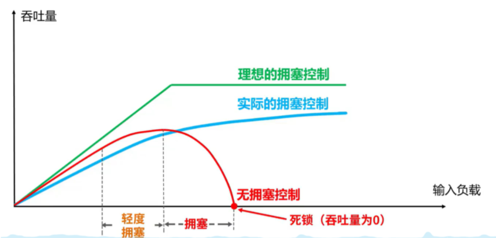
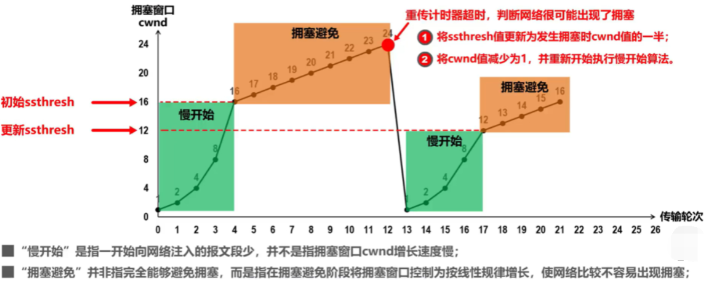
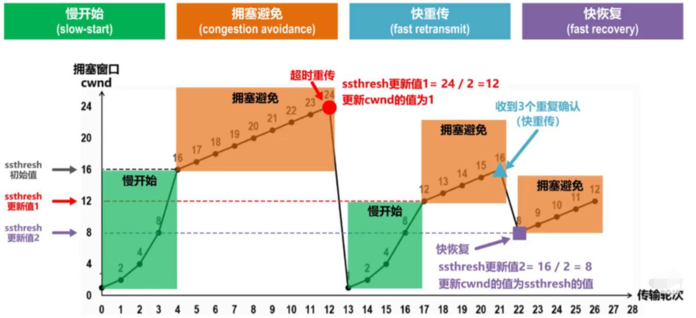

上一节所说的**流量控制**发生在发送端跟接收端之间，并没有考虑到整个网络环境的影响，如果说当前网络特别差，特别容易丢包，那么发送端就应该注意一些了。而这，也正是`拥塞控制`需要处理的问题。

对于拥塞控制来说，TCP 每条连接都需要维护两个核心状态:

- 拥塞窗口（Congestion Window，cwnd）
- 慢启动阈值（Slow Start Threshold，ssthresh）

涉及到的算法有这几个:

- 慢启动
- 拥塞避免
- 快速重传和快速恢复

接下来，我们就来一一拆解这些状态和算法。首先，从拥塞窗口说起。

## 拥塞窗口

拥塞窗口（Congestion Window，cwnd）是指目前自己还能传输的数据量大小。

那么之前介绍了接收窗口的概念，两者有什么区别呢？

- 接收窗口(rwnd)是`接收端`给的限制
- 拥塞窗口(cwnd)是`发送端`的限制

限制谁呢？

限制的是`发送窗口`的大小。

有了这两个窗口，如何来计算`发送窗口`？

```
发送窗口大小 = min(rwnd, cwnd)
```

取两者的较小值。而拥塞控制，就是来控制`cwnd`的变化。



## 慢启动

刚开始进入传输数据的时候，你是不知道现在的网路到底是稳定还是拥堵的，如果做的太激进，发包太急，那么疯狂丢包，造成雪崩式的网络灾难。

因此，拥塞控制首先就是要采用一种保守的算法来慢慢地适应整个网路，这种算法叫`慢启动`。运作过程如下:

- 首先，三次握手，双方宣告自己的接收窗口大小
- 双方初始化自己的**拥塞窗口**(cwnd)大小
- 在开始传输的一段时间，发送端每收到一个 ACK，拥塞窗口大小加 1，也就是说，每经过一个 RTT，cwnd 翻倍。如果说初始窗口为 10，那么第一轮 10 个报文传完且发送端收到 ACK 后，cwnd 变为 20，第二轮变为 40，第三轮变为 80，依次类推。 

难道就这么无止境地翻倍下去？当然不可能。它的阈值叫做**慢启动阈值**，当 cwnd 到达这个阈值之后，好比踩了下刹车，别涨了那么快了，老铁，先 hold 住！

在到达阈值后，如何来控制 cwnd 的大小呢？

这就是拥塞避免做的事情了。

## 拥塞避免

发送方维护一个叫做拥塞窗口cwnd的状态变量，其值取决于网络的拥塞程度，并且动态变化。只要网络没有出现网络拥塞就适当将拥塞窗口增加，如果网络出现阻塞，就将发送窗口减小一些。判断出现网络拥塞的依据是，有没有发生超时重传。发送方将拥塞窗口作为发送窗口。swnd，即swnd = cwnd。

维护一个慢开始门限ssthresh状态变量：

当cwnd < sssthesh时，使用慢开始算法；

当cwnd > sssthesh时，使用拥塞避免算法。

当cwnd = sssthesh时，可以使用慢开始算法，也可以使用拥塞避免算法。

慢开始算法：成倍增加

拥塞避免：每次加一




## 快速重传和快速恢复

### 快速重传

有时，个别报文段会在运输中丢失，但实际上网络并没有发生拥塞，那么这将会降低传输效率。 采用快重传可以让发送方尽早知道发生了某个报文段的丢失。 所谓快重传，就是发送方尽快进行重传，而不是等到超时重传，因为一旦超时重传将会时拥塞窗口变为1 要求接收方不要等待自己发送数据时才进行捎带确认，而是立即发送确认； 即收到了失序的报文也立即对己收到的报文进行重复确认。 发送方一旦收到3个连续的重复确认，就将相应的报文段立即重传，而不是等到报文段的超时器超时再重传。 发送方一旦收到三个重复确认，就知道现在只是丢失了个别的报文段，于是不启动慢开始算法，而启动快恢复算法；

### 快速恢复

当然，发送端收到三次重复 ACK 之后，发现丢包，觉得现在的网络已经有些拥塞了，自己会进入**快速恢复**阶段。

在这个阶段，发送端如下改变：

- 拥塞阈值降低为 cwnd 的一半
- cwnd 的大小变为拥塞阈值
- cwnd 线性增加



### 选择性重传

那你可能会问了，既然要重传，那么只重传第 5 个包还是第5、6、7 个包都重传呢？

当然第 6、7 个都已经到达了，TCP 的设计者也不傻，已经传过去干嘛还要传？干脆记录一下哪些包到了，哪些没到，针对性地重传。

在收到发送端的报文后，接收端回复一个 ACK 报文，那么在这个报文首部的可选项中，就可以加上`SACK`这个属性，通过`left edge`和`right edge`告知发送端已经收到了哪些区间的数据报。因此，即使第 5 个包丢包了，当收到第 6、7 个包之后，接收端依然会告诉发送端，这两个包到了。剩下第 5 个包没到，就重传这个包。这个过程也叫做**选择性重传(SACK，Selective Acknowledgment)**，它解决的是**如何重传**的问题。

以上就是 TCP 拥塞控制的经典算法: **慢启动**、**拥塞避免**、**快速重传和快速恢复**。

# 参考

[神三元blog](https://sanyuan0704.top/)
