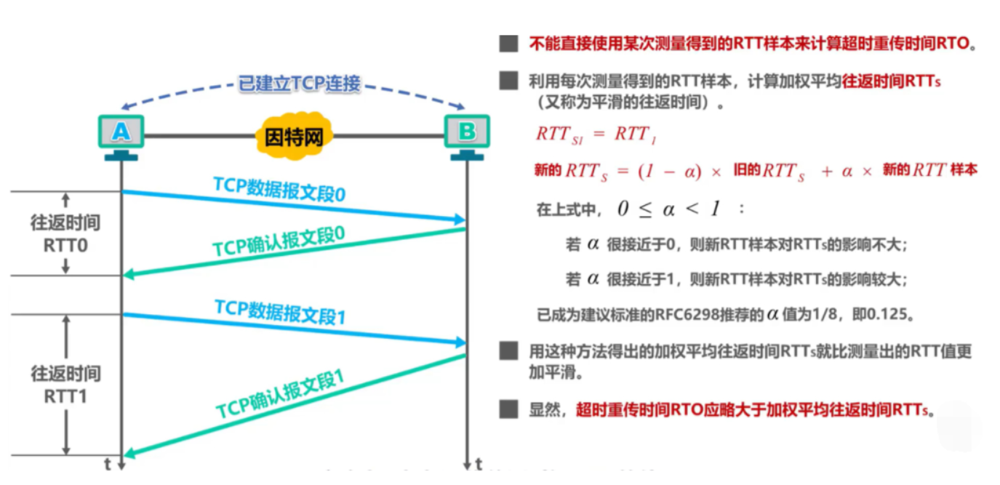
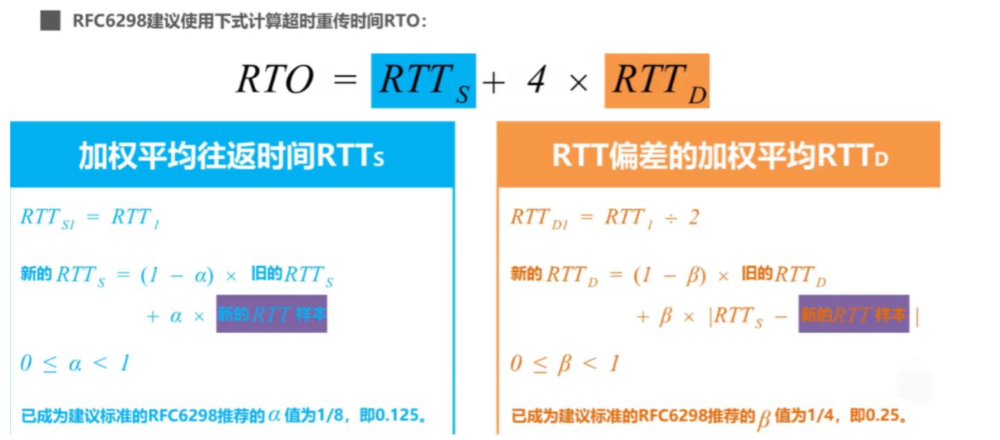

TCP 具有超时重传机制，即间隔一段时间没有等到数据包的回复时，重传这个数据包。

这个重传间隔也叫做**超时重传时间**(Retransmission TimeOut, 简称RTO)

# 加权平均往返时间

# 超时重传时间

如果出现超时重传，那么发送方会发送两次报文，因为发送方无法判断是对哪一次发送信息的确认信息，所以无法确认往返时间RTT，因此`Karn`提出一个算法，只要报文重传了，就不参与计算。但是如果是因为报文段的时延突然增大很多，这就会导致重传时间无法更新。因此修正的方法是报文段每重传一次，就把超时重传时间RTO增加为原来的两倍。