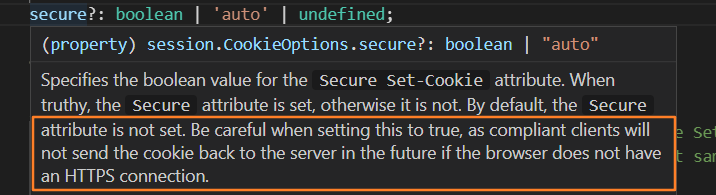

# session cookie

session

```javascript
npm i express-session
const session = require("express-session")
app.use(session({
    secret: "asfgsfgjdgsfe",
    resave: false,
    saveUninitialized: true
    //cookie: { secure: true }
}));
```

**cookie: { secure: true }**是官方文档的配置，但是注意secure为true的时候，只有https链接才能session才能生效，开发环境下永远不会生效


赋值

```javascript
req.session.token = data.data.token;
```

取值

```javascript
let token = req.session.token
```

cookie

```javascript
npm i cookie-parser
const cookieParser = require("cookie-parser")
app.use(cookieParser());
res.cookie('token', data.data.token, { maxAge: 600000, httpOnly: true });
//注意cookie是res maxAge时毫秒
console.log(req.cookies.token)
//赋值时cookie 取值cookies
```
