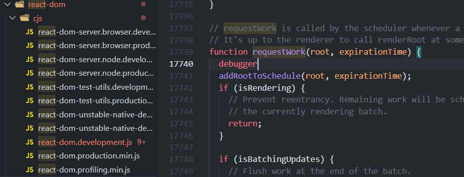
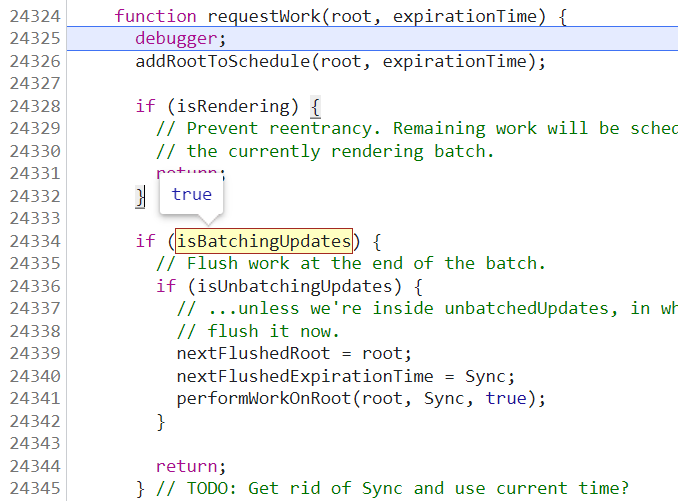
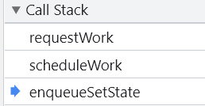
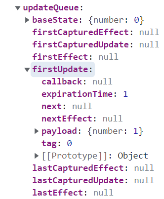
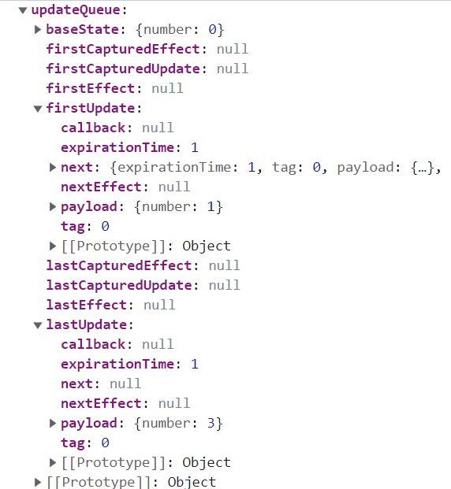
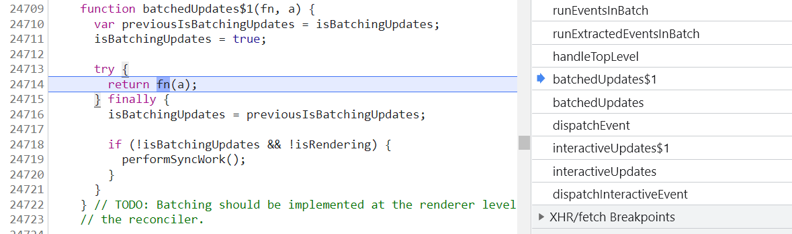

>  setState 本身的方法调用是同步的，但是调用了setState ，并不标致着 state 立马就更新了，这个更新要看当前环境的执行上下文，如果我处于批量更新的环境下，那么我的 state 不是立马更新，如果我不处于批量更新的环境下，则可能是立马更新的，为什么说可能，是因为如果处于 async model 下， state 不会立马更新，因为 async 会进入异步调度。

可用来测试demo
```javascript
import React from 'react'
import { unstable_batchedUpdates as batchedUpdates } from 'react-dom'

export default class BatchedDemo extends React.Component {
  state = {
    number: 0,
  }

  handleClick = () => {
    // 主动`batchedUpdates`
    // setTimeout(() => {
    //   this.countNumber()    1 2 3 
    // }, 0)

    // setTimeout中没有`batchedUpdates`
    //setTimeout(() => {
    //  batchedUpdates(() => this.countNumber())     0 0 0
    //}, 0)

    // 事件处理函数自带`batchedUpdates`
    // this.countNumber()     0 0 0 
  }

  countNumber() {
    const num = this.state.number
    this.setState({
      number: num + 1,
    })
    console.log(this.state.number)
    this.setState({
      number: num + 2,
    })
    console.log(this.state.number)
    this.setState({
      number: num + 3,
    })
    console.log(this.state.number)
  }

  render() {
    return <button onClick={this.handleClick}>Num: {this.state.number}</button>
  }
}

```

# 测试
在nodemoudels中的react-dom > cjs > react-dom.development.js中的requestWork打下 debugger（render会走这个方法）



点击按钮后会进入debugger



当鼠标移动到 isBatchingUpdates 和 isUnbatchingUpdates 上时，可以看他们的值分别为 true 和 false ，所以时未经过处理直接走 24344行的 return了<br />然后我们看下call stack



发现执行了enqueueSetState，然后如下图，在fiber中的updateQueue>firstUpdate>payload，确实找到了number ：1，说明update已经创建成功，没有进行实际的更新




接下来我们再点击按钮


两次，让他继续执行两次。



同样在fiber中的updateQueue中的firstUpdate 和其中的next 以及lastUpdate中分别找到了三个number，<br />在他们都加到updateQueue中后，代码又是怎么执行使state更新呢。<br />在call stack中找到 batchedUpdates 方法，发现他又调用了 **batchedUpdates$1 **方法，如下图



可以看到 他把 isBatchingUpdates 设为 true ，这里的fn 其实就是经过react处理过后的handleClick，由24718行的判断 ** if (!isBatchingUpdates && !isRendering)** 可得：当所以setState都放到updateQueue中后 ，就会执行performSyncWork 改变state的值。

**在 onClick、onFocus 等事件中，由于合成事件封装了一层，所以可以将 isBatchingUpdates 的状态更新为 true；在 React 的生命周期函数中，同样可以将 isBatchingUpdates 的状态更新为 true。那么在 React 自己的生命周期事件和合成事件中，可以拿到 isBatchingUpdates 的控制权，将状态放进队列，控制执行节奏。而在外部的原生事件中，并没有外层的封装与拦截，无法更新 isBatchingUpdates 的状态为 true。这就造成 isBatchingUpdates 的状态只会为 false，且立即执行。所以在 addEventListener 、setTimeout、setInterval 这些原生事件中都会同步更新。**<br />

~~XXX另外setTimeout是一个宏任务，从内存角度来说，和之前任务不是在同一个栈中。所以执行到这个宏任务的时候，之前的栈中数据会被还原（isBatchingUpdates是初始值false），所以不是批量更新。 XXX~~
```javascript
setTimeout(() => {
  this.countNumber()    1 2 3 
}, 0)
```
batchedUpdates 可以设置上下文，因为handleclick是react事件体系中产生的一个回调，react事件体系会主动调用batchedUpdates这种上下文情况，来帮我们设置这种上下文，所以在react里面，大部分事件调用的回调他都是会为你做批量更新，算是react中的事件绑定的性能优化。
```javascript
setTimeout(() => {
  batchedUpdates(() => this.countNumber())     0 0 0
}, 0)
```
batchedUpdates源码如下
```javascript
// TODO: Batching should be implemented at the renderer level, not inside
// the reconciler.
function batchedUpdates<A, R>(fn: (a: A) => R, a: A): R {
  //记录上一次isBatchingUpdates状态
  const previousIsBatchingUpdates = isBatchingUpdates;
  isBatchingUpdates = true;
  try {
    return fn(a);
  } finally {
    isBatchingUpdates = previousIsBatchingUpdates;
    if (!isBatchingUpdates && !isRendering) {
      performSyncWork();
    }
  }
}
```
最后执行performSyncWork代替requestWork 中做的事。

tips
```javascript
  handleClick = () => {
    this.countNumber()
  }

  countNumber() {
    const num = this.state.number
    this.setState({
      number: num + 1,
    },()=>{
      console.log(this.state.number)
    })
    this.setState({
      number: num + 2,
    },()=>{
      console.log(this.state.number)
    })
    this.setState({
      number: num + 3,
    },()=>{
      console.log(this.state.number)
    })
  }

```
此时输出的都是三<br />状态更新和执行回调的步骤是不一样，更新状态在渲染阶段，而调用回调是在提交阶段，所以肯定是批量跟新之后再一起调用回调的。


参考链接

- [https://zhuanlan.zhihu.com/p/372275423](https://zhuanlan.zhihu.com/p/372275423)
- 《react技术揭秘》- 卡颂
