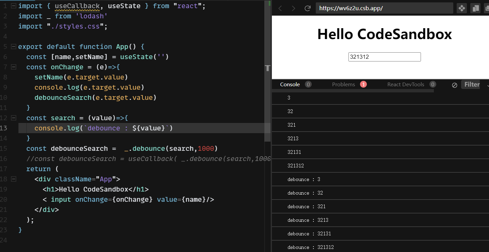

# 什么情况下一个组件会重新渲染
1. 组件自己的 state 变化
1. 父组件传递的 props 变化
1. 父组件重新渲染

优化点:

- useMemo
- memo
- children (通过{ children } 的形式)
- useCallback
- PureComponent

# useCallback

1. 对于需要传递 **函数**给子组件的场合，不用 useCallback 的话,子组件每次都会重新渲染;
1. 在调用节流、防抖函数时。

**1**
```javascript
// Parent.jsx
const [count1, setCount1] = useState(0);
// ...
const handleClickButton1 = () => {
  setCount1(count1 + 1);
};
// ...
return <Button onClickButton={handleClickButton1}>Button1</Button>


// Button.jsx
import React from 'react';

const Button = ({ onClickButton, children }) => {
  return (
    <>
      <button onClick={onClickButton}>{children}</button>
      <span>{Math.random()}</span>
    </>
  );
};

export default React.memo(Button);
```
在 Parent中 点击 Button ，即使 Button 内部没有什么变化，Button 仍会重新渲染，体现在 Math.random 返回的随机值上。原因就是 onClickButton 被重新定义，导致 React 在 diff 新旧组件时，判定组件发生了变化。这时候 useCabllback 和 memo 就发挥了作用：
```javascript
const handleClickButton2 = useCallback(() => {
  setCount2(count2 + 1);
}, [count2]);
```
回头再看上面的 Button 组件都需要一个 onClickButton 的 props ，尽管组件内部有用 React.memo 来做优化，但是我们声明的 handleClickButton1 是直接定义了一个方法，这也就导致只要是父组件重新渲染（状态或者props更新）就会导致这里声明出一个新的方法，新的方法和旧的方法尽管长的一样，但是依旧是两个不同的对象，React.memo 对比后发现对象 props 改变，就重新渲染了。

---

**2**<br />[防抖实例](https://codesandbox.io/s/recursing-galileo-wv6z2u?file=/src/App.js)


如果不用 useCallback 包裹函数 , 每次 search 都	会重新创建,导致 防抖失败

<br />

---

**tips**<br />接下来在看一个频繁更新所带来的问题
```javascript
const [text, setText] = useState('');

const handleSubmit = useCallback(() => {
  // ...
}, [text]);

return (
  <form>
    <input value={text} onChange={(e) => setText(e.target.value)} />
    <OtherForm onSubmit={handleSubmit} />
  </form>
);
```
上述例子中可以看到我们的 handleSubmit 会依赖 text 的更新而去更新，在 input 的使用中 text 的变化肯定是相当频繁的，假如这时候我们的 OtherForm 是一个很大的组件，必须要进行优化这个时候可以使用 useRef 来帮忙。
```javascript
const textRef = useRef('');
const [text, setText] = useState('');

const handleSubmit = useCallback(() => {
  console.log(textRef.current);
  // ...
}, [textRef]);

return (
  <form>
    <input value={text} onChange={(e) => {
      const { value } = e.target;
      setText(value)
      textRef.current = value;
    }} />
    <OtherForm onSubmit={handleSubmit} />
  </form>
);
```
使用 useRef 可以生成一个变量让其在组件每个生命周期内都能访问到，且 handleSubmit 并不会因为 text 的更新而更新，也就不会让 OtherForm 多次渲染。

---

**不要把所有的方法都包上 useCallback**
```javascript
const [count1, setCount1] = useState(0);
const [count2, setCount2] = useState(0);

const handleClickButton1 = () => {
  setCount1(count1 + 1)
};
const handleClickButton2 = useCallback(() => {
  setCount2(count2 + 1)
}, [count2]);

return (
  <>
    <button onClick={handleClickButton1}>button1</button>
    <button onClick={handleClickButton2}>button2</button>
  </>
)
```
此时就没有优化的必要，每次到 useCallback 这还要进行对比 , 存一下之前的函数 , 消耗更大

:::info
`useCallback` 是要配合子组件的 `shouldComponentUpdate` 或者 `React.memo` 一起来使用的，否则就是反向优化。 memo的作用是当传递的 props 有变化时 子组件才会更新
:::

# useMemo
useMemo 主要用来缓存一些计算消耗大的函数，也可以把对象缓存，只有依赖数组变化时才会计算,防止重复渲染带来的性能问题
```javascript
// ...
const [count, setCount] = useState(0);

const userInfo = {
  // ...
  age: count,
  name: 'Jace'
}

return <UserCard userInfo={userInfo}>
```
```javascript
// ...
const [count, setCount] = useState(0);

const userInfo = useMemo(() => {
  return {
    // ...
    name: "Jace",
    age: count
  };
}, [count]);

return <UserCard userInfo={userInfo}>

```
很明显的上面的 userInfo 每次都将是一个新的对象，无论 count 发生改变没，都会导致 UserCard 重新渲染，而下面的则会在 count 改变后才会返回新的对象。

除此之外 还可以把一次 昂贵的计算操作缓存
```javascript
const num = useMemo(() => {
  let num = 0;
  // 这里使用 count 针对 num 做一些很复杂的计算，当 count 没改变的时候，组件重新渲染就会直接返回之前缓存的值。
  return num;
}, [count]);

return <div>{num}</div>
```
事实上在使用中 useMemo 的场景远比 useCallback 要广泛的很多，我们可以将 useMemo 的返回值定义为返回一个函数这样就可以变通的实现了 useCallback。在开发中当我们有部分变量改变时会影响到多个地方的更新那我们就可以返回一个对象或者数组，通过解构赋值的方式来实现同时对多个数据的缓存。
```javascript
const [age, followUser] = useMemo(() => {
  return [
    new Date().getFullYear() - userInfo.birth, // 根据生日计算年龄
    async () => { // 关注用户
      await request('/follow', { uid: userInfo.id });
      // ...
    }
  ];
}, [userInfo]);

return (
  <div>
    <span>name: {userInfo.name}</span>
    <span>age: {age}</span>
    <Card followUser={followUser}/>
    {
      useMemo(() => (
        // 如果 Card1 组件内部没有使用 React.memo 函数，那还可以通过这种方式在父组件减少子组件的渲染
        <Card1 followUser={followUser}/>
      ), [followUser])
    }
  </div>
)
```

# 总结
简单理解呢 useCallback 与 useMemo 一个缓存的是函数，一个缓存的是函数的返回值。useCallback 是来优化子组件的，防止子组件的重复渲染。useMemo 可以优化当前组件也可以优化子组件，优化当前组件主要是通过 memoize 来将一些复杂的计算逻辑进行缓存。当然如果只是进行一些简单的计算也没必要使用 useMemo，这里可以考虑一些计算的性能消耗和比较 inputs 的性能消耗来做一个权衡


# 参考

[要不要使用useMemo、useCallback](https://player.bilibili.com/player.html?bvid=BV1gf4y1X7bQ)


