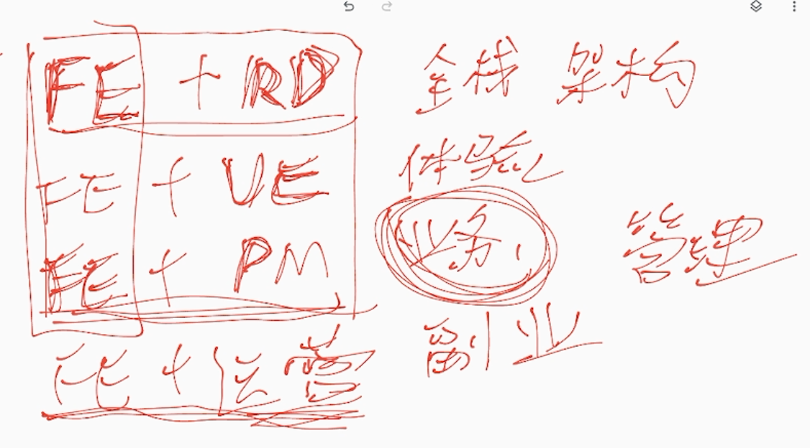
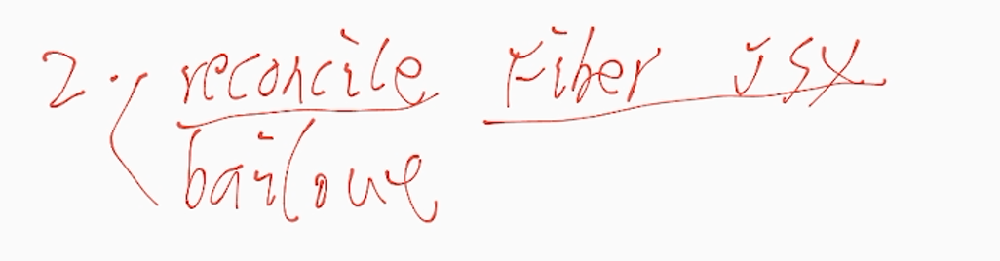
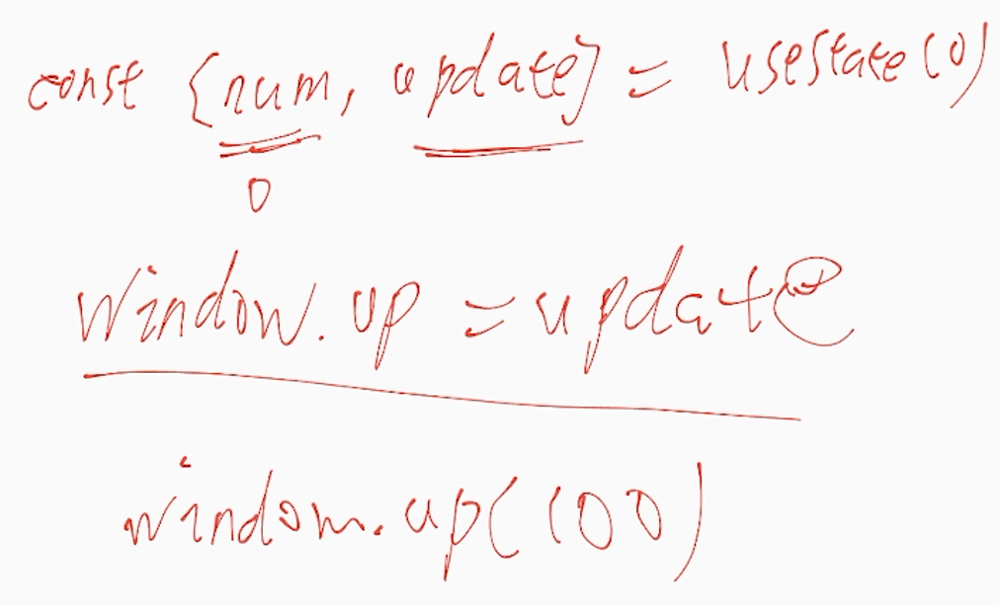
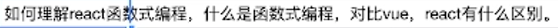
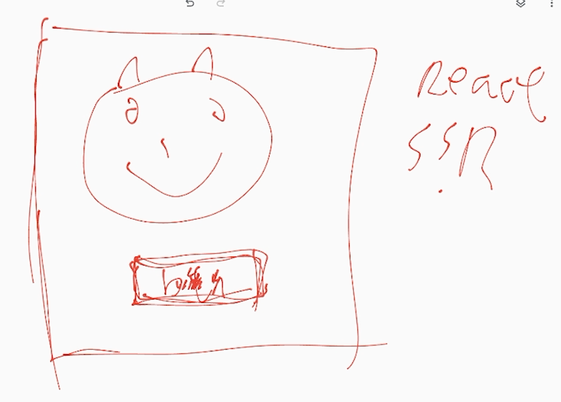

1. VUE 、REACT 都是 DSL（领域特定的语言） 类的语言 类似 HTML、CSS，选择哪个看你的业务需求、类似小程序像 VUE 其实不是 只是借鉴
1. vue3、react：看上层需求

### 高优先级打断低优先级

会丢失被打断的任务的状态 重新开始

### vite webpack

98% vs 100 vite webpack

### 1

16.8 hooks suspense 18 批处理 batch update concurment

### react 懒加载的最佳实践

react-loader 。。。。

### react 组件库 中 css 解决方案

考虑导出的问题怎么用 esm cssmoudl

### 前端转岗

转岗最重要不要丢失自己的代码能力

### react diff vs vue diff

react: fibernode（链表） jsx 数组 vue vnode 数组  vue 可正序倒序 因为数组可以随意访问。

### diff

diff 针对整个树 reconcile 比较 fiber 和 jsx 对象 bailout： should react.memo 命中 这个， 两种级别 一种是单个节点 一种是整棵树， 没有编译时的优化 所以 API

### 123

reactDom.render createRoot 用了并发特性 自己帮你处理

### other

useEffect 宏任务

### react 源码 考核的深度

1. 原理
1. 结合业务

hooks 理念

### 白屏

#### 请求 fetch

宿主环境：webview 预请求 预加载

#### 运行时

SSG  SSR 1. 常规的 SSR 页面刚出 btn 点没用 因为 react 还没加载

react18 水合模式 有个 btn 优先激活

// TODO 看看 scoket 怎么封装 看看库

### react 性能优化

eager state bailout

`update(1)` 就是 eager state 前后一样就不触发 bailout ： pure memo useMemo

### rust

构建工具 rust go 前端基建蔚来 wasm 浏览器 IDE 设计软件 figma 音视频处理

### vite webpack

webpack 兜底 vite 可以尝试用

浏览器工作原理
  