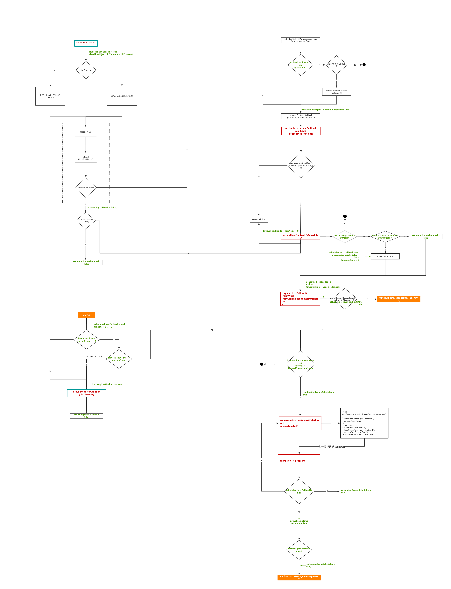

流程图中红色是关键的函数，绿色是公共变量

# 根据fps调整activeFrameTime的理解
首先 rafTime 为 requestAnimationFrame 执行回调函数的时间。var nextFrameTime = rafTime - frameDeadline + activeFrameTime;。可能第一眼不知道这个是干嘛的。可以先代入下面的比较表达式里rafTime - frameDeadline + activeFrameTime < activeFrameTime，最后转为rafTime < frameDeadline，其中 frameDeadline 会被赋值为当前帧 + 33ms，即当前帧的过期时间，如果rafTime < frameDeadline，说明下一次 requestAnimationFrame提前进入了，也就说明一帧的时间并没有33ms那么长。再通过nextFrameTime < activeFrameTime && previousFrameTime < activeFrameTime判断连续两次都小于33，那就该调整一帧时间了。再回头看 var nextFrameTime = rafTime - frameDeadline + activeFrameTime;，如果浏览器刷新频率更高，rafTime - frameDeadline 肯定是小于0的，再加 activeFrameTime，自然就小于activeFrameTime了。frameTime记录的是一帧的时间，只是第一次比较特殊。
