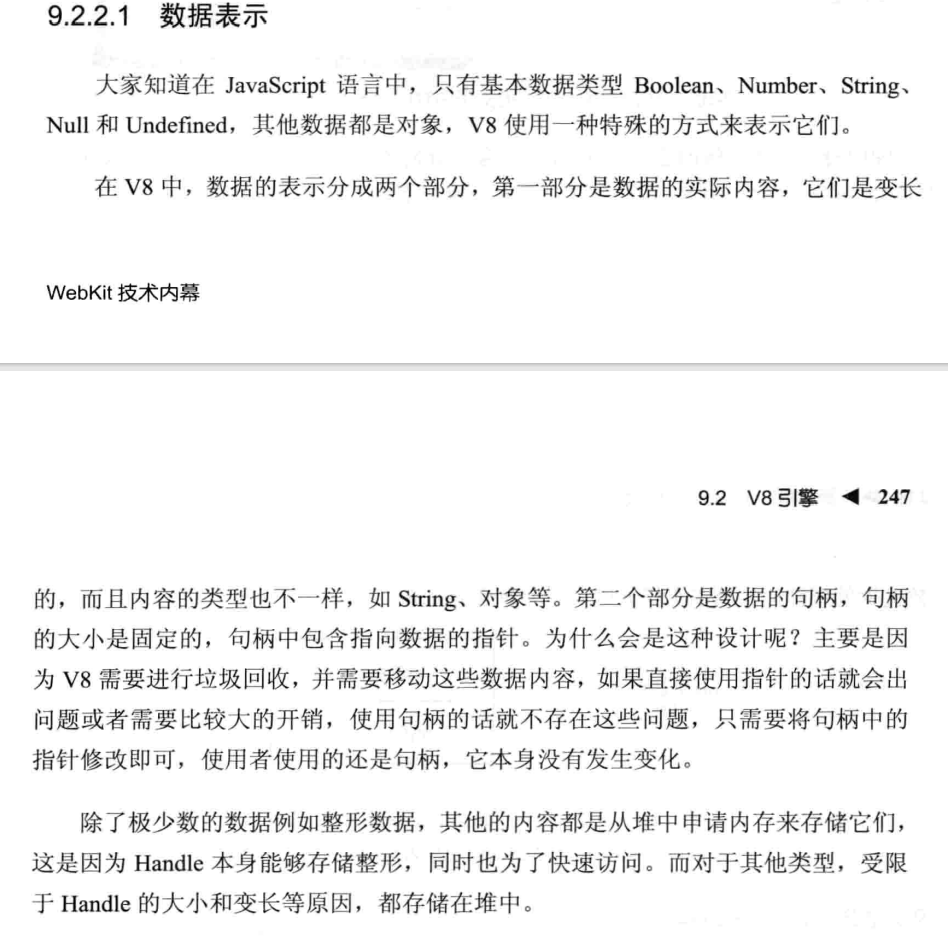
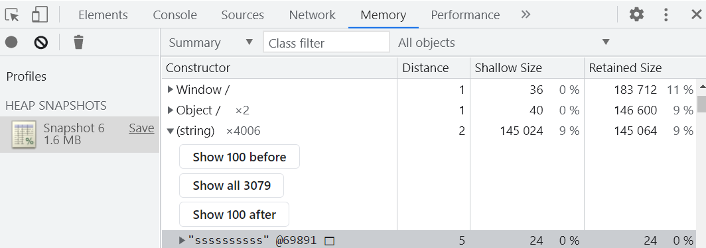
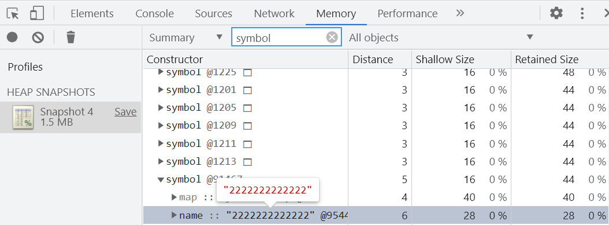
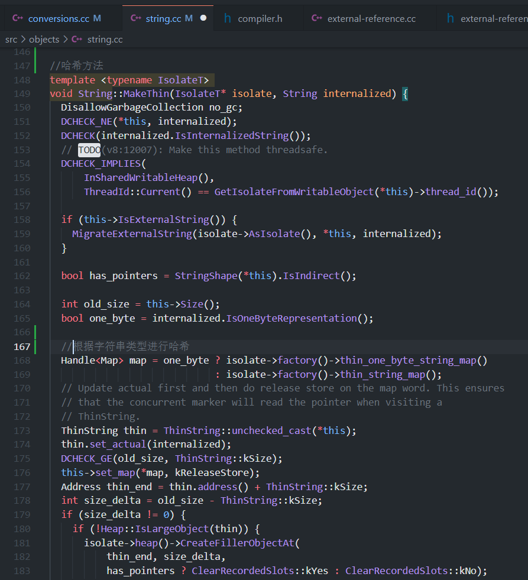
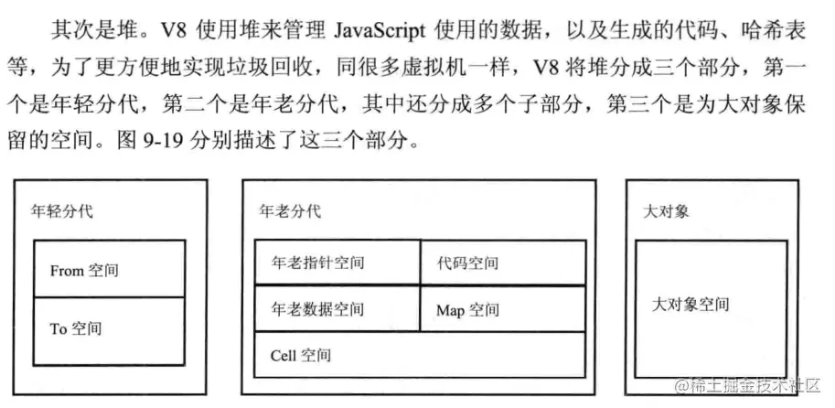

## 争议
可能很大一部分同学是这样认为的：
> 基本数据类型存放在栈内存上，引用数据类型存储在堆内存上。

当然这也是《JavaScript高级程序设计》第四版 4.4 小结中所说的。（为了方便下文用js红宝书代替）


> 基本数据类型还有一个bigint

可真是这样吗，今天我看了一个文章给出的结论是

1. 字符串： 存在堆里，栈中为引用地址，如果存在相同字符串，则引用地址相同。
1. 数字： 小整数存在栈中，其他类型存在堆中。
1. 其他类型：引擎初始化时分配唯一地址，栈中的变量存的是唯一的引用。

可他与js红宝书所说互相矛盾，让我不敢轻易相信这篇文章，于是我开始查阅相关资料。

## ECMA-262
JavaScript是根据ECMA-262标准制订的。<br />在26节[Managing Memory](https://262.ecma-international.org/12.0/#sec-managing-memory)和29节[Memory Model](https://262.ecma-international.org/12.0/#sec-memory-model)中并未提起数据具体的内存分配。<br />所以他内存的分配由运行引擎决定。<br />这样一说是不是js红宝书的言论就不攻自破了。

## 《webkit技术内幕》
在《webkit技术内幕》这本书上是这样说的

最后一句：除了极少数数据：例如整形数据，其他内容都是从堆中申请内存来储存他们。

## 分析
既然 ECMA-262 标准没有规定内存分配，我们就找个目前使用最多的 js 引擎 V8 进行实验。
```shell
[root@VM-8-6-centos /]# node --v8-options | grep -A1 stack_size
  --stack_size (default size of stack region v8 is allowed to use (in kBytes))
        type: int  default: 984
--
  --sim_stack_size (Stack size of the ARM64, MIPS64 and PPC64 simulator in kBytes (default is 2 MB))
        type: int  default: 2048
```
我们可以看到V8引擎中栈的默认值为984kb，显然，一些比较大的基本类型（例如string）是装不下的。<br />那么他究竟是怎么分配的呢，又有那些基本类型不是在栈中存储的呢。我们带着问题继续往下看。<br />首先我们创建六个值，分别对应六个基本数据类型。
```javascript
let a = undefined
let b = null
let c = true
let d = 333333333333
let e = 'ssssssssss'
let f = Symbol(2222222222222)
```
然后使用`chrome`的Memory 分析一下 HEAP SNAPSHOTS。

发现string和symbol都在其中，并分别在其类型中找到。如下图所示





由此证明， 此时我们定义的 string 和 symbol 在堆内存中。


## 关于string
**string的创建流程是这样的：**

1. v8内部有一个名为stringTable的hashmap缓存了所有字符串，在V8阅读我们的代码，转换[抽象语法树](https://link.zhihu.com/?target=https%3A//resources.jointjs.com/demos/javascript-ast)时，每遇到一个字符串，会根据其特征换算为一个[hash值](https://www.zhihu.com/search?q=hash%E5%80%BC&search_source=Entity&hybrid_search_source=Entity&hybrid_search_extra=%7B%22sourceType%22%3A%22answer%22%2C%22sourceId%22%3A2083349992%7D)，插入到hashmap中。在之后如果遇到了hash值一致的字符串，会优先从里面取出来进行比对，一致的话就不会生成新字符串类。
1. 缓存字符串时，根据字符串不同采取不同hash方式。





所以在我们创建字符串的时候，V8会先从内存中（哈希表)查找该字符串，如果存在，直接复用。如果不存在，则创建一块新的内存空间存进这个字符串，然后把地址赋到变量中。这也是为什么我们不能直接用下标的方式修改字符串: V8中的字符串都是不可变的。

```javascript
// 例: 
var a = "lin"; // V8读取字符串后，去stringTable查找是否存在 不存在 hashTable 插入 'lin'
							//并把'lin'的引用存入 a
var b = a; // 直接拷贝 'lin' 的引用 
b = "alan"; // 查找 无 存入stringTable
```

## 关于垃圾回收
简单的说，V8的数据都是放在堆上，只是像类似小整数这样的数据，再在栈上分出一个指针指向它，是完全没有必要的，直接放在栈上会更节省性能。<br />还有就是 js 的垃圾回收机制和其他语言不太一样，并不能用其他语言的套路使用在js上面。栈中的数据使用完毕后会自动回收，js对于堆中的数据，有自己的垃圾回收算法。<br />

## 系统栈的创建并切换函数执行上下文的功能
对于系统栈来说，它的功能除了保存变量之外，还有创建并切换函数执行上下文的功能。举个例子：
```javascript
function f(a) {
  console.log(a);
}

function func(a) {
  f(a);
}

func(1);
```
假设用ESP指针来保存当前的执行状态，在系统栈中会产生如下的过程：

1. 调用func, 将 func 函数的上下文压栈，ESP指向栈顶。
1. 执行func，又调用f函数，将 f 函数的上下文压栈，ESP 指针上移。
1. 执行完 f 函数，将ESP 下移，f函数对应的栈顶空间被回收。
1. 执行完 func，ESP 下移，func对应的空间被回收。
> ESP（Extended Stack Pointer）为扩展栈指针寄存器，是指针寄存器的一种，用于存放函数栈顶指针


如果采用栈来存储相对基本类型更加复杂的对象数据，那么切换上下文的开销将变得巨大！<br />不过堆内存虽然空间大，能存放大量的数据，但与此同时垃圾内存的回收会带来更大的开销。

## 总结
首先，JavaScript 是基于[ECMA-262 标准](https://262.ecma-international.org/12.0/#sec-weak-ref-objects)的，它没有定义内存布局，所以它使用什么取决于解释器是如何实现的。

1. 数字： 小整数存在栈中，其他类型存在堆中。（闭包中的变量存放在堆内存中）
1. 字符串： 存在堆里，栈中为引用地址，如果存在相同字符串，则引用地址相同。
1. 其他类型：引擎初始化时分配唯一地址，栈中的变量存的是唯一的引用。

本文是在[此文章](https://www.zhihu.com/question/482433315/answer/2083349992)的基础上进行的思考和查阅，如您有其他的看法，欢迎互相交流讨论。<br />另外推荐一个，[js代码运行可视化工具](http://latentflip.com/loupe)，希望能帮助你更好的理解 js 。

相关资料：

1. 《WebKit技术内幕》---朱永盛
1. [JavaScript中变量存储在堆中还是栈中？](https://www.zhihu.com/question/482433315/answer/2083349992)
1. [V8垃圾回收](http://newhtml.net/v8-garbage-collection/)
1. [Pointer Compression in V8](https://v8.dev/blog/pointer-compression)
1. [ECMA-262标准](https://262.ecma-international.org/12.0/#sec-weak-ref-objects)
1. [Does JavaScript use stack or heap for memory allocation or both?](https://hashnode.com/post/does-javascript-use-stack-or-heap-for-memory-allocation-or-both-cj5jl90xl01nh1twuv8ug0bjk)
1. [JS中的栈内存堆内存](https://juejin.cn/post/6844903873992196110#comment)
