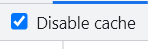

maybe sometimes 有一些问题，你找了很久，这个BUG时而有，时而无，当你实在束手无措的时候，你尝试着关闭了浏览器的关闭缓存


咔，问题解决了。当然我们并不能要求用户打开的网站的时候，要手动点击关闭缓存。

这时我们可以在请求后面加个随机数来解决这个问题。

```javascript
url+"?random="+Math.random() 
```

这样每次请求发出的时候都不会收到缓存的影响，除非前后两次的随机数是一样的🙃
